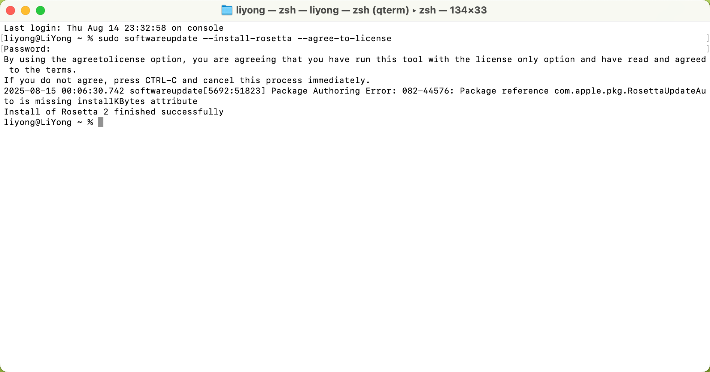
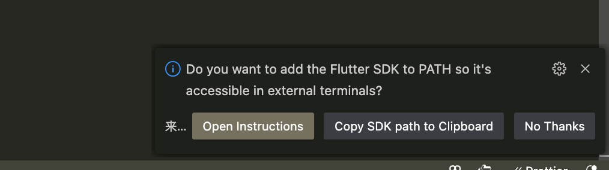
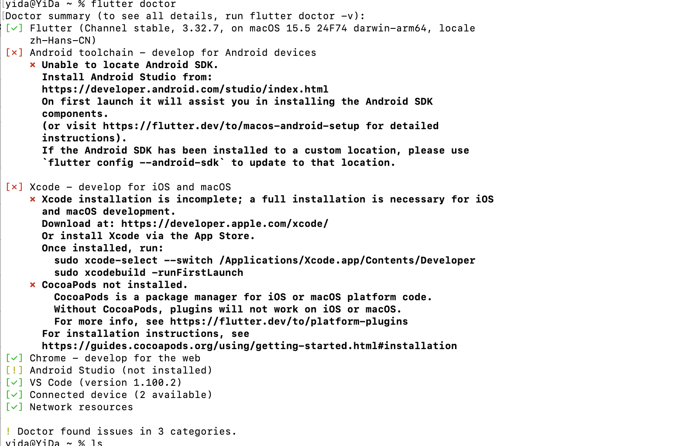
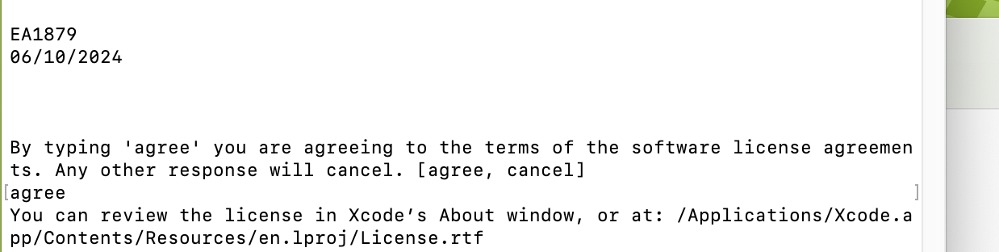
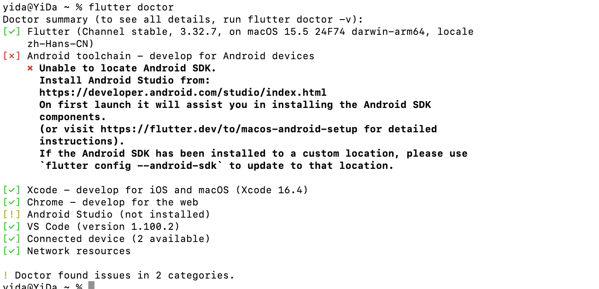
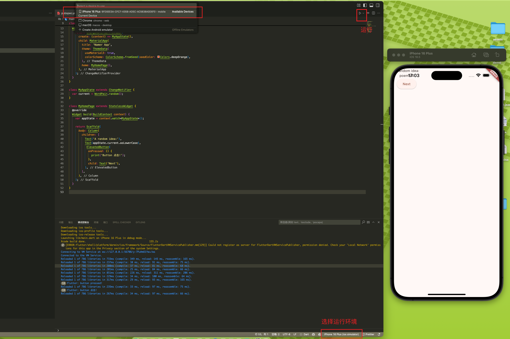

# Flutter

## 一、环境

### 1、下载

```bash
sudo softwareupdate --install-rosetta --agree-to-license
```



### 2、vsc 插件安装

[Install](https://marketplace.visualstudio.com/items?itemName=Dart-Code.flutter)

[docs](https://docs.flutter.dev/get-started/install/macos/mobile-ios#install-the-flutter-sdk)



下载完成后，配置环境变量

```bash
# 下载 flutter 到自己指定的位置
echo 'export PATH="$PATH:/Users/yida/flutter/flutter/bin"' >> ~/.zshrc

# 重启
source ~/.zshrc

# 检测
flutter doctor
```



提示有错的处理

```bash
sudo xcode-select --switch /Applications/Xcode.app/Contents/Developer

sudo xcodebuild -runFirstLaunch

# 更具指令进行下一步操作
sudo xcodebuild -license 

# 下载没有反应时，也许需要 ruby，下载指令为：brew install ruby
# If you need to have ruby first in your PATH, run:
#   echo 'export PATH="/opt/homebrew/opt/ruby/bin:$PATH"' >> ~/.zshrc

# For compilers to find ruby you may need to set:
#   export LDFLAGS="-L/opt/homebrew/opt/ruby/lib"
#   export CPPFLAGS="-I/opt/homebrew/opt/ruby/include"

# brew install cocoapods 推荐使用 brew 安装 cocoapods
sudo gem install cocoapods
```





### 3、构建第一个 demo

[docs](https://codelabs.developers.google.cn/codelabs/flutter-codelab-first?hl=zh-cn#0)


