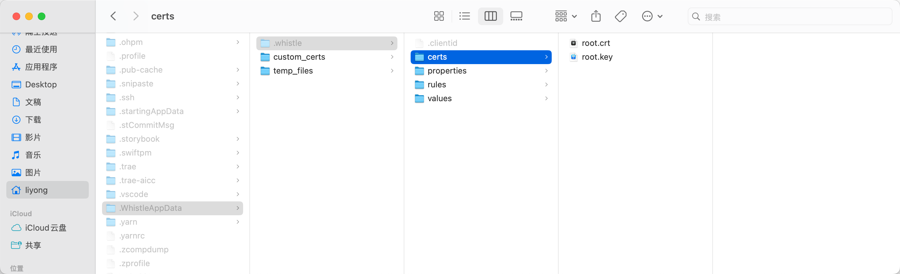
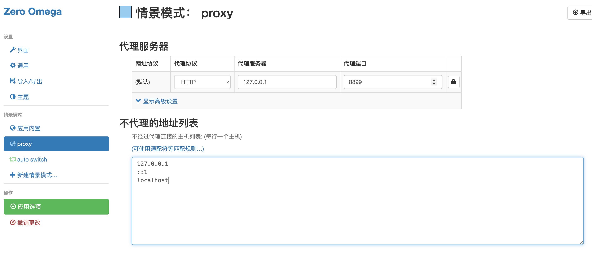
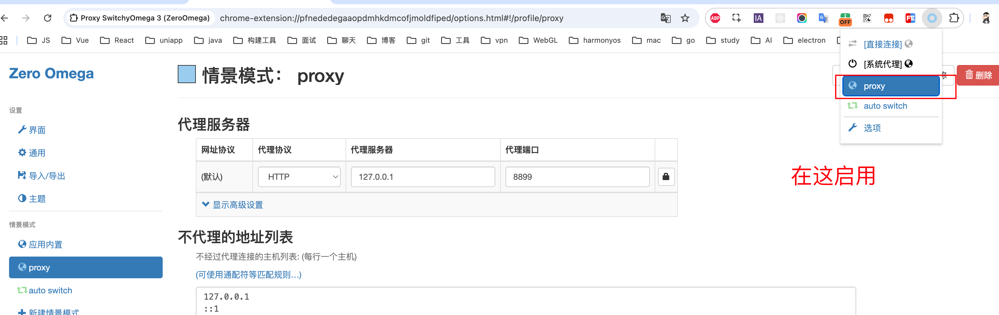
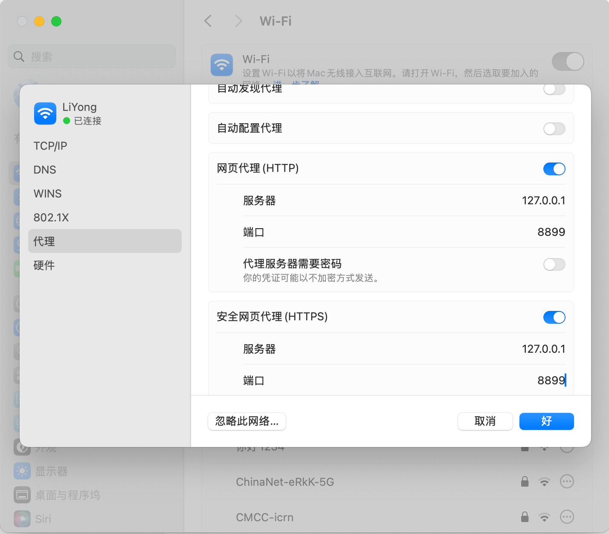
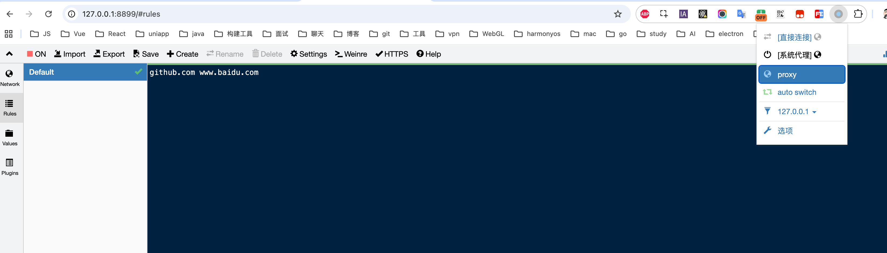

# Proxy

## 一、Whistle

[Whistle](https://wproxy.org/)

[安装证书](https://yolkpie.github.io/2020/12/22/%E5%AE%89%E8%A3%85%E8%AF%81%E4%B9%A6/)

[Chrome 插件](https://chromewebstore.google.com/detail/proxy-switchyomega-3-zero/pfnededegaaopdmhkdmcofjmoldfiped?pli=1)

### 1、下载

```bash
npm i -g whistle
```

### 2、启动

```bash
w2 start
# 重启
w2 restart
# 暂停
w2 stop
```

### 3、下载证书

```bash
# 这样下载后，不需要手动安装
w2 ca
```

注：先启动，才能下载证书。



### 4、使用

[参考](https://juejin.cn/post/7179113049868107831)

1）打开

http://127.0.0.1:8899/

2）配置插件

服务写 127.0.0.1，端口写 w2 start 启动的端口号。





3）系统设置



4）配置代理规则

例：

打开 https://github.com/ 时，重定向到 www.baidu.com



[配置规则](https://wproxy.org/docs/getting-started.html#%E8%A7%84%E5%88%99%E9%85%8D%E7%BD%AE%E7%A4%BA%E4%BE%8B)

5）Vite 热更新保留配置

1️⃣ vite.config.mts 中配置

```js
  server: {
    // 代理 ws
    hmr: {
      host: 'localhost',
      protocol: 'ws',
      port: 5173,
    }    
  },
```

2️⃣ 修改 Whistle 规则配置

注：注意端口号对应关系

```
https://test.xxx.com/ http://localhost:8087/


# 透传 Vite HMR 的 WebSocket 请求
wss://localhost:8087 ws://localhost:5173
ws://localhost:8087 ws://localhost:5173
```


