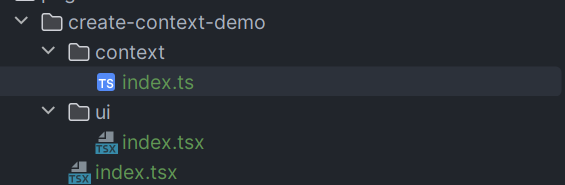
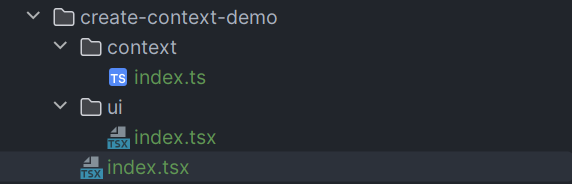
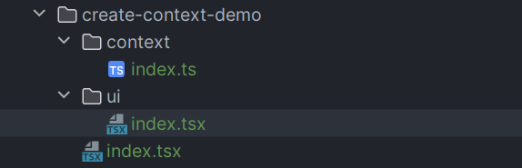
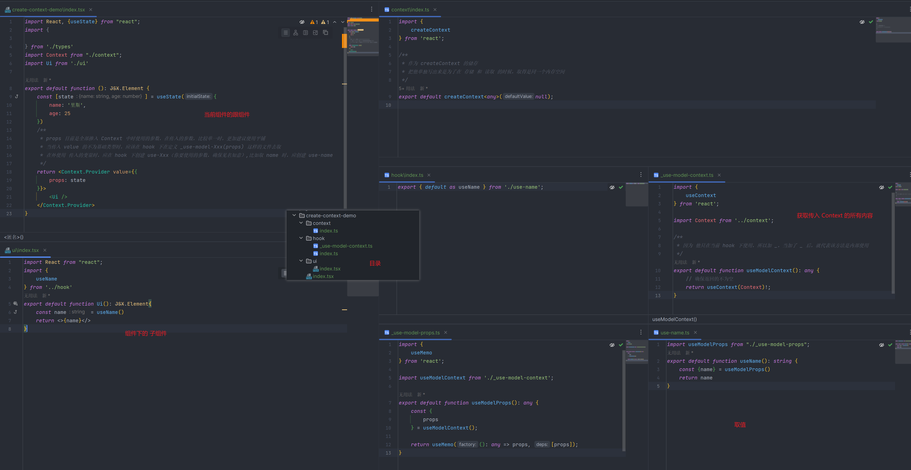

前言：

React 组件封装时数据管理，很多情况下，都是基于 props 进行一步步的传值，进行维护时有以下几个缺点：

① 传入层数过多时，在最内层无法很好理解当前参数的含义；

② 当 props 传入到中间组件时，如果改变了当前父组件传入的值，在后面的子组件更加难以理解，他为什么改变；

③ 取值的方式地方各种各样，而且有些值，是固定的，不会改变，但是依然要用 props 传入到要使用的地方。

总结：难以维护！！！

# 1、实现思路

1）基于 [useReducer](https://zh-hans.legacy.reactjs.org/docs/hooks-reference.html#usereducer) 实现数据源的集中管理；

2）使用 [useContext](https://zh-hans.legacy.reactjs.org/docs/hooks-reference.html#usecontext) 将数据传入到组件里面去；

3）传入的数据使用hook 进行统一的获取；

4）修改时使用 useReducer 的 dispatch 方法进行修改，把数据修改也放到 hook 下。

# 2、useReduce 的使用

```tsx
const [state, dispatch] = useReducer(reducer, initialState, init)
```

参数一：reducer 函数，reducer函数接受两个参数，分别是 state、action;

参数二：initialState 作为初始化参数；

参数三：init 函数，init 函数接受一个参数，这个参数为 initialState 的初始值，当时 他可以可以在这进行惰性的修改 initialState 的值。

## 1）读取

```tsx
import React, {
    useCallback,
    useReducer
} from "react";

interface IState {
    age: number;
    name: string;
}

// useReducer 的类型定义
interface IReducer {
    (state: IState): IState;
}

const initState: IState = {
    age: 18,
    name: '李四'
}

export default function ReducerDemo(): JSX.Element {
    // reducer 第一个方法，必须掺入，负责会报错
    const reducer = function (state: IState) {
        return state
    }

    const [state] = useReducer<IReducer>(reducer, initState);

    return <>
        useReducer 状态管理
        <br/>
        {state.age}
        {state.name}
    </>
}
```

## 2）修改 useReducer 中的值

```tsx
import React, {
    useCallback,
    useReducer
} from "react";
import update from 'immutability-helper'

interface IState {
    age: number;
    name: string;
}

type IAction = {
    type: 'age',
    payload: number;
} | {
    type: 'name',
    payload: string;
}

// useReducer 的类型定义
interface IReducer {
    (state: IState, action: IAction): IState;
}

const initState: IState = {
    age: 18,
    name: '李四'
}

export default function ReducerDemo(): JSX.Element {
    const reducer = function (state: IState, action: IAction) {
        switch (action.type) {
            case 'age':
                return update(state, {
                    age: {
                        $set: action.payload
                    }
                })
            case 'name':
                return update(state, {
                    name: {
                        $set: action.payload
                    }
                })
            default:
                throw new Error();
        }
    }

    const [state, dispatch] = useReducer<IReducer>(reducer, initState);

    const handleSetName = useCallback(() => {
        dispatch({type: 'name', payload: '哈哈'})
    }, [])
    const handleSetAge = useCallback(() => {
        dispatch({type: 'age', payload: 1})
    }, [])

    return <>
        useReducer 状态管理
        <br/>
        <p>{state.age}</p>
        <p>{state.name}</p>

        <button {...{
            onClick: handleSetName,
            children: '修改 name'
        }} />
        <button {...{
            onClick: handleSetAge,
            children: '修改 age'
        }} />
    </>
}
```

## 3）初次加载时修改 useReducer 的初始值

```tsx
const initState: IState = {
    age: 18,
    name: '李四'
}

export default function ReducerDemo(): JSX.Element {
    function init(initialCount: IState): IState {
        return update(initialCount, {
            name: {
                $set: '里斯'
            }
        })
    }

    // reducer 第一个方法，必须掺入，负责会报错
    const reducer = function (state: IState) {
        return state
    }

    // 使用第三个参数的时候，这里一定要写两个泛型
    const [state] = useReducer<IReducer, IState>(reducer, initState, init);

    return <>
        useReducer 状态管理
        <br/>
        {state.age}
        {state.name}
    </>
}
```

# 3、useContext 的使用

## 1）给当前夫组件的子组件中传递参数

① 给需要传入的组件中定义一个 Context 文件

 

```tsx
import {
    createContext
} from 'react';

// 作为 createContext 的储存
export default createContext<any>(null);
```

② 在组件中的根文件中引入

 

```tsx
import React, {useState} from "react";
import Context from "./context";
import Ui from './ui'

export default function (): JSX.Element {
    const [state] = useState('你好！！！')
    return <Context.Provider value={{state}}>
        <Ui />
    </Context.Provider>
}
```

③ 在组件中使用

注：只要你在根目录下包括了你需要传递的组件，不管多少层，你都可以进行参数的使用

 

```ts
import React, {
    useContext
} from "react";
import Context  from '../context'
export default function Ui(): JSX.Element{
    const state = useContext(Context)
    return <>{state?.state}</>
}
```

## 2）在组件中的使用，可参考下面的示例

注：这样使用可以让取值的时候，进行统一的抛出，不会导致各种各样的取值方式的产生，而且 方便后期维护。



代码地址：https://github.com/Not-have/practise/tree/main/react-demo/src/pages/create-context-demo

# 4、封装一个组合使用的案例

## 1）前景

createContext 作为组件内的数据共享

useReduce  作为默认数据源 和 修改数据的 状态

## 2）案例

实现一个 输入框 和 标签过滤的组件，该组件中有自己的状态管理机制，可以在纯组件时运行，也可以使用外部传值来运行。

