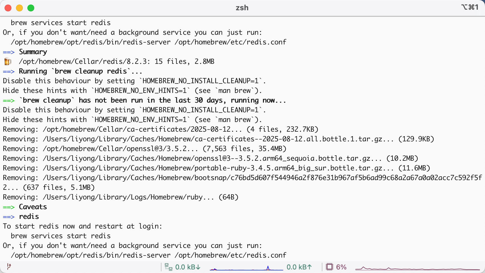
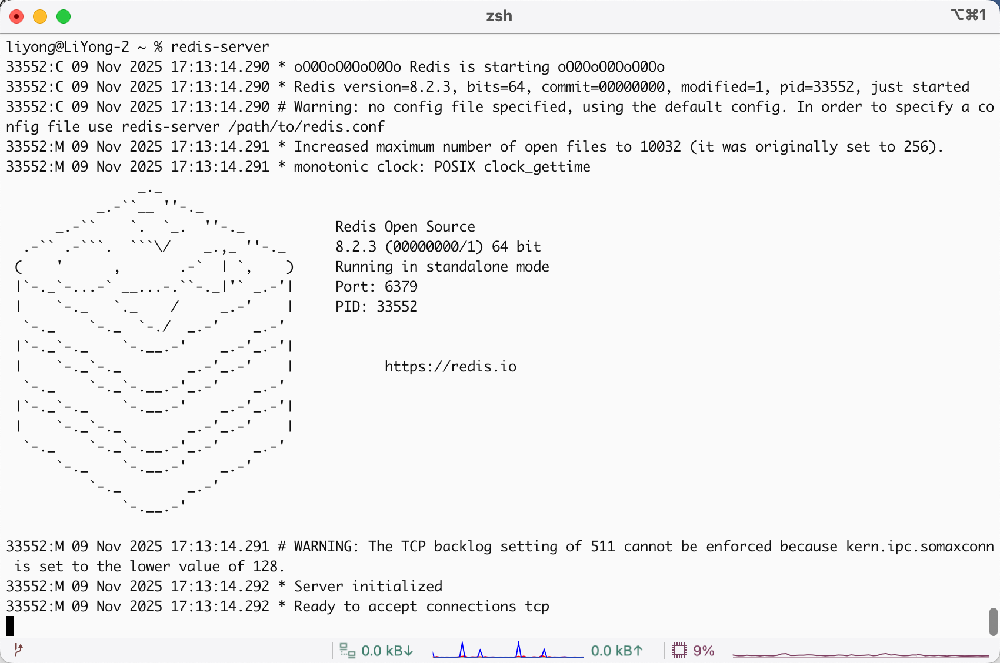
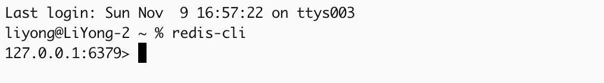
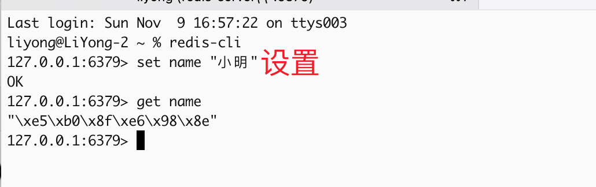
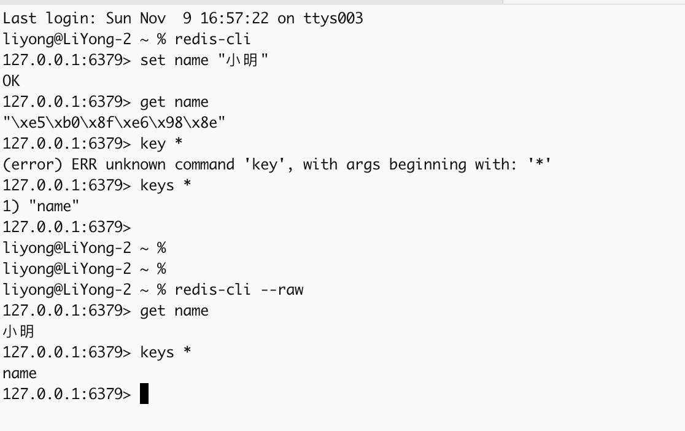
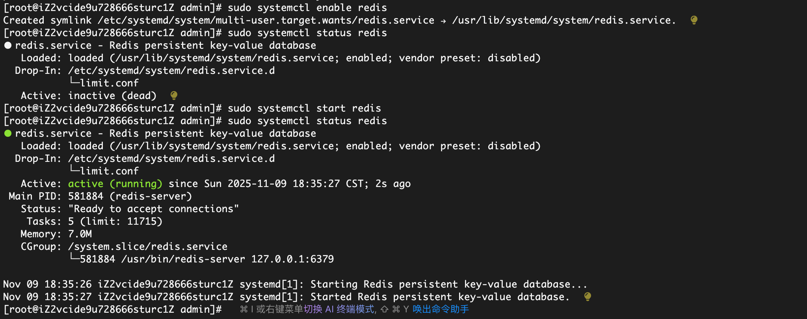

# Redis

## 一、安装

### 1、下载

注：请确保下载了 `brew`

```bash
brew install redis
```



### 2、查看是否下载成功

```bash
redis-server --version

# Redis server v=8.2.3 sha=00000000:1 malloc=libc bits=64 build=9913f0595ec3ce5b
```

### 3、启动 Redis 服务

```bash
# 临时启动，推荐
redis-server
```



### 4、链接（新开一个终端）

```bash
redis-cli
# 推荐，因为 中文被 Redis 默认以 UTF-8 编码存储后，终端显示的十六进制转义形式，所以加 --raw 后，get 时终端就显示中文了
redis-cli --raw
```



#### 1）基础使用



```bash
# 查看已经存在的数据
127.0.0.1:6379> keys *
1) "name"
127.0.0.1:6379>
```

#### 2）参数



### 5、其他指令

```bash
# 暂停
brew services stop redis

# 重启 Redis 服务
brew services restart redis

# 查看服务状态
brew services list | grep redis

# 卸载 Redis
brew uninstall redis
```

## 二、Linux 

```bash
# 安装
sudo yum install redis -y

# 启动
sudo systemctl status redis

# 设置开机启动（启动完成后执行）
sudo systemctl enable redis

# 查看状态（确保 active (running)）
sudo systemctl status redis
```



## 三、使用

### 1、类型

- 值（value）可以是 字符串(String), 哈希(Map), 列表(list), 集合(sets) 和 有序集合(sorted sets)等类型

- 字符串是使用最多的

### 2、基本使用

```bash
查看所有的 key: keys *
普通设置： set key value
设置并加过期时间： set key value EX 30 表示 30 秒后过期
获取数据： get key
删除指定数据： del key
删除全部数据: flushall
查看类型： type key
设置过期时间: expire key 20 表示指定的 key 20 秒后过期
```

### 3、Redis 列表

```bash
列表右侧增加值： rpush key value
列表左侧增加值： lpush key value
右侧删除值： rpop key
左侧删除值： lpop key
获取数据： lrange key
删除指定数据： del key
删除全部数据: flushall
查看类型： type key
```

### 4、Redis 集合

Redis 的 Set 是 String 类型的无序集合。 集合成员是唯一的， 这就意味着集合中不能出现重复的数据。它和列表的最主要区别就是没法增加重复值

```bash
给集合增数据： sadd key value
删除集合中的一个值： srem key value
获取数据： smembers key
删除指定数据： del key
删除全部数据: flushall
```

### 5、Redis 哈希

Redis hash 是一个 string 类型的 field 和 value 的映射表，hash 特别适合用于存储对象。

```bash
设置值 hmset ： hmset zhangsan name "张三" age 20 sex “男”
设置值 hset ： hset zhangsan name "张三"
获取数据： hgetall key
删除指定数据： del key
删除全部数据: flushall
```

