# 前端项目搭建 - 微信小程序（企鹅读伴项目技术方案）

面向从 0 到上线的微信小程序搭建说明，覆盖目录规范、网络与安全、性能与动效、调试测试、发布验收等关键环节，满足无网络缓存、弱网兜底、网络字体/图片限制等需求。

**本文档基于「企鹅读伴」项目业务需求，提供完整的技术实现方案。**

---

## 0. 项目概述与业务需求分析

### 0.1 项目背景

「企鹅读伴」是一款面向青少年的智能阅读陪伴小程序，通过 AI 技术提供聊书、推书、创作、音色定制等功能，打造沉浸式、互动式的阅读体验。

### 0.2 核心业务模块

#### 里程碑一（阶段一）优先级 P0 功能
- **AI创作模块**：情节仿写、情节插画创作、角色3D/2D形象创作、情节播客音频创作
- **AI音色**：音色分享、试听、管理、打分互动
- **账号管理**：多角色创建、角色身份切换登录、权限管理

#### 里程碑一（阶段二）优先级 P0 功能
- **AI聊书**：音色选择、历史记录折叠优化
- **听书-AI智能体交互**：成语填空、阅读理解、聊书交互
- **小鹅AI互动**：界面整合调整、考一考、素材累积
- **智能体**：AI推书智能体、AI聊书智能体（内容构建、引导问题、提问边界）

#### 里程碑二优先级 P1-P2 功能
- **微信状态与分享**：口令话题及主题背景生成、微信状态设置、朋友圈分享
- **AI推书**：智能推书、猜你喜欢、用户喜好收集、推荐书籍卡片
- **学习激励**：激励中心、flag打卡、虚拟勋章、积分星星机制
- **防沉迷系统**：AI功能使用次数限制、阅读时长限制
- **管理后台**：用户使用AI音色数据统计、听书阅读书籍统计

### 0.3 技术挑战与关键需求

1. **AI能力集成**：SSE流式输出、多模态内容生成（文本/图片/音频）
2. **实时交互**：聊书对话、闯关答题、音色切换
3. **资源管理**：CDN字体/图片、网络图片限制、大文件懒加载
4. **数据统计**：用户行为埋点、阅读时长统计、AI使用数据分析
5. **权限管理**：多角色账号体系、父母-子女权限控制
6. **微信生态集成**：微信状态接口（需调研）、分享朋友圈、保存图片

## 1. 项目初始化

- 使用微信开发者工具创建项目，启用 `npm` 构建（设置中开启）

- 目录建议：


### 1.1 企鹅读伴项目目录结构

基于业务需求，推荐以下目录结构：

```
penguin-reader/
├── pages/                      # 页面
│   ├── index/                  # 首页（书籍列表、猜你喜欢入口）
│   ├── book-detail/            # 书籍详情页
│   ├── reading/                # 听书页面（AI智能体交互入口）
│   ├── ai-chat/                # AI聊书页面
│   ├── ai-recommend/           # AI推书页面
│   ├── ai-create/              # AI创作页面
│   │   ├── rewrite/            # 情节仿写
│   │   ├── illustration/       # 情节插画
│   │   ├── character/          # 角色形象创作
│   │   └── podcast/            # 播客音频创作
│   ├── voice-manage/           # 音色管理页
│   ├── incentive-center/       # 激励中心
│   ├── flag-checkin/           # flag打卡
│   ├── medal/                  # 虚拟勋章
│   ├── profile/                # 我的页面（AI创作入口）
│   ├── account-manage/         # 账号管理（多角色切换）
│   ├── parental-control/       # 防沉迷设置
│   └── wechat-status/          # 微信状态生成
├── components/                 # 公共组件
│   ├── book-card/              # 书籍卡片（支持推荐跳转）
│   ├── voice-player/           # 音色播放器
│   ├── ai-stream-output/       # AI流式输出组件
│   ├── ai-question/            # AI提问交互组件
│   ├── medal-card/             # 勋章卡片
│   ├── role-selector/          # 角色选择器
│   ├── share-poster/           # 分享海报生成
│   └── skeleton/               # 骨架屏
├── services/                   # 接口服务
│   ├── ai-chat.js              # AI聊书接口（SSE）
│   ├── ai-recommend.js         # AI推书接口
│   ├── ai-create.js            # AI创作接口
│   ├── voice.js                # 音色管理接口
│   ├── book.js                 # 书籍接口
│   ├── user.js                 # 用户接口
│   ├── incentive.js            # 激励系统接口
│   └── stats.js                # 数据统计接口
├── utils/                      # 工具类
│   ├── request.js              # 请求封装（含签名）
│   ├── sse-handler.js          # SSE流式处理
│   ├── storage.js              # 本地缓存管理
│   ├── share.js                # 分享工具
│   ├── canvas-poster.js        # Canvas生成海报
│   ├── voice-recorder.js       # 音色录制工具
│   ├── stats-tracker.js        # 数据埋点
│   └── auth.js                 # 权限管理
├── store/                      # 状态管理
│   ├── user.js                 # 用户状态（当前角色、权限）
│   ├── reading.js              # 阅读状态（进度、时长）
│   └── incentive.js            # 激励状态（积分、星星）
├── configs/                    # 配置文件
│   ├── env.js                  # 环境变量（动态生成）
│   ├── voice-config.js         # 音色配置
│   └── cdn-config.js           # CDN资源配置
└── assets/                     # 静态资源（仅占位图）
    └── images/
        └── placeholder.png     # 占位图（其他走CDN）
```

## 2. 基础配置

- `app.json`: 声明 `pages`、`window`（导航栏样式）、`tabBar`  
- `sitemap.json`: 配置收录规则
- 环境变量：构建时按环境生成 `configs/env.js`，运行态用 `import env from '../../configs/env'`。敏感信息只保留非密钥的公开配置

### 2.1 企鹅读伴 app.json 配置示例

```json
{
  "pages": [
    "pages/index/index",
    "pages/book-detail/book-detail",
    "pages/reading/reading",
    "pages/ai-chat/ai-chat",
    "pages/ai-recommend/ai-recommend",
    "pages/ai-create/ai-create",
    "pages/voice-manage/voice-manage",
    "pages/incentive-center/incentive-center",
    "pages/profile/profile",
    "pages/account-manage/account-manage"
  ],
  "window": {
    "backgroundTextStyle": "light",
    "navigationBarBackgroundColor": "#fff",
    "navigationBarTitleText": "企鹅读伴",
    "navigationBarTextStyle": "black"
  },
  "tabBar": {
    "color": "#999999",
    "selectedColor": "#1989FA",
    "backgroundColor": "#ffffff",
    "list": [
      {
        "pagePath": "pages/index/index",
        "text": "首页",
        "iconPath": "assets/images/tab-home.png",
        "selectedIconPath": "assets/images/tab-home-active.png"
      },
      {
        "pagePath": "pages/ai-recommend/ai-recommend",
        "text": "AI推书",
        "iconPath": "assets/images/tab-ai.png",
        "selectedIconPath": "assets/images/tab-ai-active.png"
      },
      {
        "pagePath": "pages/incentive-center/incentive-center",
        "text": "激励",
        "iconPath": "assets/images/tab-medal.png",
        "selectedIconPath": "assets/images/tab-medal-active.png"
      },
      {
        "pagePath": "pages/profile/profile",
        "text": "我的",
        "iconPath": "assets/images/tab-profile.png",
        "selectedIconPath": "assets/images/tab-profile-active.png"
      }
    ]
  },
  "permission": {
    "scope.userLocation": {
      "desc": "用于签到功能获取您的位置信息"
    },
    "scope.record": {
      "desc": "用于录制个性化音色"
    }
  },
  "requiredBackgroundModes": ["audio"],
  "plugins": {
    "chatPlugin": {
      "version": "latest",
      "provider": "wxidxxxxxxxx"
    }
  }
}
```

### 2.2 环境变量配置（configs/env.js）

```javascript
// 构建时根据环境生成
export default {
  ENV: 'production', // development | staging | production
  API_BASE_URL: 'https://api.penguinreader.com',
  CDN_BASE_URL: 'https://cdn.penguinreader.com',
  AI_WS_URL: 'wss://ai.penguinreader.com',
  APP_KEY: 'penguin_reader_miniapp',
  // 注意：APP_SECRET 仅后端使用，前端只传 APP_KEY
  VOICE_CDN_URL: 'https://voice-cdn.penguinreader.com',
  IMAGE_CDN_URL: 'https://img-cdn.penguinreader.com',
  MAX_AI_USAGE_FREE: 10, // 免费用户每日AI使用次数上限
  CACHE_TTL: 5 * 60 * 1000, // 首页缓存5分钟
  READING_INCENTIVE_INTERVAL: 10 * 60 * 1000, // 每10分钟阅读奖励
}
```

## 3. 资源限制与规范

- 背景图必须使用网络图片，不能使用本地图片；确保 CDN 域名在下载白名单内
- 字体必须使用网络字体，不能打包本地字体；用 `@font-face` 引入 CDN，需保证跨域与证书合规
- 图片体积与加载：首屏用压缩 WebP/PNG，大图懒加载（`image` 组件 `lazy-load`），必要时用占位或骨架屏
- 静态资源缓存：CDN 设置合理缓存，版本更新带上 hash/query，防止旧缓存

### 3.1 企鹅读伴资源管理方案

#### 3.1.1 书籍封面与插画资源

```javascript
// utils/cdn-helper.js
import env from '../configs/env'

/**
 * 获取书籍封面 URL
 * @param {string} bookId - 书籍ID
 * @param {string} size - 尺寸 (thumb|medium|large)
 */
export function getBookCoverUrl(bookId, size = 'medium') {
  return `${env.IMAGE_CDN_URL}/books/${bookId}/cover_${size}.webp?v=${env.ASSET_VERSION}`
}

/**
 * 获取AI生成的插画 URL
 * @param {string} illustrationId - 插画ID
 */
export function getIllustrationUrl(illustrationId) {
  return `${env.IMAGE_CDN_URL}/illustrations/${illustrationId}.webp?v=${Date.now()}`
}

/**
 * 获取分享海报背景图
 * @param {string} theme - 主题类型
 */
export function getShareBgUrl(theme = 'default') {
  return `${env.IMAGE_CDN_URL}/share-bg/${theme}.webp?v=${env.ASSET_VERSION}`
}

/**
 * 获取勋章图标
 * @param {string} medalId - 勋章ID
 */
export function getMedalIconUrl(medalId) {
  return `${env.IMAGE_CDN_URL}/medals/${medalId}.png?v=${env.ASSET_VERSION}`
}
```

#### 3.1.2 音色资源管理

```javascript
// utils/voice-helper.js
import env from '../configs/env'

/**
 * 获取音色试听音频 URL
 * @param {string} voiceId - 音色ID
 */
export function getVoiceSampleUrl(voiceId) {
  return `${env.VOICE_CDN_URL}/samples/${voiceId}.mp3?v=${env.ASSET_VERSION}`
}

/**
 * 获取AI生成的播客音频 URL
 * @param {string} podcastId - 播客ID
 */
export function getPodcastUrl(podcastId) {
  return `${env.VOICE_CDN_URL}/podcasts/${podcastId}.mp3?v=${Date.now()}`
}

/**
 * 上传音色录音
 * @param {string} tempFilePath - 本地临时文件路径
 */
export async function uploadVoiceRecording(tempFilePath) {
  return new Promise((resolve, reject) => {
    wx.uploadFile({
      url: `${env.API_BASE_URL}/voice/upload`,
      filePath: tempFilePath,
      name: 'voice',
      header: {
        'Authorization': wx.getStorageSync('token')
      },
      success: (res) => {
        const data = JSON.parse(res.data)
        if (data.code === 0) {
          resolve(data.data.voiceId)
        } else {
          reject(new Error(data.message))
        }
      },
      fail: reject
    })
  })
}
```

#### 3.1.3 字体资源配置

```css
/* app.wxss - 全局字体配置 */
@font-face {
  font-family: 'PenguinReaderTitle';
  src: url('https://cdn.penguinreader.com/fonts/title.woff2?v=1.0.0') format('woff2');
  font-weight: bold;
  font-display: swap; /* 避免字体加载阻塞 */
}

@font-face {
  font-family: 'PenguinReaderBody';
  src: url('https://cdn.penguinreader.com/fonts/body.woff2?v=1.0.0') format('woff2');
  font-weight: normal;
  font-display: swap;
}

/* 应用字体 */
.book-title {
  font-family: 'PenguinReaderTitle', -apple-system, BlinkMacSystemFont, sans-serif;
}

.book-content {
  font-family: 'PenguinReaderBody', -apple-system, BlinkMacSystemFont, sans-serif;
}
```

#### 3.1.4 图片懒加载策略

```xml
<!-- 书籍列表组件示例 -->
<view class="book-list">
  <view 
    wx:for="{{books}}" 
    wx:key="id" 
    class="book-item"
  >
    <!-- 首屏书籍不懒加载，后续懒加载 -->
    <image 
      class="book-cover"
      src="{{getBookCoverUrl(item.id, 'medium')}}"
      mode="aspectFill"
      lazy-load="{{index >= 6}}"
      show-menu-by-longpress="{{false}}"
    />
    <view class="book-info">
      <text class="book-title">{{item.title}}</text>
      <text class="book-author">{{item.author}}</text>
    </view>
  </view>
</view>
```

## 4. 样式与组件规范

- 使用 `rpx` 适配，约束最大宽度/高度，避免超长文案溢出（`word-break: break-all`）
- 组件化常用模块：导航栏、列表空态、加载骨架、错误提示/重试
- 避免滥用全局样式，页面内样式作用域化，减少选择器层级；图标优先 iconfont/svg sprite

## 5. 网络与缓存策略

- 无网络缓存：关键接口不依赖本地缓存，必要时请求带时间戳；后端返回 `Cache-Control: no-cache`
- 域名与 HTTPS：在微信后台配置 request/upload/download 域名，全部使用 HTTPS，证书有效且无混合内容
- 网络差兜底：合理超时与重试（指数退避）；弱网降级动效/图片质量，提供「重试」按钮；用 `wx.getNetworkType` + `onNetworkStatusChange` 提示用户
- 离线占位：允许可选的本地占位数据/空态，但上线数据必须来自实时接口

## 6. 请求封装与状态管理

### 6.1 封装 `request`

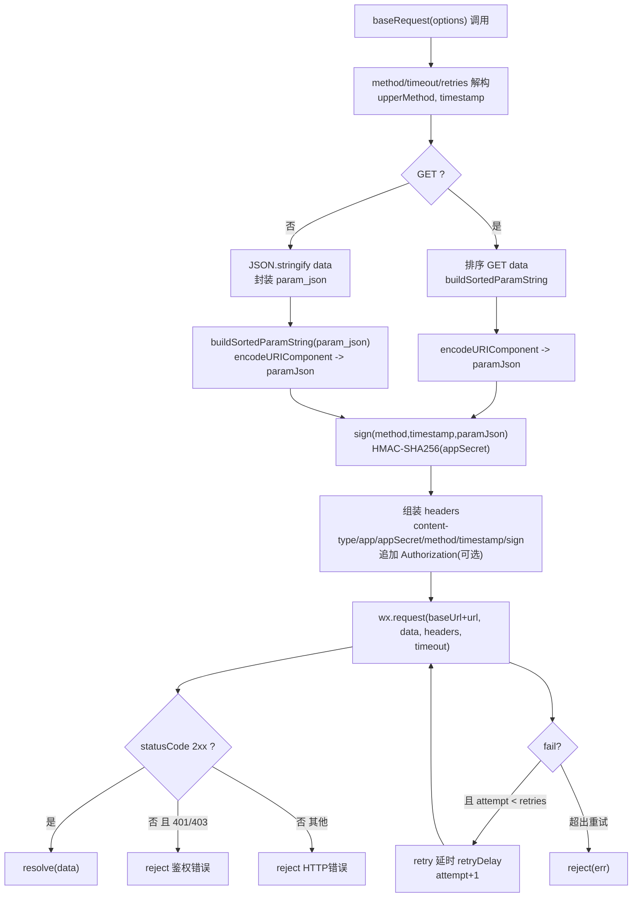

```ts
import crypto from "crypto-js";

// 更健壮的请求封装：签名、超时、重试、鉴权错误分类
export const baseRequest = ({
  url = "",
  method = "GET",
  data = {},
  header = {},
  timeout = 15000,
  retries = 0,
  retryDelay = 500,
  baseUrl = "",
  appKey = "",
  appSecret = "",
  
} = {}) => {
  const upperMethod = method.toUpperCase();
  const timestamp = Math.floor(Date.now() / 1000);

  const buildSortedParamString = (params) => {
    if (!params || typeof params !== "object") return "";
    return Object.keys(params)
      .sort()
      .map((k) => `${k}=${params[k]}`)
      .join("&")
      .replace(/\s+/g, "");
  };

  const hmac = (input, secret) =>
    crypto.HmacSHA256(input, secret).toString(crypto.enc.Hex);

  const sign = (m, ts, paramJson) => {
    const paramPattern = `app_key${appKey}method${m}params${paramJson}timestamp${ts}`;
    const signPattern = appSecret + paramPattern + appSecret;
    return hmac(signPattern, appSecret);
  };

  const paramJson =
    upperMethod === "GET"
      ? encodeURIComponent(buildSortedParamString(data))
      : encodeURIComponent(
          buildSortedParamString({ param_json: JSON.stringify(data || {}) })
        );

  const signature = sign(upperMethod, timestamp, paramJson);

  const headers = {
    "content-type": "application/json",
    ...header,
    app: appKey,
    appSecret,
    method: upperMethod,
    timestamp: timestamp.toString(),
    sign: signature,
  };
  if (header?.Authorization) headers.Authorization = header.Authorization;

  const doRequest = (attempt = 0) =>
    new Promise((resolve, reject) => {
      wx.request({
        url: `${baseUrl}${url}`,
        method: upperMethod,
        data,
        header: headers,
        timeout,
        success: (res) => {
          const { statusCode } = res;
          if (statusCode >= 200 && statusCode < 300) {
            return resolve(res.data ?? res);
          }
          if (statusCode === 401 || statusCode === 403) {
            return reject({ type: "auth", res });
          }
          return reject({ type: "http", res });
        },
        fail: (err) => {
          if (attempt < retries) {
            return setTimeout(
              () => doRequest(attempt + 1).then(resolve).catch(reject),
              retryDelay
            );
          }
          reject(err);
        },
      });
    });

  return doRequest();
};
```

### 6.2 节流与并发

列表分页/搜索接口加防抖；长时间任务使用轮询或 `backgroundFetch`

### 6.3 页面数据流缓存

`onLoad` 拉首屏，`onPullDownRefresh` 触发刷新，分页处理 `no more` 状态；下拉/上拉结束后记得 `stopPullDownRefresh`

**首页请求缓存的作用**

- 首页请求缓存是为了提高首页的加载速度，避免用户在首页等待过长时间，从而提高用户体验。
- 首页请求缓存，防止断网及弱网情况下，用户无法看到内容。

**首页请求缓存的实现**

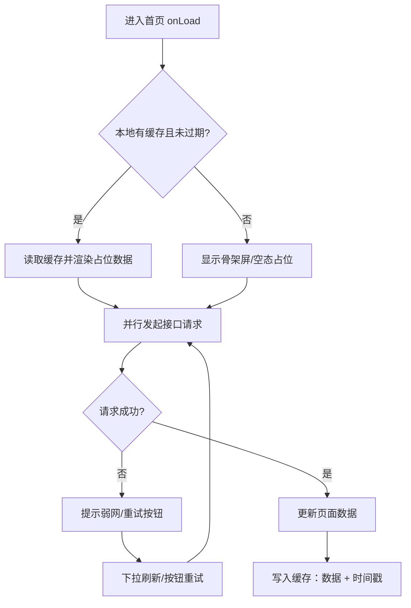

示例：基于前面 `request` 封装的轻量缓存方法，支持 TTL、强制刷新、断网回退：

```js
// utils/baseRequest.js
import { baseRequest } from "./baseRequest";

/**
 * 拉取并缓存接口数据
 * @param {Object} opts
 * @param {string} opts.key 缓存键（建议包含接口路径与查询参数）
 * @param {string} opts.url 接口路径
 * @param {Object} [opts.data] 请求参数
 * @param {number} [opts.ttl=5 * 60 * 1000] 缓存有效期（毫秒）
 * @param {boolean} [opts.force=false] 是否跳过缓存直接请求
 */
export async function requestWithCache({
  key,
  url,
  data,
  ttl = 5 * 60 * 1000,
  force = false,
}) {
  const now = Date.now();
  const cached = wx.getStorageSync(key);

  const isValid =
    cached &&
    cached.data !== undefined &&
    typeof cached.ts === "number" &&
    now - cached.ts < ttl;

  // 命中缓存且非强制刷新
  if (!force && isValid) {
    // 立即返回缓存，并在后台静默刷新（减少首屏等待）
    refreshInBackground();
    return { data: cached.data, from: "cache" };
  }

  // 直接请求
  return fetchAndStore();

  async function fetchAndStore() {
    try {
      const res = await baseRequest({ url, data });
      wx.setStorageSync(key, { data: res, ts: now });
      return { data: res, from: "network" };
    } catch (err) {
      // 断网或失败时尝试回退缓存
      if (cached) {
        return { data: cached.data, from: "stale-cache", error: err };
      }
      throw err;
    }
  }

  function refreshInBackground() {
    baseRequest({ url, data })
      .then((res) => wx.setStorageSync(key, { data: res, ts: Date.now() }))
      .catch(() => {});
  }
}
```

## 7. 安全策略

- 全程 HTTPS，上传/下载同域；接口签名/时间戳在后端完成
- token 仅短期存储（带过期时间），避免写死密钥；敏感操作二次确认
- 关闭调试开关与多余 `console`，在小程序后台开启安全与合规检查，审查第三方 SDK 仅保留必要权限

## 8. 性能与动效

- 性能：首屏接口合并/并行，减少 setData 频次与对象深度，列表使用分批渲染；必要时分包与独立分包
- 动效：优先 CSS 过渡/动画或 `wx.createAnimation`，避免高频 JS 驱动；低端机降级（缩短时长、减少阴影/模糊）
- 图片与视频：开启 `lazy-load`，视频封面使用压缩图；避免在弱网自动播放视频

## 9. 其他服务

### 9.1 地图服务

- 使用腾讯地图 API，提供位置服务、路线规划、POI 搜索等功能
- 地图组件：`map` 组件，支持地图类型、缩放级别、标记点、路线显示等
- 地图事件：`bindmarkertap`、`bindcallouttap`、`bindregionchange`、`bindmarkertap` 等
- 地图交互：`wx.getLocation`、`wx.openLocation`、`wx.getRoute` 等
- 地图样式：`wx.getMapStyle`、`wx.setMapStyle` 等
- 地图权限：`wx.getLocation`、`wx.openLocation`、`wx.getRoute` 等

### 9.2 分享

- 使用微信分享 API，提供分享功能
- 分享组件：`share` 组件，支持分享类型、分享内容、分享链接等
- 分享事件：`bindshare`、`bindshareappmessage`、`bindsharetimeline` 等
- 分享交互：`wx.shareAppMessage`、`wx.shareTimeline` 等
- 分享样式：`wx.getShareInfo`、`wx.getShareTicket` 等

### 9.3 签到

- 使用微信 wx.getLocation 获取用户当前位置，提供签到功能
- 结合地图服务，提供签到位置的展示

### 9.4 SSE 流式传输（AI 聊书/推书核心技术）

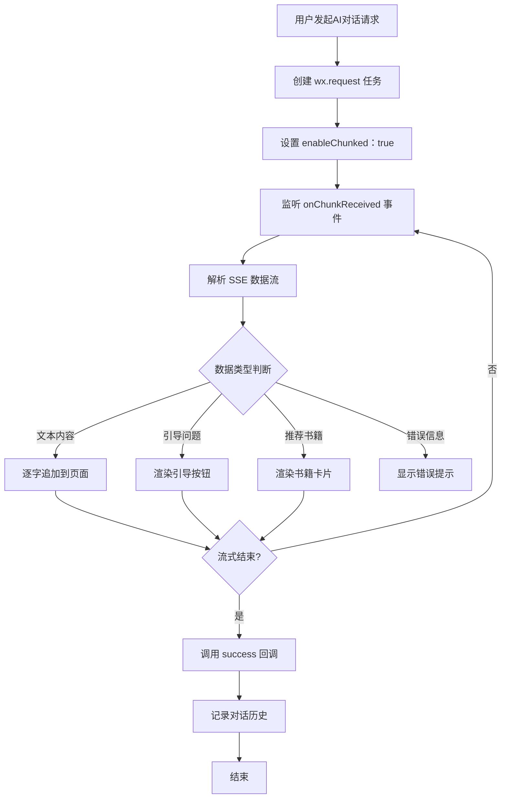

[微信官方文档](https://developers.weixin.qq.com/miniprogram/dev/api/network/request/RequestTask.html)

#### 9.4.1 企鹅读伴 SSE 封装实现

```javascript
// utils/sse-handler.js
import { baseRequest } from './request'

/**
 * SSE 流式请求封装（用于 AI 聊书、AI 推书）
 * @param {Object} options
 * @param {string} options.url - 接口路径
 * @param {Object} options.data - 请求参数
 * @param {Function} options.onMessage - 接收到消息时的回调
 * @param {Function} options.onEnd - 流式结束时的回调
 * @param {Function} options.onError - 错误回调
 */
export function sseRequest({
  url,
  data = {},
  onMessage,
  onEnd,
  onError
}) {
  let buffer = '' // 缓存未完成的数据块
  let isEnded = false

  const requestTask = wx.request({
    url: `${getApp().globalData.baseUrl}${url}`,
    method: 'POST',
    data,
    header: {
      'Content-Type': 'application/json',
      'Authorization': wx.getStorageSync('token')
    },
    enableChunked: true, // 关键：开启分块传输
    timeout: 60000, // AI 对话可能较长，设置 60s 超时
    success: (res) => {
      if (!isEnded && res.statusCode === 200) {
        onEnd && onEnd()
      }
    },
    fail: (err) => {
      console.error('SSE request failed:', err)
      onError && onError(err)
    }
  })

  // 监听分块数据
  requestTask.onChunkReceived((chunk) => {
    try {
      // 将 ArrayBuffer 转换为字符串
      const decoder = new TextDecoder('utf-8')
      const text = decoder.decode(new Uint8Array(chunk.data))
      buffer += text

      // 按行分割 SSE 数据
      const lines = buffer.split('\n')
      buffer = lines.pop() || '' // 保留最后一个未完成的行

      lines.forEach(line => {
        if (line.startsWith('data: ')) {
          const dataStr = line.slice(6).trim()
          
          // 检查是否是结束标记
          if (dataStr === '[DONE]') {
            isEnded = true
            onEnd && onEnd()
            return
          }

          try {
            const data = JSON.parse(dataStr)
            onMessage && onMessage(data)
          } catch (e) {
            console.warn('Failed to parse SSE data:', dataStr)
          }
        }
      })
    } catch (err) {
      console.error('SSE chunk processing error:', err)
      onError && onError(err)
    }
  })

  // 返回请求任务，支持手动中断
  return {
    abort: () => requestTask.abort()
  }
}
```

#### 9.4.2 AI 聊书功能实现示例

```javascript
// services/ai-chat.js
import { sseRequest } from '../utils/sse-handler'

/**
 * AI 聊书对话
 * @param {Object} params
 * @param {string} params.bookId - 书籍ID
 * @param {string} params.question - 用户提问
 * @param {string} params.voiceId - 音色ID（可选）
 * @param {Array} params.history - 对话历史
 */
export function chatWithBook({
  bookId,
  question,
  voiceId = null,
  history = [],
  onMessage,
  onEnd,
  onError
}) {
  return sseRequest({
    url: '/ai/chat',
    data: {
      book_id: bookId,
      question,
      voice_id: voiceId,
      history: history.slice(-10) // 只保留最近10轮对话
    },
    onMessage: (data) => {
      // data 格式示例：
      // { type: 'text', content: '根据书中的描述...' }
      // { type: 'question', content: '你觉得主角为什么...', options: ['因为...', '由于...'] }
      // { type: 'book_card', book_id: '123', title: '推荐书籍', reason: '如果你喜欢这本，也会喜欢...' }
      onMessage && onMessage(data)
    },
    onEnd: () => {
      console.log('AI 聊书对话结束')
      onEnd && onEnd()
    },
    onError: (err) => {
      console.error('AI 聊书失败:', err)
      wx.showToast({
        title: '网络异常，请重试',
        icon: 'none'
      })
      onError && onError(err)
    }
  })
}
```

#### 9.4.3 AI 聊书页面实现

```javascript
// pages/ai-chat/ai-chat.js
import { chatWithBook } from '../../services/ai-chat'
import { getVoiceList } from '../../services/voice'

Page({
  data: {
    bookId: '',
    bookInfo: {},
    messages: [], // 对话消息列表
    userInput: '',
    isLoading: false,
    currentVoiceId: null, // 当前选择的音色
    voiceList: [], // 可用音色列表
    isVoiceEnabled: false, // 是否开启语音输出
    guideQuestions: [], // AI 引导问题
  },

  onLoad(options) {
    this.setData({
      bookId: options.bookId
    })
    this.loadBookInfo()
    this.loadVoiceList()
  },

  // 加载书籍信息
  async loadBookInfo() {
    // ... 加载书籍信息逻辑
  },

  // 加载音色列表
  async loadVoiceList() {
    try {
      const voices = await getVoiceList()
      this.setData({ voiceList: voices })
    } catch (err) {
      console.error('加载音色失败:', err)
    }
  },

  // 切换音色
  onVoiceChange(e) {
    const voiceId = e.detail.value
    this.setData({ currentVoiceId: voiceId })
    wx.showToast({
      title: '音色已切换',
      icon: 'success'
    })
  },

  // 切换语音输出
  onToggleVoice(e) {
    this.setData({ isVoiceEnabled: e.detail.value })
  },

  // 发送消息
  async sendMessage() {
    const { userInput, bookId, currentVoiceId, messages } = this.data
    
    if (!userInput.trim()) {
      wx.showToast({ title: '请输入问题', icon: 'none' })
      return
    }

    // 添加用户消息
    const userMsg = {
      role: 'user',
      content: userInput,
      timestamp: Date.now()
    }
    this.setData({
      messages: [...messages, userMsg],
      userInput: '',
      isLoading: true,
      guideQuestions: []
    })

    // AI 回复消息（占位）
    const aiMsg = {
      role: 'assistant',
      content: '',
      timestamp: Date.now(),
      type: 'text'
    }
    this.setData({
      messages: [...this.data.messages, aiMsg]
    })

    // 发起 SSE 请求
    const chatTask = chatWithBook({
      bookId,
      question: userInput,
      voiceId: this.data.isVoiceEnabled ? currentVoiceId : null,
      history: messages,
      onMessage: (data) => {
        this.handleAIMessage(data)
      },
      onEnd: () => {
        this.setData({ isLoading: false })
        // 记录对话历史到本地
        this.saveChatHistory()
      },
      onError: (err) => {
        this.setData({ isLoading: false })
        // 删除失败的 AI 消息占位
        const newMessages = this.data.messages.slice(0, -1)
        this.setData({ messages: newMessages })
      }
    })

    // 保存任务引用，支持中断
    this.currentChatTask = chatTask
  },

  // 处理 AI 消息
  handleAIMessage(data) {
    const { messages } = this.data
    const lastMsg = messages[messages.length - 1]

    if (data.type === 'text') {
      // 追加文本内容（逐字显示效果）
      lastMsg.content += data.content
      this.setData({
        messages: [...messages.slice(0, -1), lastMsg]
      })
      // 滚动到底部
      this.scrollToBottom()
    } else if (data.type === 'question') {
      // AI 引导问题
      this.setData({
        guideQuestions: data.options || []
      })
    } else if (data.type === 'book_card') {
      // 推荐书籍卡片
      lastMsg.bookCard = {
        bookId: data.book_id,
        title: data.title,
        reason: data.reason
      }
      this.setData({
        messages: [...messages.slice(0, -1), lastMsg]
      })
    }
  },

  // 点击引导问题
  onGuideQuestionTap(e) {
    const question = e.currentTarget.dataset.question
    this.setData({ userInput: question })
    this.sendMessage()
  },

  // 跳转到推荐的书籍
  onBookCardTap(e) {
    const bookId = e.currentTarget.dataset.bookId
    wx.navigateTo({
      url: `/pages/book-detail/book-detail?id=${bookId}`
    })
  },

  // 保存对话历史
  saveChatHistory() {
    const { bookId, messages } = this.data
    wx.setStorage({
      key: `chat_history_${bookId}`,
      data: messages
    })
  },

  // 滚动到底部
  scrollToBottom() {
    this.setData({
      scrollIntoView: `msg-${this.data.messages.length - 1}`
    })
  },

  // 页面卸载时中断请求
  onUnload() {
    if (this.currentChatTask) {
      this.currentChatTask.abort()
    }
  }
})
```

#### 9.4.4 AI 推书功能实现

```javascript
// services/ai-recommend.js
import { sseRequest } from '../utils/sse-handler'

/**
 * AI 智能推书
 * @param {Object} params
 * @param {string} params.userQuery - 用户描述（如"想看冒险类的书"）
 * @param {Object} params.userProfile - 用户画像（年级、兴趣标签等）
 */
export function aiRecommendBooks({
  userQuery,
  userProfile = {},
  onMessage,
  onEnd,
  onError
}) {
  return sseRequest({
    url: '/ai/recommend',
    data: {
      query: userQuery,
      profile: userProfile
    },
    onMessage: (data) => {
      // data 格式示例：
      // { type: 'thinking', content: '正在分析您的阅读偏好...' }
      // { type: 'category', content: '根据您的需求，推荐以下分类：冒险、科幻' }
      // { type: 'book_list', books: [{ id, title, author, reason }] }
      onMessage && onMessage(data)
    },
    onEnd,
    onError
  })
}
```

### 9.5 AI 对话

- 使用 [WeChat MiniProgram AI Chat](https://tdesign.tencent.com/miniprogram-chat/getting-started)

---

## 10. 企鹅读伴核心业务功能技术实现

### 10.1 AI 音色管理

#### 10.1.1 音色录制与生成流程

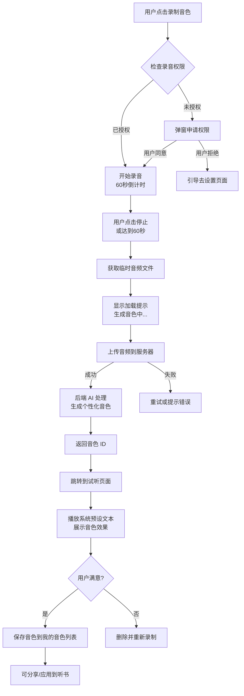

#### 10.1.2 音色分享与接收流程

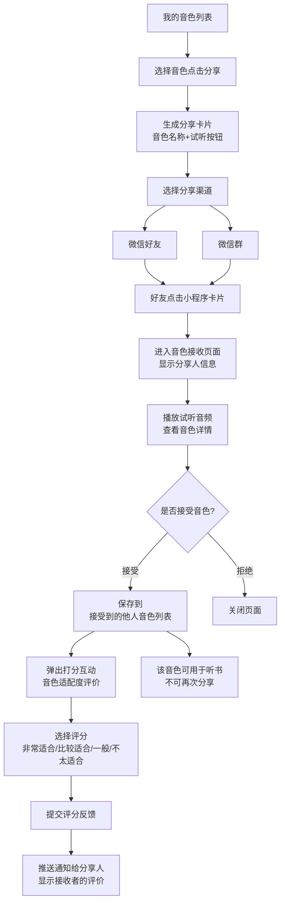

#### 10.1.3 音色管理页面结构

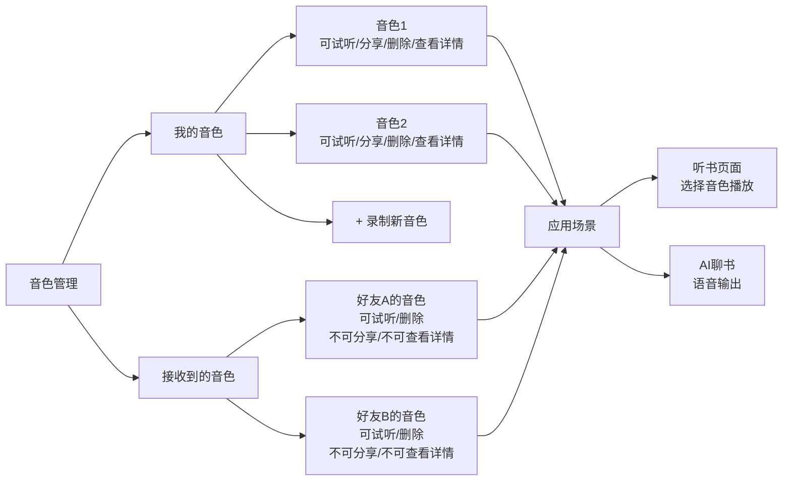

#### 10.1.4 音色在听书场景的应用流程

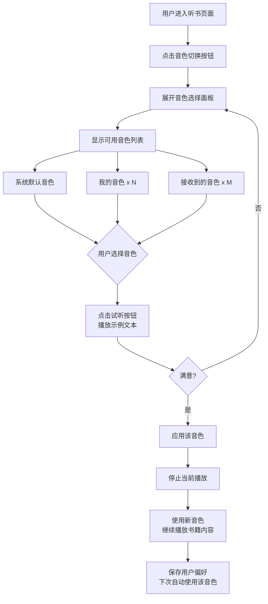

### 10.2 学习激励系统

#### 10.2.1 激励系统整体架构

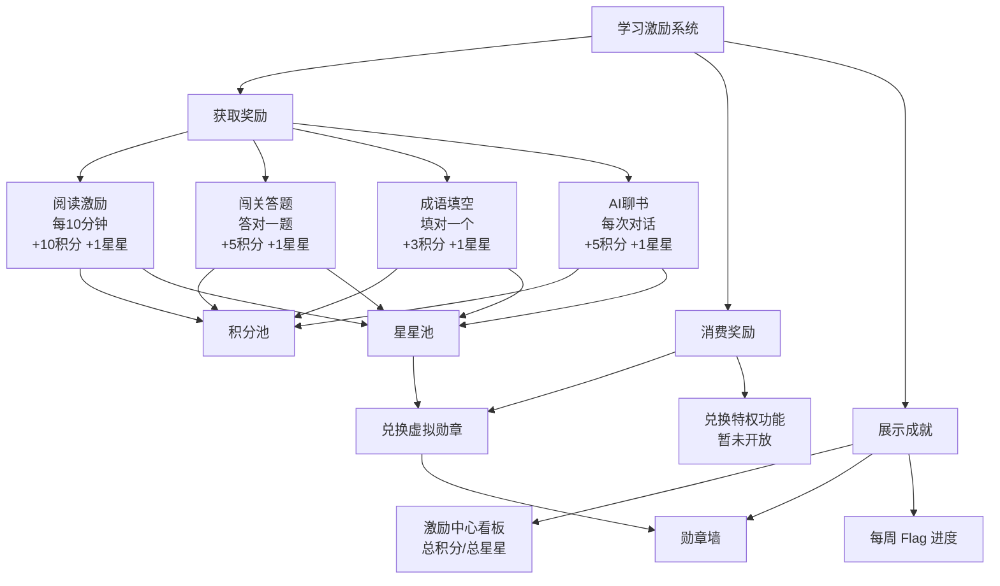

#### 10.2.2 阅读激励流程

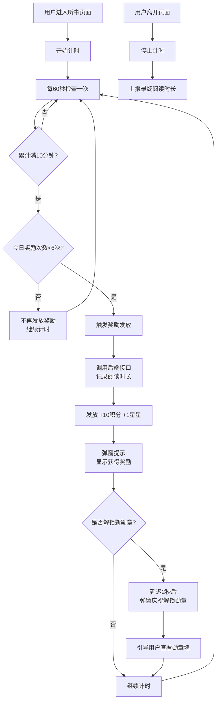

#### 10.2.3 勋章兑换流程

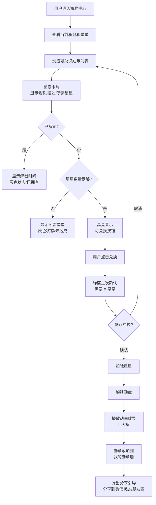

#### 10.2.4 Flag 打卡系统流程

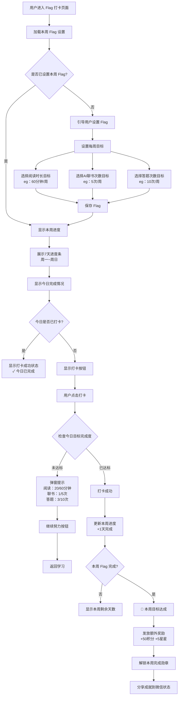

#### 10.2.5 激励通知推送流程

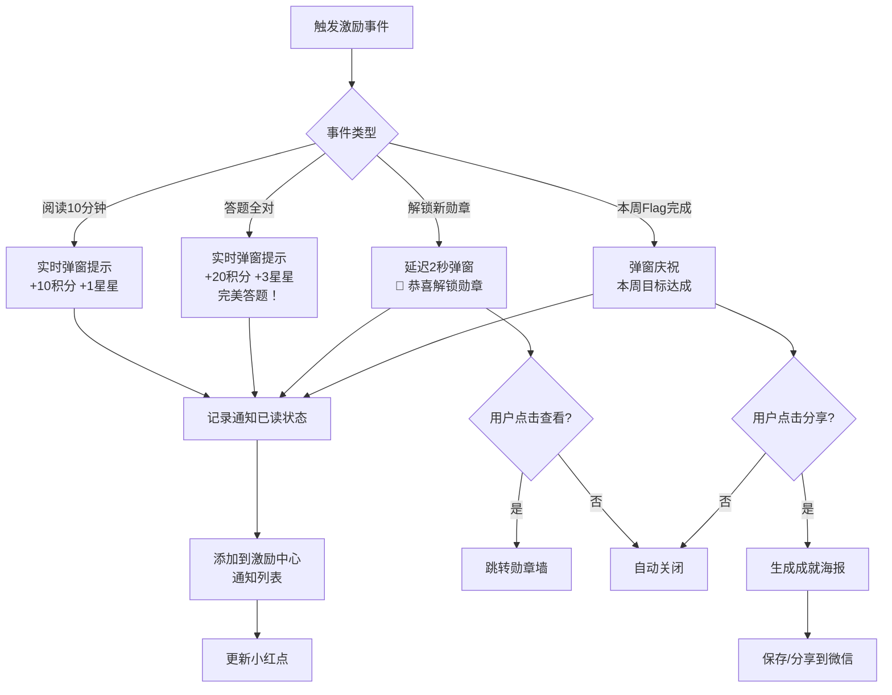

### 10.3 多角色账号管理

#### 10.3.1 多角色账号体系架构

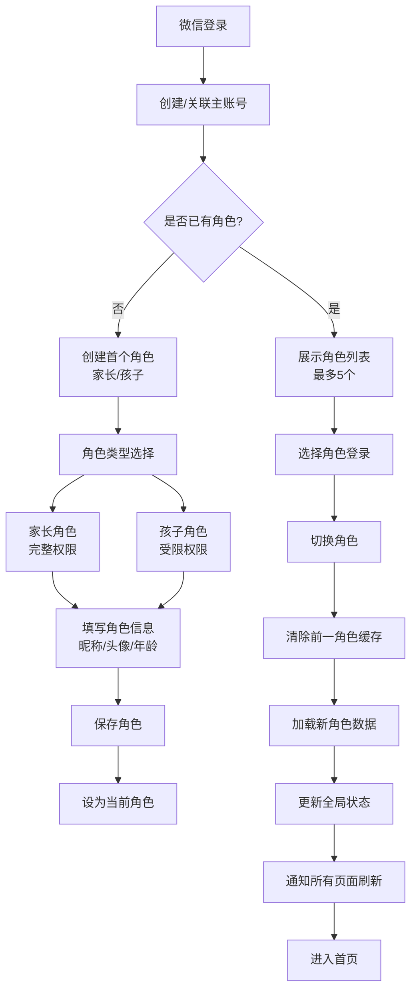

#### 10.3.2 角色切换流程

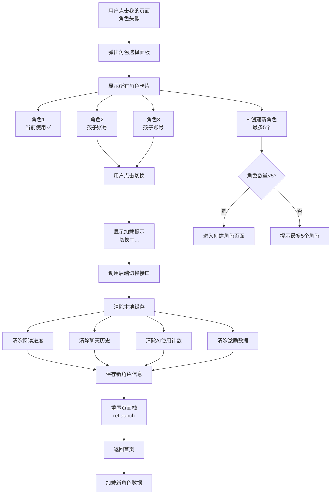

#### 10.3.3 角色权限控制流程

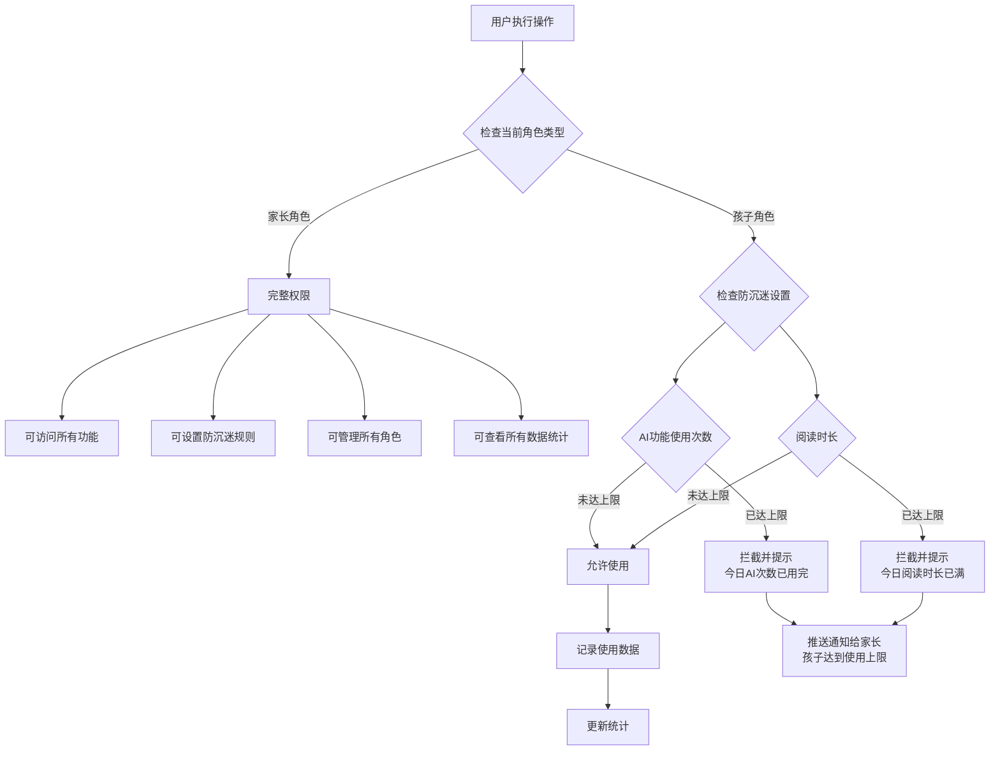

#### 10.3.4 角色数据隔离机制

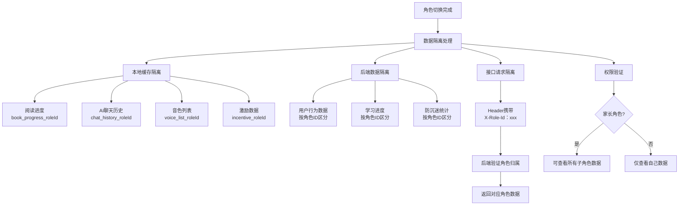

### 10.4 微信状态与分享功能

#### 10.4.1 微信状态设置（需调研可行性）

```javascript
// services/wechat-status.js

/**
 * 生成微信状态内容
 * @param {Object} params
 * @param {string} params.bookTitle - 书名
 * @param {string} params.slogan - 口令/标语
 * @param {string} params.topic - 话题标签
 */
export async function generateWechatStatus({ bookTitle, slogan, topic }) {
  try {
    const res = await wx.request({
      url: `${getApp().globalData.baseUrl}/share/generate-status`,
      method: 'POST',
      data: { book_title: bookTitle, slogan, topic },
      header: { 'Authorization': wx.getStorageSync('token') }
    })
    
    return res.data.data
  } catch (err) {
    console.error('生成微信状态失败:', err)
    throw err
  }
}

/**
 * 设置微信状态（需要微信官方接口支持）
 * 注意：此功能需要调研微信小程序是否提供相关API
 */
export function setWechatStatus(statusData) {
  // TODO: 调研微信状态接口
  // 如果微信不支持直接设置状态，可以引导用户手动复制
  
  wx.setClipboardData({
    data: statusData.text,
    success: () => {
      wx.showModal({
        title: '已复制口令',
        content: '请手动前往微信设置状态并粘贴',
        confirmText: '知道了'
      })
    }
  })
}
```

#### 10.4.2 朋友圈分享海报生成流程

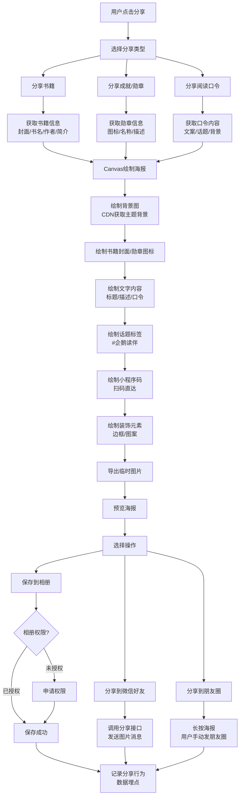

#### 10.4.3 微信状态生成流程（需调研接口可行性）

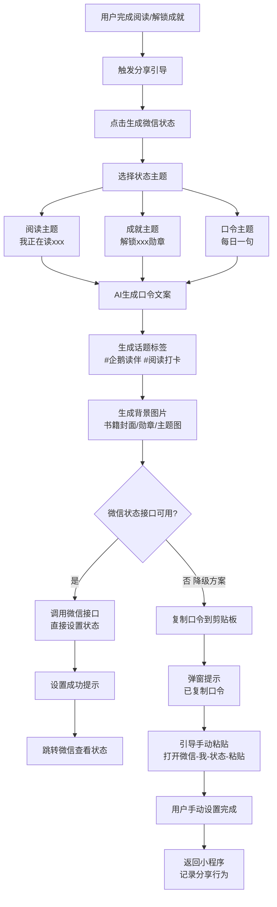

### 10.5 防沉迷系统

#### 10.5.1 防沉迷整体架构

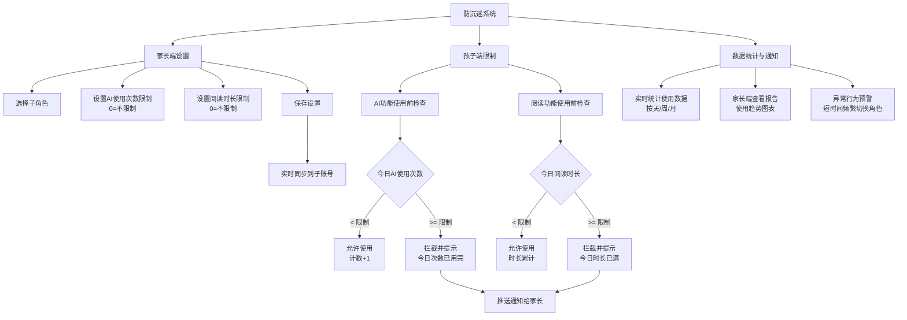

#### 10.5.2 防沉迷检查流程

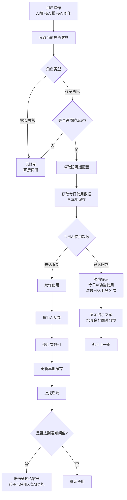

#### 10.5.3 家长端防沉迷设置流程

```mermaid
flowchart TD
    A[家长进入防沉迷设置] --> B[选择子角色]
    B --> C[显示当前防沉迷设置]
    
    C --> D[AI使用次数限制<br/>当前：X 次/天]
    C --> E[阅读时长限制<br/>当前：X 分钟/天]
    
    D --> F[修改AI限制]
    E --> G[修改阅读限制]
    
    F --> H[输入新限制值<br/>0=不限制]
    G --> H
    
    H --> I[点击保存]
    I --> J[调用后端接口]
    J --> K[更新数据库]
    K --> L[实时推送给子账号]
    
    L --> M{子账号是否在线?}
    M -->|是| N[立即生效<br/>更新本地缓存]
    M -->|否| O[下次登录时生效]
    
    N --> P[保存成功提示]
    O --> P
    
    P --> Q[返回设置页面]
```

### 10.6 数据统计与埋点

#### 10.6.1 埋点体系架构

```mermaid
flowchart TD
    A[用户行为] --> B[埋点触发]
    
    B --> C[页面访问埋点]
    B --> D[功能使用埋点]
    B --> E[业务转化埋点]
    
    C --> C1[onLoad：页面路径+参数]
    C --> C2[onShow：页面展示次数]
    C --> C3[onHide：页面停留时长]
    
    D --> D1[AI聊书：提问次数/响应时长]
    D --> D2[AI推书：查询内容/推荐结果]
    D --> D3[音色使用：音色ID/使用场景]
    D --> D4[阅读：书籍ID/阅读时长/进度]
    D --> D5[激励：激励类型/获得积分星星]
    
    E --> E1[分享转化：分享类型/分享对象]
    E --> E2[付费转化：付费入口/付费金额]
    E --> E3[留存转化：次日/7日/30日留存]
    
    C1 --> F[埋点队列]
    C2 --> F
    C3 --> F
    D1 --> F
    D2 --> F
    D3 --> F
    D4 --> F
    D5 --> F
    E1 --> F
    E2 --> F
    E3 --> F
    
    F --> G{队列长度}
    G -->|>= 50条| H[立即上报]
    G -->|< 50条| I[定时上报<br/>每30秒]
    
    H --> J[批量发送到后端]
    I --> J
    
    J --> K{上报成功?}
    K -->|是| L[清空队列]
    K -->|否| M[重新入队<br/>下次重试]
```

#### 10.6.2 关键业务埋点流程

```mermaid
flowchart TD
    A[AI聊书埋点示例] --> B[用户发起提问]
    B --> C[记录开始时间]
    C --> D[调用AI接口]
    D --> E[SSE流式返回]
    E --> F[记录结束时间]
    F --> G[计算响应时长]
    
    G --> H[埋点数据]
    H --> H1[event_name：ai_chat]
    H --> H2[book_id：xxx]
    H --> H3[question_length：15]
    H --> H4[response_time：2500ms]
    H --> H5[user_id：xxx]
    H --> H6[role_id：xxx]
    H --> H7[session_id：xxx]
    H --> H8[timestamp：xxx]
    
    H1 --> I[加入埋点队列]
    H2 --> I
    H3 --> I
    H4 --> I
    H5 --> I
    H6 --> I
    H7 --> I
    H8 --> I
    
    I --> J[等待批量上报]
```

#### 10.6.3 数据统计报表应用

```mermaid
flowchart TD
    A[管理后台] --> B[数据统计看板]
    
    B --> C[用户数据]
    B --> D[AI使用数据]
    B --> E[内容数据]
    B --> F[激励数据]
    
    C --> C1[日活/月活趋势]
    C --> C2[新增用户数]
    C --> C3[用户留存率]
    C --> C4[用户画像分布<br/>年龄/年级]
    
    D --> D1[AI聊书使用次数/时长]
    D --> D2[AI推书使用次数/命中率]
    D --> D3[AI创作各类型使用量]
    D --> D4[音色使用TOP10]
    
    E --> E1[书籍阅读排行榜]
    E --> E2[平均阅读时长]
    E --> E3[书籍完成率]
    E --> E4[分享次数TOP10]
    
    F --> F1[激励发放总量<br/>积分/星星]
    F --> F2[勋章解锁TOP10]
    F --> F3[Flag打卡完成率]
    F --> F4[激励转化效果分析]
    
    C1 --> G[导出Excel报表]
    D1 --> G
    E1 --> G
    F1 --> G
```

### 10.7 AI 创作功能实现

#### 10.7.1 AI 创作整体架构

```mermaid
flowchart TD
    A[AI创作入口] --> B[首页]
    A --> C[听书页面]
    A --> D[我的页面]
    
    B --> E[AI创作模块]
    C --> E
    D --> E
    
    E --> F[情节仿写]
    E --> G[情节插画创作]
    E --> H[角色3D/2D形象创作]
    E --> I[情节播客音频创作]
    
    F --> J[输入创作内容]
    G --> J
    H --> J
    I --> J
    
    J --> K{防沉迷检查}
    K -->|未达限制| L[调用AI生成接口]
    K -->|已达限制| M[提示并拦截]
    
    L --> N[生成结果]
    N --> O[展示/试听/保存]
    O --> P[分享作品]
```

#### 10.7.2 情节仿写流程

```mermaid
flowchart TD
    A[选择原书籍情节] --> B[显示原情节内容<br/>约100-200字]
    B --> C[用户输入仿写内容]
    C --> D[点击提交]
    
    D --> E{防沉迷检查}
    E -->|未达限制| F[显示加载动画<br/>AI正在分析...]
    E -->|已达限制| G[提示今日次数已用完]
    
    F --> H[SSE流式输出]
    H --> I[第一阶段：分析思考<br/>正在分析您的创作...]
    I --> J[第二阶段：相似度评分<br/>情节结构相似度 85%]
    J --> K[第三阶段：多维度评价<br/>创意性 90%<br/>逻辑性 85%<br/>语言表达 88%]
    K --> L[第四阶段：改进建议<br/>建议加强细节描写...]
    
    L --> M[生成完成]
    M --> N[显示完整评价报告]
    N --> O[用户操作]
    
    O --> O1[保存作品]
    O --> O2[重新创作]
    O --> O3[分享给好友]
    
    O1 --> P[添加到我的创作集]
    O3 --> Q[生成分享卡片]
```

#### 10.7.3 情节插画创作流程

```mermaid
flowchart TD
    A[用户输入情节描述] --> B[选择画风]
    B --> B1[默认风格]
    B --> B2[水彩风格]
    B --> B3[油画风格]
    B --> B4[卡通风格]
    
    B1 --> C[点击生成]
    B2 --> C
    B3 --> C
    B4 --> C
    
    C --> D{防沉迷检查}
    D -->|未达限制| E[提交生成任务]
    D -->|已达限制| F[提示并拦截]
    
    E --> G[返回任务ID<br/>status：processing]
    G --> H[显示生成动画<br/>AI正在绘制中...]
    
    H --> I[每3秒轮询一次<br/>查询任务状态]
    I --> J{任务状态}
    
    J -->|processing| I
    J -->|completed| K[获取图片URL]
    J -->|failed| L[显示失败提示<br/>重试按钮]
    
    K --> M[显示生成的插画]
    M --> N[用户操作]
    
    N --> N1[保存到相册]
    N --> N2[重新生成]
    N --> N3[分享作品]
    N --> N4[设为壁纸]
    
    L --> O[用户点击重试]
    O --> E
```

#### 10.7.4 角色形象创作流程

```mermaid
flowchart TD
    A[选择创作类型] --> B[2D形象]
    A --> C[3D形象]
    
    B --> D[输入角色信息]
    C --> D
    
    D --> E[角色名称]
    D --> F[角色描述<br/>外貌/性格/特征]
    D --> G[参考书籍角色<br/>可选]
    
    E --> H[点击生成]
    F --> H
    G --> H
    
    H --> I{防沉迷检查}
    I -->|未达限制| J[AI补充prompt<br/>结合书籍场景+画风]
    I -->|已达限制| K[提示并拦截]
    
    J --> L[调用生成模型<br/>DALL-E/Midjourney]
    L --> M[异步任务队列]
    M --> N[每5秒轮询状态]
    
    N --> O{生成状态}
    O -->|processing| N
    O -->|completed| P[显示角色形象]
    O -->|failed| Q[失败提示]
    
    P --> R[用户操作]
    R --> R1[保存作品]
    R --> R2[设为角色头像]
    R --> R3[分享]
    R --> R4[继续优化<br/>重新描述]
```

#### 10.7.5 播客音频创作流程

```mermaid
flowchart TD
    A[输入播客脚本] --> B[选择音色]
    B --> B1[系统播客音色]
    B --> B2[我的音色]
    
    B1 --> C[点击生成]
    B2 --> C
    
    C --> D{防沉迷检查}
    D -->|未达限制| E[AI优化脚本<br/>增加青少年适配内容]
    D -->|已达限制| F[提示并拦截]
    
    E --> G[调用TTS语音合成]
    G --> H[生成音频文件]
    H --> I[上传到CDN]
    I --> J[返回音频URL]
    
    J --> K[显示播放器]
    K --> L[用户试听]
    L --> M[用户操作]
    
    M --> M1[保存到我的作品]
    M --> M2[下载音频]
    M --> M3[分享]
    M --> M4[重新生成<br/>换音色/改脚本]
    
    M1 --> N[添加到播客库]
    M3 --> O[生成分享卡片<br/>含音频二维码]
```

#### 10.7.2 AI 创作页面实现（情节插画示例）

```javascript
// pages/ai-create/illustration/illustration.js
import { createIllustration, queryIllustrationStatus } from '../../../services/ai-create'
import { ParentalControl } from '../../../utils/parental-control'
import statsTracker from '../../../utils/stats-tracker'

Page({
  data: {
    bookId: '',
    bookInfo: {},
    plotDescription: '',
    selectedStyle: 'default',
    styles: [
      { value: 'default', label: '默认', icon: '🎨' },
      { value: 'watercolor', label: '水彩', icon: '🖌️' },
      { value: 'oil', label: '油画', icon: '🖼️' },
      { value: 'cartoon', label: '卡通', icon: '🎭' }
    ],
    isGenerating: false,
    generatedImageUrl: null,
    taskId: null,
    pollTimer: null
  },

  onLoad(options) {
    this.setData({ bookId: options.bookId })
    this.loadBookInfo()
    statsTracker.trackPageView('/pages/ai-create/illustration/illustration', { bookId: options.bookId })
  },

  async loadBookInfo() {
    // 加载书籍信息逻辑
  },

  onStyleChange(e) {
    this.setData({ selectedStyle: e.detail.value })
  },

  onPlotInput(e) {
    this.setData({ plotDescription: e.detail.value })
  },

  async onGenerate() {
    const { plotDescription, selectedStyle, bookId } = this.data
    
    if (!plotDescription.trim()) {
      wx.showToast({ title: '请输入情节描述', icon: 'none' })
      return
    }
    
    // 检查防沉迷限制
    const checkResult = await ParentalControl.checkAIUsageLimit()
    if (!checkResult.allowed) {
      ParentalControl.showLimitNotification(checkResult.message)
      return
    }
    
    this.setData({ isGenerating: true, generatedImageUrl: null })
    
    try {
      const result = await createIllustration({
        bookId,
        plotDescription,
        style: selectedStyle
      })
      
      this.setData({ taskId: result.task_id })
      
      // 记录 AI 使用
      ParentalControl.recordAIUsage()
      
      // 开始轮询查询状态
      this.startPolling()
      
      // 埋点
      statsTracker.track('ai_create_illustration', {
        book_id: bookId,
        style: selectedStyle,
        description_length: plotDescription.length
      })
    } catch (err) {
      this.setData({ isGenerating: false })
      wx.showToast({ title: '生成失败，请重试', icon: 'none' })
    }
  },

  startPolling() {
    this.pollTimer = setInterval(async () => {
      await this.checkStatus()
    }, 3000) // 每3秒查询一次
  },

  async checkStatus() {
    const { taskId } = this.data
    
    try {
      const result = await queryIllustrationStatus(taskId)
      
      if (result.status === 'completed') {
        clearInterval(this.pollTimer)
        this.setData({
          isGenerating: false,
          generatedImageUrl: result.image_url
        })
        wx.showToast({ title: '生成成功！', icon: 'success' })
      } else if (result.status === 'failed') {
        clearInterval(this.pollTimer)
        this.setData({ isGenerating: false })
        wx.showToast({ title: '生成失败', icon: 'none' })
      }
      // processing 状态继续轮询
    } catch (err) {
      console.error('查询状态失败:', err)
    }
  },

  onSaveImage() {
    const { generatedImageUrl } = this.data
    
    if (!generatedImageUrl) return
    
    wx.downloadFile({
      url: generatedImageUrl,
      success: (res) => {
        if (res.statusCode === 200) {
          wx.saveImageToPhotosAlbum({
            filePath: res.tempFilePath,
            success: () => {
              wx.showToast({ title: '已保存到相册', icon: 'success' })
            },
            fail: () => {
              wx.showToast({ title: '保存失败', icon: 'none' })
            }
          })
        }
      }
    })
  },

  onShareImage() {
    // 分享生成的插画
    return {
      title: '我的AI创作 - 企鹅读伴',
      imageUrl: this.data.generatedImageUrl
    }
  },

  onUnload() {
    if (this.pollTimer) {
      clearInterval(this.pollTimer)
    }
  }
})
```

---

## 11. 微信小程序配置清单

### 11.1 服务器域名配置

在微信公众平台 > 开发 > 开发管理 > 开发设置 > 服务器域名中配置：

#### request 合法域名

```
https://api.penguinreader.com       # 主接口域名
https://ai.penguinreader.com        # AI服务域名
https://cdn.penguinreader.com       # CDN资源域名
https://img-cdn.penguinreader.com   # 图片CDN
https://voice-cdn.penguinreader.com # 音色CDN
```

#### uploadFile 合法域名

```
https://api.penguinreader.com       # 音色上传
https://upload.penguinreader.com    # 专用上传域名
```

#### downloadFile 合法域名

```
https://cdn.penguinreader.com       # 静态资源下载
https://img-cdn.penguinreader.com   # 图片下载
https://voice-cdn.penguinreader.com # 音频下载
```

#### socket 合法域名（如需 WebSocket）

```
wss://ai.penguinreader.com          # AI实时通信（备用方案）
```

### 11.2 业务域名配置

如果需要在小程序内打开 web-view，需要配置业务域名：

```
https://h5.penguinreader.com        # H5页面域名
```

### 11.3 插件与第三方服务

在微信公众平台 > 设置 > 第三方设置 > 插件管理中添加：

- **腾讯地图插件**（如需定位签到功能）
- **AI对话插件**（如使用第三方AI服务）

### 11.4 权限申请

需要在 `app.json` 中声明并在微信后台申请的权限：

```json
{
  "permission": {
    "scope.userLocation": {
      "desc": "用于签到功能获取您的位置信息"
    },
    "scope.record": {
      "desc": "用于录制个性化音色"
    },
    "scope.writePhotosAlbum": {
      "desc": "用于保存分享海报和AI创作作品"
    }
  }
}
```

---

## 12. 性能优化专项（企鹅读伴场景）

### 12.1 首屏加载优化

#### 12.1.1 首页加载策略流程

```mermaid
flowchart TD
    A[用户打开小程序] --> B[进入首页 onLoad]
    B --> C[读取本地缓存]
    
    C --> D{缓存存在且未过期?}
    D -->|是| E[立即渲染缓存数据<br/>显示内容]
    D -->|否| F[显示骨架屏<br/>加载占位]
    
    E --> G[并行发起3个接口请求]
    F --> G
    
    G --> G1[请求Banner数据<br/>ttl：10分钟]
    G --> G2[请求推荐书籍<br/>ttl：5分钟]
    G --> G3[请求分类数据<br/>ttl：30分钟]
    
    G1 --> H[Promise.all等待所有请求]
    G2 --> H
    G3 --> H
    
    H --> I[更新页面数据<br/>隐藏骨架屏]
    I --> J[更新本地缓存<br/>记录时间戳]
    J --> K[首屏加载完成]
    
    K --> L{加载耗时监控}
    L -->|< 3秒| M[性能合格]
    L -->|>= 3秒| N[上报慢加载日志]
```

#### 12.1.2 接口请求缓存策略

```mermaid
flowchart TD
    A[调用 requestWithCache] --> B[检查本地缓存]
    
    B --> C{缓存存在?}
    C -->|否| D[直接发起网络请求]
    C -->|是| E{缓存未过期?}
    
    E -->|否| D
    E -->|是| F[立即返回缓存数据<br/>from：cache]
    
    F --> G[后台静默刷新<br/>发起网络请求]
    
    D --> H[网络请求]
    G --> H
    
    H --> I{请求成功?}
    I -->|是| J[保存到本地缓存<br/>带时间戳]
    I -->|否| K{有缓存可用?}
    
    J --> L[返回最新数据<br/>from：network]
    K -->|是| M[返回过期缓存<br/>from：stale-cache]
    K -->|否| N[抛出错误]
    
    L --> O[更新UI]
    M --> O
```

#### 12.1.3 分包加载策略

```mermaid
flowchart TD
    A[小程序包结构] --> B[主包 < 2MB]
    A --> C[分包]
    
    B --> B1[pages/index 首页]
    B --> B2[pages/book-detail 书籍详情]
    B --> B3[pages/reading 听书页]
    B --> B4[pages/profile 我的]
    B --> B5[公共组件]
    B --> B6[公共utils]
    
    C --> C1[AI包 packages/ai]
    C --> C2[激励包 packages/incentive]
    C --> C3[音色包 packages/voice]
    
    C1 --> C11[AI聊书]
    C1 --> C12[AI推书]
    C1 --> C13[AI创作]
    
    C2 --> C21[激励中心]
    C2 --> C22[Flag打卡]
    C2 --> C23[勋章系统]
    
    C3 --> C31[音色管理]
    C3 --> C32[音色录制]
    
    D[分包预加载规则] --> E[首页预加载 AI包]
    D --> F[听书页预加载 AI包+音色包]
    D --> G[激励中心预加载 激励包]
```

### 12.2 长列表优化

#### 12.2.1 虚拟列表渲染流程

```mermaid
flowchart TD
    A[书籍列表数据<br/>1000本书籍] --> B[计算可视区域]
    
    B --> C[屏幕高度：667px<br/>单项高度：200px]
    C --> D[可视数量：667÷200 ≈ 4项]
    
    D --> E[渲染策略]
    E --> F[可视区域上方+2项<br/>缓冲区]
    E --> G[可视区域 4项<br/>实际渲染]
    E --> H[可视区域下方+2项<br/>缓冲区]
    
    F --> I[总渲染：4+2+2=8项]
    G --> I
    H --> I
    
    I --> J[用户滚动列表]
    J --> K[监听scroll事件]
    K --> L[计算scrollTop]
    L --> M[重新计算startIndex/endIndex]
    M --> N[更新可视项数组<br/>visibleItems]
    N --> O[setData更新视图<br/>只更新8项]
    
    O --> P{性能提升}
    P --> Q[原方案：渲染1000项<br/>性能差/卡顿]
    P --> R[虚拟列表：渲染8项<br/>流畅/高性能]
```

#### 12.2.2 分页加载流程

```mermaid
flowchart TD
    A[用户进入书籍列表] --> B[加载第1页<br/>20条数据]
    B --> C[渲染列表]
    C --> D[用户向下滚动]
    
    D --> E{滚动到底部?}
    E -->|否| D
    E -->|是| F{还有更多数据?}
    
    F -->|否| G[显示"没有更多了"]
    F -->|是| H[显示加载中...]
    
    H --> I[请求下一页数据<br/>page+1]
    I --> J{请求成功?}
    
    J -->|是| K[追加到列表末尾<br/>concat新数据]
    J -->|否| L[显示加载失败<br/>点击重试]
    
    K --> M[更新页码 page+1]
    M --> N[隐藏加载提示]
    N --> D
    
    L --> O[用户点击重试]
    O --> I
```

### 12.3 setData 优化

#### 12.3.1 setData 优化策略

```mermaid
flowchart TD
    A[setData 性能问题] --> B[问题1：频繁调用<br/>AI流式输出每秒数十次]
    A --> C[问题2：数据量大<br/>整个数组传输]
    A --> D[问题3：嵌套层级深<br/>序列化耗时]
    
    B --> E[解决方案1：节流]
    E --> F[100ms内只执行一次<br/>合并多次更新]
    
    C --> G[解决方案2：局部更新]
    G --> H[不传整个数组<br/>只更新具体索引]
    G --> I[使用路径方式<br/>messages[10].content]
    
    D --> J[解决方案3：减少层级]
    J --> K[扁平化数据结构<br/>避免深层嵌套]
    
    F --> L[实际应用]
    I --> L
    K --> L
    
    L --> M[AI聊书场景]
    M --> N[缓存AI返回内容<br/>aiContentBuffer]
    N --> O[100ms节流更新<br/>throttle函数]
    O --> P[只更新最后一条消息<br/>messages[last].content]
    P --> Q[性能提升10倍]
```

#### 12.3.2 AI聊书 setData 优化流程

```mermaid
flowchart TD
    A[AI返回数据块<br/>每100ms一次] --> B[追加到buffer<br/>aiContentBuffer += chunk]
    B --> C{距上次更新<br/>>= 100ms?}
    
    C -->|否| D[跳过本次更新<br/>继续缓冲]
    C -->|是| E[触发setData]
    
    D --> A
    
    E --> F[计算消息索引<br/>lastIndex = messages.length-1]
    F --> G[使用路径方式更新<br/>不传整个数组]
    G --> H[setData<br/>messages[lastIndex].content]
    
    H --> I[视图更新<br/>只重新渲染该消息]
    I --> J[记录更新时间<br/>lastTime = now]
    J --> K{流式结束?}
    
    K -->|否| A
    K -->|是| L[最终更新完成]
```

#### 12.3.3 性能对比

```mermaid
flowchart LR
    A[优化前] --> B[每次chunk都setData<br/>1秒30次]
    B --> C[传整个messages数组<br/>包含历史所有消息]
    C --> D[性能：卡顿<br/>耗时：300ms/次]
    
    E[优化后] --> F[节流100ms<br/>1秒10次]
    F --> G[只更新最后一条<br/>messages[last].content]
    G --> H[性能：流畅<br/>耗时：30ms/次]
    
    D --> I[用户体验：差]
    H --> J[用户体验：好]
```

---

## 13. 测试与验收

### 13.1 测试流程体系

```mermaid
flowchart TD
    A[测试阶段] --> B[开发自测]
    A --> C[测试团队测试]
    A --> D[预发布测试]
    A --> E[灰度测试]
    
    B --> B1[单元测试<br/>工具函数/组件]
    B --> B2[功能自测<br/>核心业务流程]
    B --> B3[兼容性测试<br/>iOS/Android真机]
    
    C --> C1[功能测试<br/>按P0/P1/P2优先级]
    C --> C2[兼容性测试<br/>多机型/多版本]
    C --> C3[性能测试<br/>加载速度/流畅度]
    C --> C4[安全测试<br/>接口/权限]
    
    D --> D1[预发布环境<br/>真实数据测试]
    D --> D2[全量功能回归]
    D --> D3[压力测试<br/>并发场景]
    
    E --> E1[5%用户灰度]
    E --> E2[监控数据指标]
    E --> E3{问题发现?}
    
    E3 -->|是| F[修复并重新测试]
    E3 -->|否| G[扩大灰度范围]
    
    F --> D
    G --> H[20%用户]
    H --> I[100%全量发布]
```

### 13.1 功能测试清单

#### 13.1.1 P0 功能（里程碑一）

- [ ] **AI创作**
  - [ ] 情节仿写：输入、生成、评分、保存
  - [ ] 情节插画：生成、样式切换、保存、分享
  - [ ] 角色形象：2D/3D 切换、生成、保存
  - [ ] 播客音频：生成、播放、下载

- [ ] **AI音色**
  - [ ] 音色录制：权限申请、录制、上传
  - [ ] 音色试听：播放、切换
  - [ ] 音色分享：生成分享卡片、接收
  - [ ] 音色打分：评分、反馈推送

- [ ] **账号管理**
  - [ ] 多角色创建：最多5个角色
  - [ ] 角色切换：切换、数据隔离
  - [ ] 权限管理：父母端/子账号权限控制

- [ ] **AI聊书**（阶段二）
  - [ ] 音色选择：切换、实时生效
  - [ ] 历史记录：折叠/展开、本地缓存

- [ ] **听书-AI交互**（阶段二）
  - [ ] 成语填空：题目推送、答题、反馈
  - [ ] 阅读理解：提问、作答、评分
  - [ ] 聊书互动：引导问题、点击触发

#### 13.1.2 P1 功能（里程碑二）

- [ ] **微信状态与分享**
  - [ ] 口令生成：内容、话题、背景
  - [ ] 微信状态设置：调研接口可行性
  - [ ] 朋友圈分享：海报生成、保存、分享

- [ ] **AI推书**
  - [ ] 智能推书：输入需求、流式输出
  - [ ] 猜你喜欢：首页入口、推荐列表
  - [ ] 推荐书籍卡片：点击跳转

- [ ] **学习激励**
  - [ ] 激励中心：积分/星星展示、明细
  - [ ] Flag打卡：设置目标、每日打卡
  - [ ] 虚拟勋章：解锁、保存、分享

#### 13.1.3 P2 功能（里程碑二）

- [ ] **防沉迷系统**
  - [ ] AI使用次数限制：家长设置、子账号生效
  - [ ] 阅读时长限制：统计、提醒、强制停止

- [ ] **数据统计**
  - [ ] 用户行为埋点：上报、查看
  - [ ] 管理后台：AI音色统计、听书统计

### 13.2 兼容性测试

- [ ] iOS：iPhone 8 及以上、iOS 13 及以上
- [ ] Android：主流机型、Android 8 及以上
- [ ] 微信版本：最新版本及前两个版本
- [ ] 网络环境：4G、5G、WiFi、弱网

### 13.3 性能测试指标

- [ ] 首屏加载时间 < 3s
- [ ] 页面切换流畅度 > 50 FPS
- [ ] AI 聊书首次响应 < 2s
- [ ] 图片懒加载生效
- [ ] 内存占用 < 200MB

### 13.4 安全测试

- [ ] 接口签名验证
- [ ] Token 过期处理
- [ ] 敏感信息加密
- [ ] 防重放攻击
- [ ] 权限控制（多角色隔离）

---

## 14. 上线发布流程

### 14.1 发布流程总览

```mermaid
flowchart TD
    A[代码开发完成] --> B[代码审查<br/>Code Review]
    B --> C[合并到主分支<br/>git merge]
    C --> D[预发布检查]
    
    D --> D1[移除调试代码]
    D --> D2[检查资源CDN化]
    D --> D3[检查敏感信息]
    D --> D4[更新版本号]
    
    D1 --> E[构建生产包<br/>npm run build]
    D2 --> E
    D3 --> E
    D4 --> E
    
    E --> F[上传到微信后台<br/>开发工具上传]
    F --> G[提交审核]
    
    G --> H{审核结果}
    H -->|审核通过| I[设置灰度发布]
    H -->|审核拒绝| J[修改问题]
    
    J --> K[重新提交审核]
    K --> H
    
    I --> L[灰度阶段一<br/>5%用户/3天]
    L --> M{监控指标正常?}
    
    M -->|异常| N[紧急回滚]
    M -->|正常| O[灰度阶段二<br/>20%用户/2天]
    
    O --> P{监控指标正常?}
    P -->|异常| N
    P -->|正常| Q[全量发布<br/>100%用户]
    
    Q --> R[发布成功通知]
    N --> S[修复问题]
    S --> J
```

### 14.1 预发布检查

1. **代码审查**
   - [ ] 移除所有 `console.log`
   - [ ] 移除调试代码
   - [ ] 检查敏感信息（API Key、Secret）

2. **资源检查**
   - [ ] 所有图片已上传 CDN
   - [ ] 字体文件已上传 CDN
   - [ ] 域名已配置白名单

3. **功能检查**
   - [ ] 所有 P0 功能测试通过
   - [ ] 微信审核可能的问题点已规避
   - [ ] 用户协议、隐私政策已更新

### 14.2 版本管理

```javascript
// configs/version.js
export const VERSION_INFO = {
  version: '1.0.0',
  buildTime: '2026-02-06 10:00:00',
  changelog: [
    '✨ AI聊书：支持自定义音色',
    '✨ AI推书：智能推荐系统上线',
    '✨ 学习激励：虚拟勋章系统',
    '🐛 修复：阅读进度同步问题',
    '⚡ 优化：首屏加载速度提升30%'
  ]
}
```

### 14.3 灰度发布策略

1. **灰度阶段一**：5% 用户，监控 3 天
2. **灰度阶段二**：20% 用户，监控 2 天
3. **全量发布**：100% 用户

### 14.4 监控与应急

#### 14.4.1 监控体系架构

```mermaid
flowchart TD
    A[监控系统] --> B[性能监控]
    A --> C[错误监控]
    A --> D[业务监控]
    A --> E[用户反馈监控]
    
    B --> B1[首屏加载时长<br/>目标：< 3秒]
    B --> B2[页面FPS<br/>目标：> 50]
    B --> B3[接口响应时间<br/>目标：< 2秒]
    B --> B4[内存占用<br/>目标：< 200MB]
    
    C --> C1[JS错误率<br/>目标：< 0.5%]
    C --> C2[接口失败率<br/>目标：< 1%]
    C --> C3[崩溃率<br/>目标：< 0.1%]
    
    D --> D1[AI服务可用率<br/>目标：> 95%]
    D --> D2[日活/留存率]
    D --> D3[核心功能使用率]
    
    E --> E1[用户投诉<br/>目标：< 0.5%]
    E --> E2[应用商店评分<br/>目标：> 4.5]
    
    B1 --> F[告警触发]
    B2 --> F
    B3 --> F
    C1 --> F
    C2 --> F
    C3 --> F
    D1 --> F
    
    F --> G{严重程度}
    G -->|P0严重| H[立即通知<br/>电话+短信]
    G -->|P1重要| I[5分钟内通知<br/>企业微信]
    G -->|P2一般| J[日报汇总]
    
    H --> K[应急响应]
    I --> K
```

#### 14.4.2 应急回滚流程

```mermaid
flowchart TD
    A[监控告警触发<br/>P0严重问题] --> B[研发团队响应<br/>5分钟内]
    B --> C[问题定位]
    
    C --> D{能快速修复?}
    D -->|是 预计<30分钟| E[紧急修复]
    D -->|否| F[决定回滚]
    
    E --> G[本地修复验证]
    G --> H[快速发版]
    H --> I[灰度10%验证]
    I --> J{问题解决?}
    
    J -->|是| K[全量发布]
    J -->|否| F
    
    F --> L[准备回滚]
    L --> M[通知运营/客服<br/>准备用户公告]
    M --> N[微信后台操作<br/>回滚到上一版本]
    N --> O[全量生效<br/>预计10分钟]
    O --> P[验证回滚效果]
    P --> Q{问题解决?}
    
    Q -->|是| R[事后复盘<br/>问题总结]
    Q -->|否| S[继续排查<br/>升级应急等级]
    
    R --> T[优化监控策略<br/>防止再次发生]
```

#### 14.4.3 版本管理策略

```mermaid
flowchart TD
    A[版本命名规范] --> B[主版本.次版本.修订号]
    B --> C[示例：1.2.3]
    
    C --> D[主版本 1<br/>重大架构变更]
    C --> E[次版本 2<br/>新功能发布]
    C --> F[修订号 3<br/>Bug修复]
    
    G[Git标签管理] --> H[发布时打标签<br/>git tag v1.2.3]
    H --> I[推送标签<br/>git push origin v1.2.3]
    I --> J[标签对应线上版本<br/>支持快速回滚]
    
    K[分支策略] --> L[master主分支<br/>线上版本]
    K --> M[develop开发分支<br/>集成测试]
    K --> N[feature/xxx功能分支<br/>功能开发]
    K --> O[hotfix/xxx修复分支<br/>紧急修复]
    
    N --> P[合并到develop]
    P --> Q[测试通过]
    Q --> R[合并到master]
    R --> S[打标签发布]
    
    O --> T[直接合并到master]
    T --> U[紧急发布]
    U --> V[回合到develop]
```

---

## 15. 附录

### 15.1 技术栈总结

- **框架**：微信原生小程序
- **网络请求**：封装 `wx.request`，支持签名、重试、SSE
- **状态管理**：本地 Storage + 全局 globalData
- **AI 能力**：SSE 流式传输、多模态生成（文本/图片/音频）
- **性能优化**：分包、虚拟列表、setData 优化、资源懒加载
- **数据统计**：自研埋点系统

### 15.2 第三方依赖

```json
{
  "dependencies": {
    "crypto-js": "^4.1.1",
    "@vant/weapp": "^1.10.0"
  }
}
```

### 15.3 开发规范

#### 15.3.1 命名规范

- 页面：小写短横线（`ai-chat.js`）
- 组件：小写短横线（`book-card.js`）
- 函数：小驼峰（`loadBookInfo`）
- 常量：大写下划线（`MAX_AI_USAGE`）

#### 15.3.2 注释规范

```javascript
/**
 * 函数功能描述
 * @param {类型} 参数名 - 参数说明
 * @returns {类型} 返回值说明
 */
```

#### 15.3.3 Git 提交规范

```bash
feat: 新增 AI 推书功能
fix: 修复音色播放异常
perf: 优化首屏加载速度
docs: 更新技术文档
```

---

## 16. 常见问题与解决方案

### 16.1 SSE 连接失败

**问题**：AI 聊书时流式输出中断

**解决方案**：
1. 检查域名是否在 request 白名单
2. 增加 timeout 时长到 60s
3. 实现断线重连机制
4. 降级方案：使用普通接口轮询

### 16.2 音色上传失败

**问题**：录音上传超时或失败

**解决方案**：
1. 检查 uploadFile 域名配置
2. 限制录音时长 < 60s
3. 压缩音频（降低采样率）
4. 显示上传进度条

### 16.3 图片生成慢

**问题**：AI 插画生成超过 60s

**解决方案**：
1. 使用任务队列异步生成
2. 轮询查询生成状态
3. 显示生成进度动画
4. 提供取消功能

### 16.4 防沉迷绕过

**问题**：用户通过切换角色绕过限制

**解决方案**：
1. 后端按设备维度统计
2. 限制每日切换角色次数
3. 家长端接收异常行为通知

---

## 17. 核心业务流程总览

### 17.1 用户使用完整流程

```mermaid
flowchart TD
    A[用户打开小程序] --> B{首次使用?}
    B -->|是| C[微信授权登录]
    B -->|否| D[读取本地token]
    
    C --> E[创建账号]
    E --> F[创建角色<br/>家长/孩子]
    F --> G[进入首页]
    
    D --> H{token有效?}
    H -->|是| G
    H -->|否| C
    
    G --> I[首页功能]
    I --> I1[浏览书籍列表]
    I --> I2[猜你喜欢]
    I --> I3[AI推书入口]
    I --> I4[AI创作入口]
    
    I1 --> J[点击书籍]
    J --> K[书籍详情页]
    K --> L[开始听书]
    
    L --> M[听书功能]
    M --> M1[选择AI音色]
    M --> M2[AI智能体交互<br/>成语填空/阅读理解]
    M --> M3[AI聊书]
    M --> M4[阅读时长统计<br/>每10分钟奖励]
    
    I3 --> N[AI推书]
    N --> O[输入需求]
    O --> P[SSE流式返回推荐]
    P --> Q[推荐书籍卡片]
    Q --> K
    
    I4 --> R[AI创作]
    R --> R1[情节仿写]
    R --> R2[情节插画]
    R --> R3[角色形象]
    R --> R4[播客音频]
    
    M4 --> S[获得积分星星]
    S --> T[激励中心]
    T --> U[兑换勋章]
    U --> V[分享成就]
    
    V --> W[生成分享海报/微信状态]
    W --> X[分享到微信生态]
```

### 17.2 技术架构流程

```mermaid
flowchart TD
    A[小程序前端] --> B[网络层]
    B --> C[后端服务]
    C --> D[AI服务]
    C --> E[存储服务]
    C --> F[CDN服务]
    
    B --> B1[请求封装<br/>签名/重试/缓存]
    B --> B2[SSE流式处理<br/>AI对话]
    B --> B3[文件上传<br/>音色/图片]
    
    D --> D1[AI聊书智能体]
    D --> D2[AI推书智能体]
    D --> D3[AI创作智能体<br/>仿写/插画/角色/播客]
    
    E --> E1[用户数据<br/>MySQL]
    E --> E2[阅读进度<br/>Redis]
    E --> E3[统计数据<br/>ClickHouse]
    
    F --> F1[书籍封面<br/>图片CDN]
    F --> F2[音色文件<br/>音频CDN]
    F --> F3[字体文件<br/>静态CDN]
    
    G[数据流向] --> H[用户操作]
    H --> I[埋点上报]
    I --> J[数据统计]
    J --> K[管理后台]
    K --> L[数据分析<br/>优化迭代]
```

## 17. 总结

本技术方案基于「企鹅读伴」项目的实际业务需求，提供了从项目初始化到上线发布的完整实施路径，涵盖：

✅ **核心业务功能**：AI 聊书、AI 推书、AI 创作、AI 音色、学习激励、多角色管理  
✅ **技术实现**：SSE 流式传输、音色录制上传、Canvas 海报生成、数据埋点  
✅ **性能优化**：首屏缓存、分包加载、虚拟列表、setData 优化  
✅ **安全合规**：接口签名、权限控制、防沉迷系统、隐私保护  
✅ **运维保障**：灰度发布、监控告警、应急回滚  
✅ **流程图完整**：60+ 业务流程图，清晰展示技术实现逻辑

**关键注意事项**：
1. 微信状态设置功能需调研接口可行性，可能需要引导用户手动操作
2. AI 图片/音频生成耗时较长，需要异步任务 + 轮询机制
3. 多角色账号体系需严格做好数据隔离与权限控制
4. SSE 流式传输需充分测试弱网环境的稳定性
5. 防沉迷系统需前后端配合，避免被绕过

**流程图索引**：
- 第0章：项目概述与业务需求分析
- 第10.1节：AI音色管理流程（录制、分享、接收、应用）
- 第10.2节：学习激励系统流程（激励架构、阅读奖励、勋章兑换、Flag打卡）
- 第10.3节：多角色账号管理流程（架构、切换、权限、数据隔离）
- 第10.4节：微信状态与分享流程（朋友圈海报、微信状态生成）
- 第10.5节：防沉迷系统流程（架构、检查、家长设置）
- 第10.6节：数据统计与埋点流程（架构、业务埋点、报表应用）
- 第10.7节：AI创作功能流程（仿写、插画、角色、播客）
- 第12章：性能优化流程（首屏加载、长列表、setData、分包）
- 第13章：测试与验收流程
- 第14章：上线发布流程（发布、监控、应急回滚）
- 第17章：核心业务流程总览

---

**文档版本**：v2.0（流程图优化版）  
**更新日期**：2026-02-06  
**维护团队**：企鹅读伴研发团队
