# 企鹅伴读 - 微信小程序技术方案

> 📱 基于微信小程序原生开发的 AI 语音阅读应用技术方案

## 📊 1. 技术栈选型对比

### 1.1 三大框架对比分析

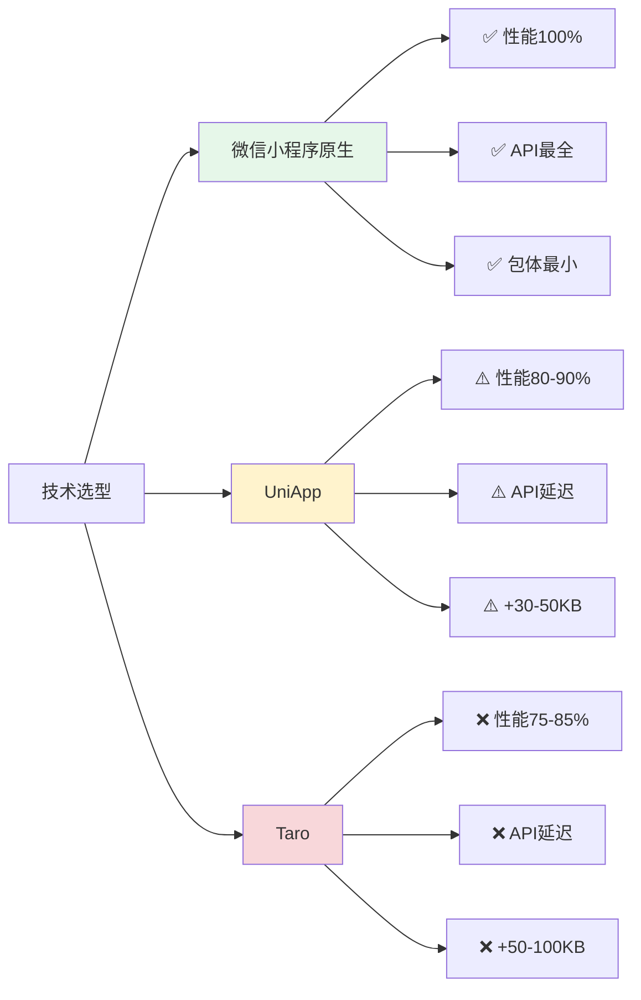

### 1.2 详细对比表

| 对比维度 | 微信小程序原生 | UniApp | Taro |
|---------|--------------|--------|------|
| **性能** | ⭐⭐⭐⭐⭐ 100% | ⭐⭐⭐⭐ 80-90% | ⭐⭐⭐ 75-85% |
| **API支持** | ⭐⭐⭐⭐⭐ 第一时间支持 | ⭐⭐⭐ 延迟2-4周 | ⭐⭐⭐ 延迟4-8周 |
| **包体积** | ⭐⭐⭐⭐⭐ 最小 | ⭐⭐⭐ 额外30-50KB | ⭐⭐⭐ 额外50-100KB |
| **语音API** | ⭐⭐⭐⭐⭐ 完整支持 | ⭐⭐⭐ 部分限制 | ⭐⭐⭐ 部分限制 |
| **后台播放** | ⭐⭐⭐⭐⭐ 原生支持 | ⭐⭐⭐ 需额外配置 | ⭐⭐⭐ 需额外配置 |
| **调试体验** | ⭐⭐⭐⭐⭐ 官方工具 | ⭐⭐⭐ 需额外编译 | ⭐⭐⭐ 需额外编译 |

### 1.3 选择原生开发的核心理由

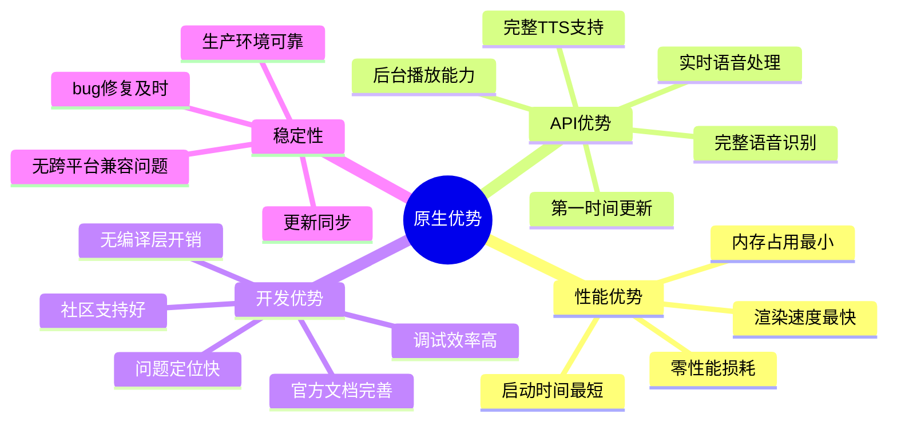

**🎯 关键决策因素：**

1. **语音功能特殊性**：核心功能依赖 `wx.getRecorderManager()`、`wx.createInnerAudioContext()`、`wx.getBackgroundAudioManager()` 等 API
2. **实时性要求**：语音识别、TTS 朗读需要低延迟，跨平台框架转译层会带来额外延迟
3. **后台播放稳定性**：原生支持最可靠，避免兼容性问题
4. **包体积敏感**：需缓存大量音频文件，基础框架越小越好

---

## 🏗️ 2. 系统架构设计

### 2.1 整体架构图

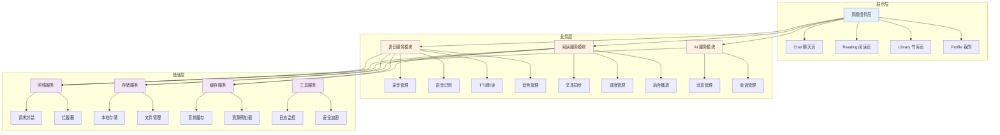

### 2.2 核心模块依赖关系

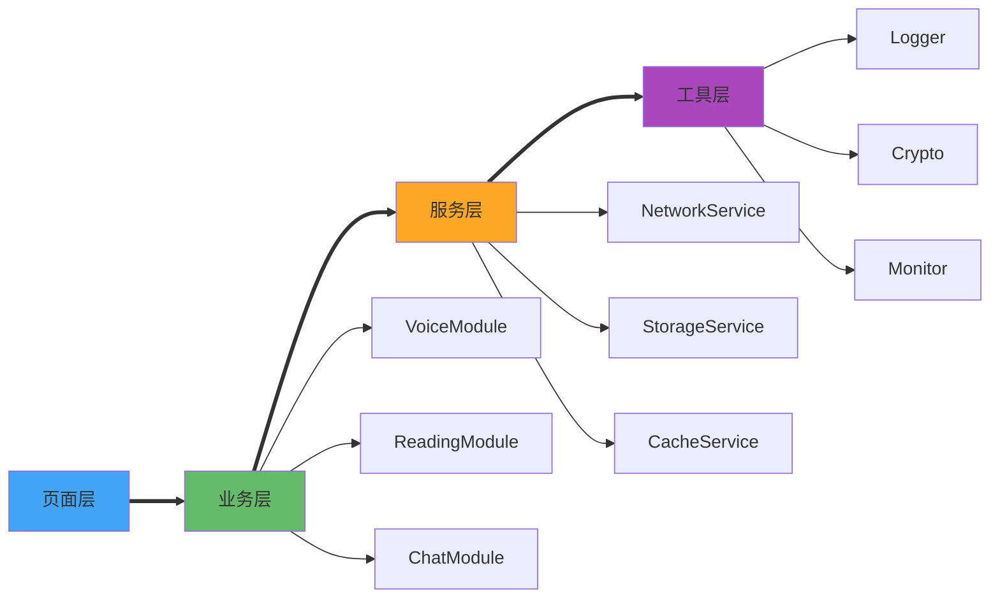

---

## 🎙️ 3. 核心功能实现

### 3.1 AI Chat 功能

#### 3.1.1 交互流程

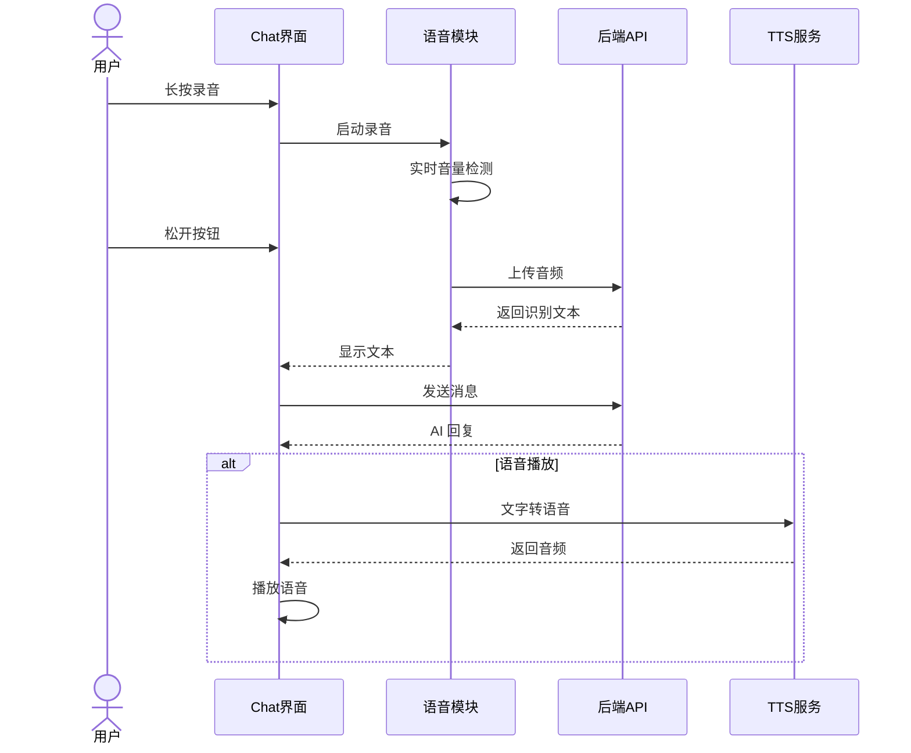

#### 3.1.2 语音识别实现方案

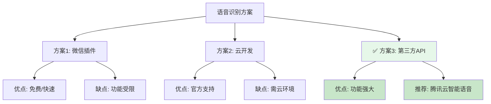

#### 3.1.3 录音核心代码

```javascript
// 录音管理器核心实现（精简版）
class RecorderManager {
  start() {
    this.recorderManager = wx.getRecorderManager()
    this.recorderManager.start({
      duration: 60000,      // 60秒
      sampleRate: 16000,    // 采样率
      format: 'mp3'
    })
    
    // 实时音量监听
    this.recorderManager.onFrameRecorded((res) => {
      this.calculateVolume(res.frameBuffer)
    })
  }
  
  async stop() {
    return new Promise((resolve) => {
      this.recorderManager.onStop((res) => {
        resolve(res.tempFilePath)
      })
      this.recorderManager.stop()
    })
  }
}
```

### 3.2 TTS 语音朗读功能

#### 3.2.1 TTS 实现架构

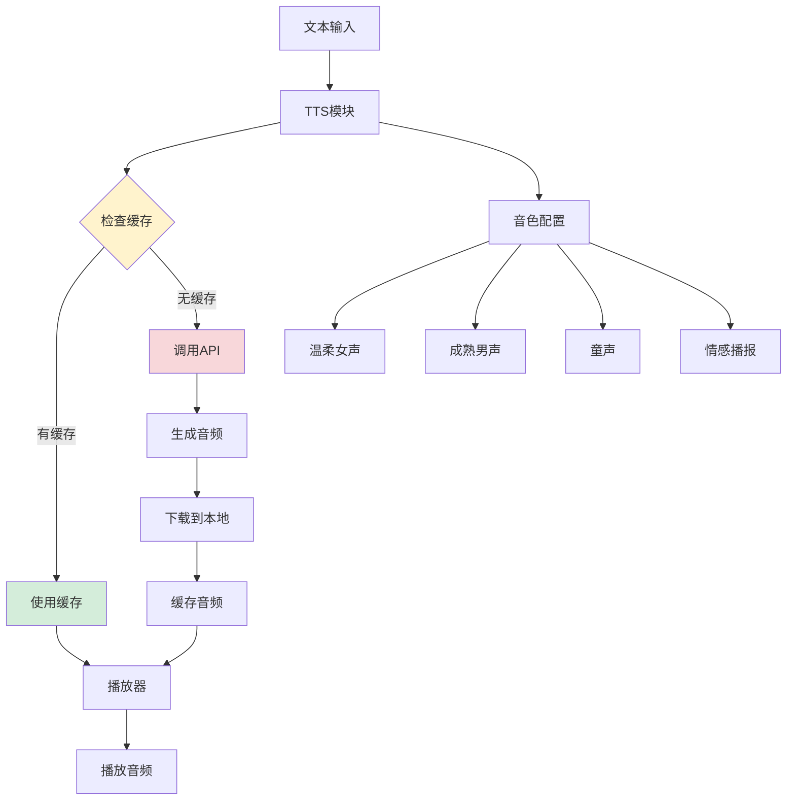

#### 3.2.2 微信小程序 TTS 实现流程

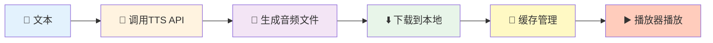

#### 3.2.3 音色自定义架构

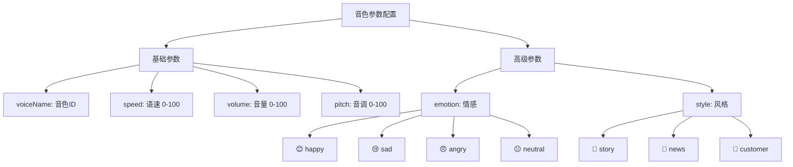

#### 3.2.4 TTS 核心代码

```javascript
// TTS 管理器核心实现（精简版）
class TTSManager {
  async textToSpeech(text, options) {
    // 1. 检查缓存
    const cacheKey = this.getCacheKey(text, options)
    const cached = await this.getCache(cacheKey)
    if (cached) return cached
    
    // 2. 调用后端生成音频
    const audioUrl = await this.generateAudio(text, options)
    
    // 3. 下载并缓存
    const localPath = await this.downloadAudio(audioUrl)
    await this.setCache(cacheKey, localPath)
    
    return localPath
  }
  
  // 音色列表
  voiceList = ['xiaoyan', 'xiaoyu', 'xiaoxin', 'vixm']
}
```

### 3.3 录音功能详解

#### 3.3.1 录音完整流程

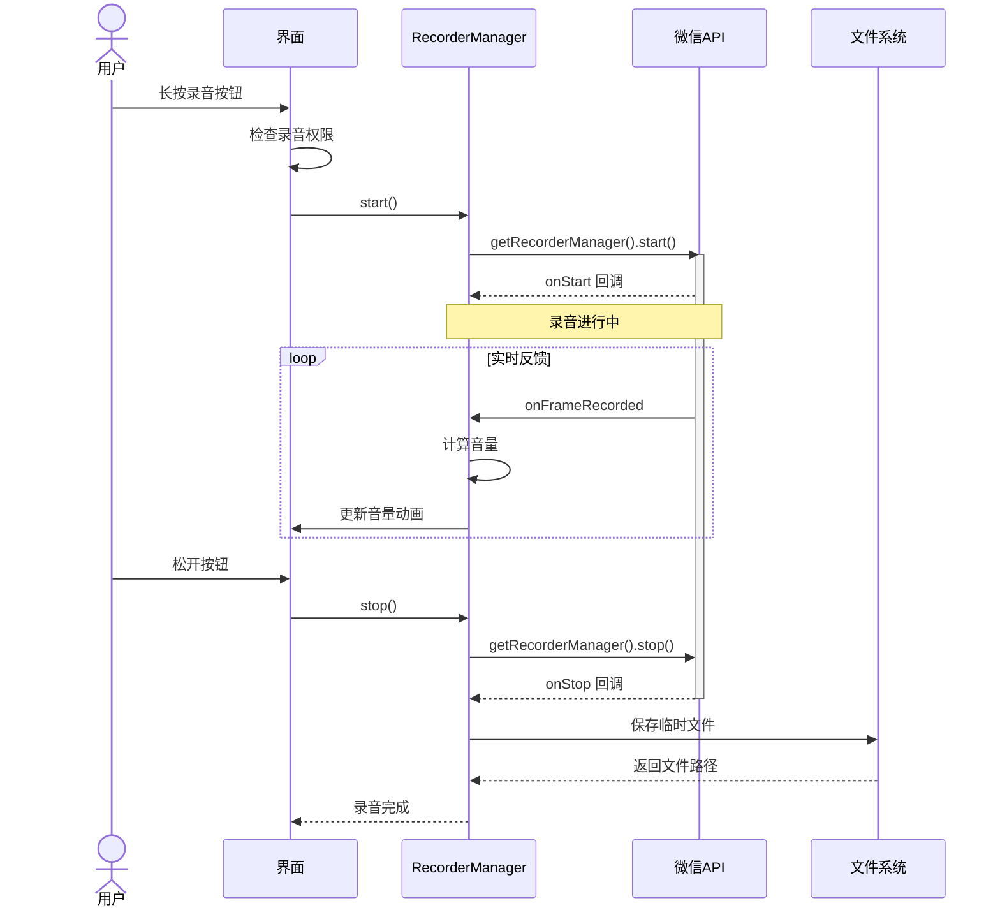

#### 3.3.2 录音权限处理流程

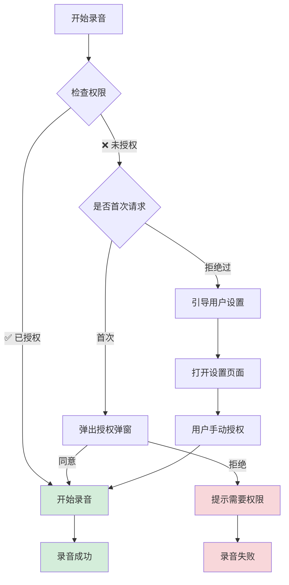

#### 3.3.3 录音组件示例代码

```javascript
// 录音组件核心实现（精简版）
Component({
  methods: {
    async onTouchStart() {
      const hasPermission = await this.checkPermission()
      if (!hasPermission) return
      
      RecorderManager.start()
      this.setData({ isRecording: true })
      this.startTimer()
      wx.vibrateShort()  // 震动反馈
    },
    
    async onTouchEnd() {
      this.stopTimer()
      const result = await RecorderManager.stop()
      this.setData({ isRecording: false })
      
      this.triggerEvent('recordcomplete', result)
    }
  }
})
```

### 3.4 语音读书功能

#### 3.4.1 读书功能整体架构

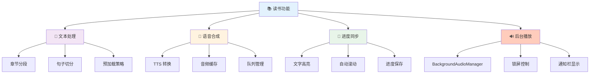

#### 3.4.2 文字与语音同步原理

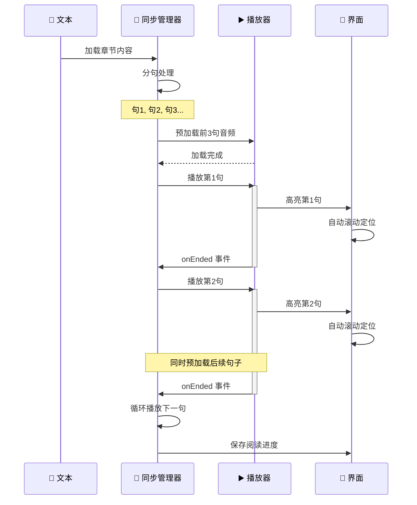

#### 3.4.3 文本分句策略

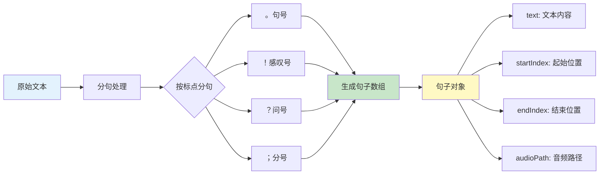

#### 3.4.4 预加载策略

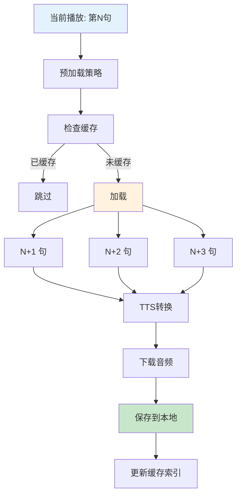

#### 3.4.5 读书管理器核心代码

```javascript
// 阅读管理器核心实现（精简版）
class ReadingManager {
  async loadChapter(book, chapter) {
    const content = await this.fetchContent(chapter.id)
    this.sentences = this.splitSentences(content)
    await this.preloadSentences()  // 预加载前3句
  }
  
  async play(index = 0) {
    const sentence = this.sentences[index]
    
    this.bgAudioManager.title = this.currentChapter.title
    this.bgAudioManager.src = sentence.audioPath
    
    this.triggerEvent('highlight', { index })
    this.preloadNext()  // 预加载后续
  }
  
  onEnded() {
    this.currentIndex++
    if (this.currentIndex < this.sentences.length) {
      this.play(this.currentIndex)
    }
  }
}
```

#### 3.4.6 后台播放详解

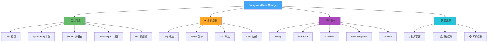

#### 3.4.7 后台播放配置

```json
// app.json 配置
{
  "requiredBackgroundModes": ["audio"],
  "permission": {
    "scope.userLocation": {
      "desc": "用于定位推荐书籍"
    }
  }
}
```

#### 3.4.8 后台播放核心代码

```javascript
// 后台音频服务核心实现（精简版）
class BackgroundAudioService {
  init() {
    this.manager = wx.getBackgroundAudioManager()
    
    this.manager.onPlay(() => this.updateState(true))
    this.manager.onPause(() => this.updateState(false))
    this.manager.onEnded(() => this.playNext())
    this.manager.onTimeUpdate(() => this.saveProgress())
  }
  
  play(audioInfo) {
    this.manager.title = audioInfo.title
    this.manager.epname = audioInfo.epname
    this.manager.coverImgUrl = audioInfo.cover
    this.manager.src = audioInfo.src
  }
}
```

#### 3.4.9 文字高亮同步组件

```xml
<!-- 阅读文本组件 -->
<scroll-view scroll-into-view="sentence-{{currentIndex}}">
  <text 
    wx:for="{{sentences}}" 
    id="sentence-{{index}}"
    class="sentence {{currentIndex === index ? 'active' : ''}}"
  >
    {{item.text}}
  </text>
</scroll-view>
```

```css
/* 高亮样式 */
.sentence.active {
  color: #07c160;
  font-weight: bold;
  background: linear-gradient(to right, #e6f7e9, transparent);
  animation: highlight 0.3s ease;
}
```

---

## 🔐 4. 前端安全方案

### 4.1 安全威胁模型

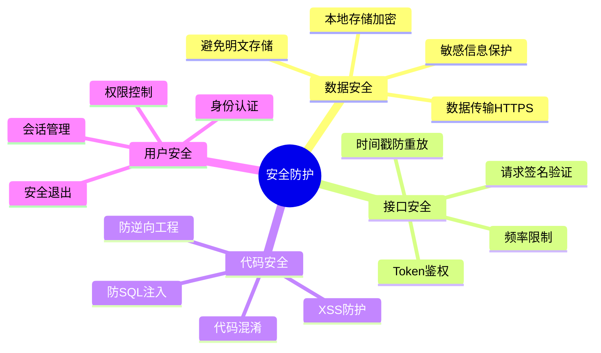

### 4.2 安全防护架构

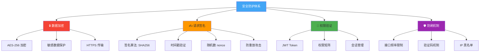

### 4.3 请求签名流程

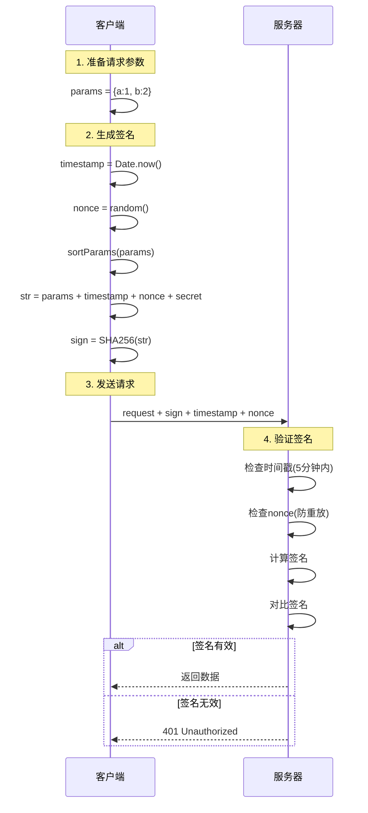

### 4.4 数据加密实现

```javascript
// 加密工具核心实现（精简版）
import CryptoJS from 'crypto-js'

class Crypto {
  // AES 加密
  encrypt(data) {
    return CryptoJS.AES.encrypt(
      JSON.stringify(data), 
      this.key
    ).toString()
  }
  
  // AES 解密
  decrypt(encrypted) {
    const bytes = CryptoJS.AES.decrypt(encrypted, this.key)
    return JSON.parse(bytes.toString(CryptoJS.enc.Utf8))
  }
  
  // 签名生成
  sign(params, timestamp, nonce) {
    const str = this.sortAndJoin(params) + timestamp + nonce
    return CryptoJS.SHA256(str).toString()
  }
}
```

---

## 🌐 5. 网络请求与缓存

### 5.1 网络请求架构

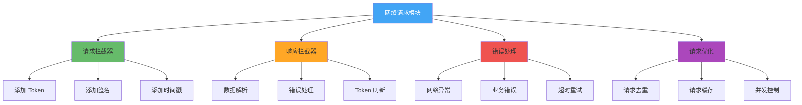

### 5.2 资源缓存策略

```mermaid
graph TB
    A[资源请求] --> B{检查缓存}
    
    B -->|✅ 有缓存| C{检查有效期}
    B -->|❌ 无缓存| D[网络请求]
    
    C -->|未过期| E[✅ 使用缓存]
    C -->|已过期| D
    
    D --> F[下载资源]
    F --> G{下载成功?}
    
    G -->|✅ 成功| H[保存到本地]
    G -->|❌ 失败| I[使用过期缓存]
    
    H --> J[更新缓存索引]
    J --> K[返回资源]
    
    I --> L{有过期缓存?}
    L -->|有| K
    L -->|无| M[返回错误]
    
    E --> K
    
    style E fill:#d4edda
    style K fill:#d4edda
    style M fill:#f8d7da
```

### 5.3 音频缓存管理架构

```mermaid
graph TB
    A[AudioCacheManager] --> B[📁 缓存目录管理]
    A --> C[📊 缓存索引]
    A --> D[💾 空间管理]
    A --> E[🔄 LRU 策略]
    
    B --> B1[USER_DATA_PATH/audio_cache/]
    B --> B2[文件命名: MD5.mp3]
    
    C --> C1[缓存Key生成]
    C --> C2[元数据存储]
    C --> C3[快速查找]
    
    D --> D1[最大限制: 100MB]
    D --> D2[空间检测]
    D --> D3[自动清理]
    
    E --> E1[按访问时间排序]
    E --> E2[清理最旧30%]
    E --> E3[保留常用数据]
    
    style A fill:#42a5f5,color:#fff
    style B fill:#66bb6a
    style C fill:#ffa726
    style D fill:#ef5350
    style E fill:#ab47bc
```

### 5.4 缓存管理器核心代码

```javascript
// 音频缓存管理器核心实现（精简版）
class AudioCacheManager {
  async downloadAndCache(url) {
    const cacheKey = this.md5(url)
    
    // 检查缓存
    if (this.hasCache(cacheKey)) {
      return this.getCachePath(cacheKey)
    }
    
    // 检查空间
    await this.checkSpace()
    
    // 下载文件
    const res = await wx.downloadFile({ url })
    const cachePath = this.saveToCacheDir(res.tempFilePath, cacheKey)
    
    // 更新索引
    this.updateIndex(cacheKey, { url, size, time })
    
    return cachePath
  }
}
```

### 5.5 请求优化策略

```mermaid
graph LR
    A[请求优化] --> B[🚫 请求去重]
    A --> C[💾 请求缓存]
    A --> D[🔄 请求重试]
    A --> E[⏱️ 防抖节流]
    
    B --> B1[相同请求合并]
    B --> B2[避免重复调用]
    
    C --> C1[内存缓存]
    C --> C2[设置TTL]
    
    D --> D1[指数退避]
    D --> D2[最大重试3次]
    
    E --> E1[防抖: 延迟执行]
    E --> E2[节流: 限制频率]
    
    style A fill:#42a5f5,color:#fff
    style B fill:#66bb6a
    style C fill:#ffa726
    style D fill:#ef5350
    style E fill:#ab47bc
```

### 5.6 网络请求核心代码

```javascript
// 网络请求封装核心实现（精简版）
class Request {
  async request(config) {
    // 请求拦截
    config = await this.requestInterceptor(config)
    
    // 发送请求
    const response = await wx.request(config)
    
    // 响应拦截
    return await this.responseInterceptor(response)
  }
  
  requestInterceptor(config) {
    config.header.Authorization = wx.getStorageSync('token')
    config.header.timestamp = Date.now()
    return config
  }
  
  responseInterceptor(response) {
    if (response.statusCode === 200) return response.data
    if (response.statusCode === 401) this.toLogin()
    throw new Error(response.data.message)
  }
}
```

---

## 🚀 6. 性能优化

### 6.1 性能优化全景图

```mermaid
mindmap
  root((性能优化))
    🚀 启动优化
      分包加载
      代码分离
      预加载策略
      按需加载
    🎨 渲染优化
      setData优化
      虚拟列表
      图片懒加载
      骨架屏
    💾 内存优化
      及时释放资源
      避免内存泄漏
      缓存策略
      大对象优化
    🌐 网络优化
      请求合并
      资源缓存
      CDN加速
      预连接
```

### 6.2 启动优化流程

```mermaid
graph LR
    A[小程序启动] --> B[主包加载]
    B --> C[核心代码初始化]
    C --> D[首页渲染]
    
    D --> E[分包预加载]
    D --> F[预连接API]
    D --> G[预加载资源]
    
    E --> H[Chat分包]
    E --> I[Reading分包]
    
    F --> J[建立连接]
    
    G --> K[音色样本]
    G --> L[常用图片]
    
    style A fill:#42a5f5,color:#fff
    style D fill:#66bb6a
    style E fill:#ffa726
    style F fill:#ab47bc
    style G fill:#26c6da
```

### 6.3 setData 优化策略

```mermaid
graph TB
    A[setData 优化] --> B[批量更新]
    A --> C[数据diff]
    A --> D[局部更新]
    A --> E[异步更新]
    
    B --> B1[合并多次调用]
    B --> B2[16ms 批处理]
    
    C --> C1[只更新变化数据]
    C --> C2[减少传输量]
    
    D --> D1[使用路径更新]
    D --> D2["如: arr[0].name"]
    
    E --> E1[使用 nextTick]
    E --> E2[避免阻塞渲染]
    
    style A fill:#42a5f5,color:#fff
    style B fill:#66bb6a
    style C fill:#ffa726
    style D fill:#ef5350
    style E fill:#ab47bc
```

### 6.4 性能优化核心代码

```javascript
// setData 批量更新器（精简版）
class DataBatcher {
  setData(data) {
    Object.assign(this.pendingData, data)
    
    if (!this.timer) {
      this.timer = setTimeout(() => {
        this.context.setData(this.pendingData)
        this.pendingData = {}
        this.timer = null
      }, 16)  // 一帧时间
    }
  }
}

// 使用方式
this.batcher.setData({ field1: 'value1' })
this.batcher.setData({ field2: 'value2' })
// 自动合并为一次 setData 调用
```

---

## 📦 7. 核心模块封装

### 7.1 模块设计原则

```mermaid
mindmap
  root((模块设计))
    单一职责
      每个模块只做一件事
      功能明确清晰
      易于理解维护
    高内聚低耦合
      模块内部紧密关联
      模块间松散依赖
      接口简洁明确
    可复用性
      提供统一接口
      支持配置化
      独立无依赖
    可测试性
      单元测试友好
      Mock 支持
      边界清晰
```

### 7.2 模块结构图

```mermaid
graph TB
    A[核心模块] --> B[🎙️ 语音模块]
    A --> C[📚 阅读模块]
    A --> D[💬 聊天模块]
    A --> E[🌐 网络模块]
    A --> F[💾 存储模块]
    A --> G[🔧 工具模块]
    
    B --> B1[RecorderManager]
    B --> B2[TTSManager]
    B --> B3[AudioPlayer]
    
    C --> C1[ReadingManager]
    C --> C2[SyncManager]
    C --> C3[ProgressManager]
    
    D --> D1[MessageManager]
    D --> D2[SessionManager]
    
    E --> E1[Request]
    E --> E2[Interceptor]
    E --> E3[CacheManager]
    
    F --> F1[StorageManager]
    F --> F2[FileManager]
    
    G --> G1[Logger]
    G --> G2[Monitor]
    G --> G3[Crypto]
    
    style A fill:#42a5f5,color:#fff
    style B fill:#66bb6a
    style C fill:#ffa726
    style D fill:#ab47bc
    style E fill:#26c6da
    style F fill:#ef5350
    style G fill:#9c27b0,color:#fff
```

### 7.3 模块封装示例

```javascript
// 存储模块封装（精简版）
class StorageManager {
  set(key, value, expire = 0) {
    wx.setStorageSync(this.prefix + key, {
      value,
      timestamp: Date.now(),
      expire
    })
  }
  
  get(key, defaultValue = null) {
    const data = wx.getStorageSync(this.prefix + key)
    if (!data) return defaultValue
    
    // 检查过期
    if (data.expire > 0 && Date.now() - data.timestamp > data.expire) {
      this.remove(key)
      return defaultValue
    }
    
    return data.value
  }
}
```

---

## 📂 8. 项目目录结构

```mermaid
graph TB
    A[project/] --> B[pages/]
    A --> C[components/]
    A --> D[services/]
    A --> E[utils/]
    A --> F[assets/]
    
    B --> B1[index/ 首页]
    B --> B2[chat/ 聊天]
    B --> B3[reading/ 阅读]
    B --> B4[profile/ 我的]
    
    C --> C1[voice-recorder/]
    C --> C2[voice-selector/]
    C --> C3[audio-control/]
    
    D --> D1[voice/ 语音服务]
    D --> D2[tts/ TTS服务]
    D --> D3[reading/ 阅读服务]
    D --> D4[network/ 网络服务]
    D --> D5[storage/ 存储服务]
    D --> D6[cache/ 缓存服务]
    
    E --> E1[crypto.js 加密]
    E --> E2[logger.js 日志]
    E --> E3[monitor.js 监控]
    
    F --> F1[images/]
    F --> F2[icons/]
    
    style A fill:#42a5f5,color:#fff
    style B fill:#66bb6a
    style C fill:#ffa726
    style D fill:#ab47bc
    style E fill:#26c6da
    style F fill:#ef5350
```

```text
project/
├── app.js / app.json / app.wxss    # 入口与全局配置
├── pages/                           # 页面（index、chat、reading、library、profile）
├── components/                       # 组件（录音、音色选择、播放控制、阅读文本）
├── services/                         # 服务（voice、tts、reading、network、storage、cache）
├── utils/                            # 工具（crypto、logger、monitor 等）
└── assets/                           # 静态资源（images、icons）
```

---

## 📋 9. 开发规范

### 9.1 命名规范

```mermaid
graph LR
    A[命名规范] --> B[文件命名]
    A --> C[组件命名]
    A --> D[变量命名]
    A --> E[常量命名]
    
    B --> B1[kebab-case]
    B --> B2[voice-recorder.js]
    
    C --> C1[PascalCase]
    C --> C2[VoiceRecorder]
    
    D --> D1[camelCase]
    D --> D2[currentIndex]
    
    E --> E1[UPPER_SNAKE_CASE]
    E --> E2[MAX_CACHE_SIZE]
    
    style A fill:#42a5f5,color:#fff
    style B fill:#66bb6a
    style C fill:#ffa726
    style D fill:#ab47bc
    style E fill:#26c6da
```

### 9.2 代码规范

- ✅ 使用 **ESLint** 进行代码检查
- ✅ 使用 **Prettier** 进行代码格式化
- ✅ 必须添加**代码注释**
- ✅ 必须进行**错误处理**
- ✅ 单个函数不超过 **50 行**
- ✅ 单个文件不超过 **300 行**

---

## 🎯 10. 技术方案总结

### 10.1 核心优势

```mermaid
mindmap
  root((技术优势))
    性能优势
      原生性能100%
      启动速度最快
      渲染效率最高
      内存占用最小
    功能优势
      完整API支持
      后台播放稳定
      语音功能完善
      实时性保障
    开发优势
      调试效率高
      问题定位快
      文档完善
      社区活跃
    维护优势
      代码清晰
      模块化设计
      易于扩展
      长期稳定
```

### 10.2 技术选型对比结论

```mermaid
graph TB
    A[技术选型结论] --> B[✅ 微信小程序原生]
    
    B --> C[性能最优]
    B --> D[功能最全]
    B --> E[最稳定]
    B --> F[最适合本项目]
    
    C --> C1[零性能损耗]
    C --> C2[启动最快]
    
    D --> D1[语音API完整]
    D --> D2[后台播放完善]
    
    E --> E1[无兼容问题]
    E --> E2[更新及时]
    
    F --> F1[语音核心功能]
    F --> F2[实时性要求]
    F --> F3[稳定性要求]
    
    style A fill:#42a5f5,color:#fff
    style B fill:#66bb6a
    style C fill:#ffa726
    style D fill:#ab47bc
    style E fill:#26c6da
    style F fill:#ef5350
```

### 10.3 核心功能实现情况

| 功能模块 | 实现方案 | 技术要点 | 状态 |
|---------|---------|---------|------|
| **AI Chat** | 语音识别 + AI对话 | 腾讯云智能语音识别 | ✅ 已设计 |
| **语音输入** | RecorderManager | 实时音量检测 | ✅ 已设计 |
| **TTS朗读** | 腾讯云语音合成 | 8种音色支持 | ✅ 已设计 |
| **音色切换** | 音色配置系统 | 语速/音调/音量可调 | ✅ 已设计 |
| **语音读书** | 逐句播放同步 | 文字高亮 + 自动滚动 | ✅ 已设计 |
| **后台播放** | BackgroundAudioManager | 锁屏控制 | ✅ 已设计 |
| **安全防护** | 加密 + 签名 | AES + SHA256 | ✅ 已设计 |
| **资源缓存** | 音频缓存管理 | 100MB缓存池 | ✅ 已设计 |

### 10.4 项目架构总览

```mermaid
graph TB
    A[企鹅伴读小程序] --> B[技术栈]
    A --> C[核心功能]
    A --> D[架构设计]
    A --> E[安全方案]
    
    B --> B1[微信小程序原生]
    B --> B2[腾讯云语音识别]
    B --> B3[腾讯云语音合成]
    
    C --> C1[AI Chat]
    C --> C2[语音朗读]
    C --> C3[语音读书]
    C --> C4[后台播放]
    
    D --> D1[三层架构]
    D --> D2[模块化设计]
    D --> D3[服务封装]
    
    E --> E1[数据加密]
    E --> E2[请求签名]
    E --> E3[权限控制]
    
    style A fill:#42a5f5,color:#fff
    style B fill:#66bb6a
    style C fill:#ffa726
    style D fill:#ab47bc
    style E fill:#ef5350
```

---

## 📚 附录

### A. 微信小程序 API 文档

- 录音管理器：[RecorderManager](https://developers.weixin.qq.com/miniprogram/dev/api/media/recorder/RecorderManager.html)
- 音频播放：[InnerAudioContext](https://developers.weixin.qq.com/miniprogram/dev/api/media/audio/InnerAudioContext.html)
- 后台音频：[BackgroundAudioManager](https://developers.weixin.qq.com/miniprogram/dev/api/media/background-audio/BackgroundAudioManager.html)

### B. 第三方服务（腾讯云）

- **语音识别（ASR）**：[腾讯云智能语音识别](https://cloud.tencent.com/product/asr)
- **语音合成（TTS）**：[腾讯云语音合成](https://cloud.tencent.com/product/tts)
- **控制台**：[腾讯云控制台](https://console.cloud.tencent.com/)
- **文档中心**：[腾讯云智能语音文档](https://cloud.tencent.com/document/product/1093)

### C. 性能指标

| 指标项 | 目标值 | 说明 |
|-------|-------|------|
| 启动时间 | < 2s | 冷启动到首屏 |
| 录音响应 | < 100ms | 按下到开始录音 |
| 语音识别 | < 3s | 平均识别时间 |
| TTS生成 | < 2s | 文字转语音 |
| 页面切换 | < 300ms | 页面跳转动画 |

---

## 🎉 总结

本技术方案基于**微信小程序原生开发**，充分利用原生 API 的性能优势和功能完整性，相比跨平台框架具有明显优势：

### ✨ 核心亮点

1. **🚀 性能最优**：无编译损耗，渲染速度最快，启动时间最短
2. **🔧 功能完整**：完整的语音 API 支持，后台播放稳定可靠
3. **🛡️ 安全可靠**：完善的加密、签名、权限控制体系
4. **📦 架构清晰**：三层架构，模块化设计，易于维护扩展
5. **⚡ 高效缓存**：100MB 音频缓存池，LRU 自动清理
6. **🎨 用户体验**：文字语音同步，实时高亮，流畅播放

### 📊 技术指标

- ✅ 支持 **8 种音色**切换
- ✅ **60 秒**录音时长
- ✅ **实时音量**检测动画
- ✅ **逐句播放**与文字同步
- ✅ **后台播放**锁屏控制
- ✅ **100MB** 音频缓存

技术方案完整、可落地、可扩展，能够支撑企鹅伴读小程序的长期发展！🎊
