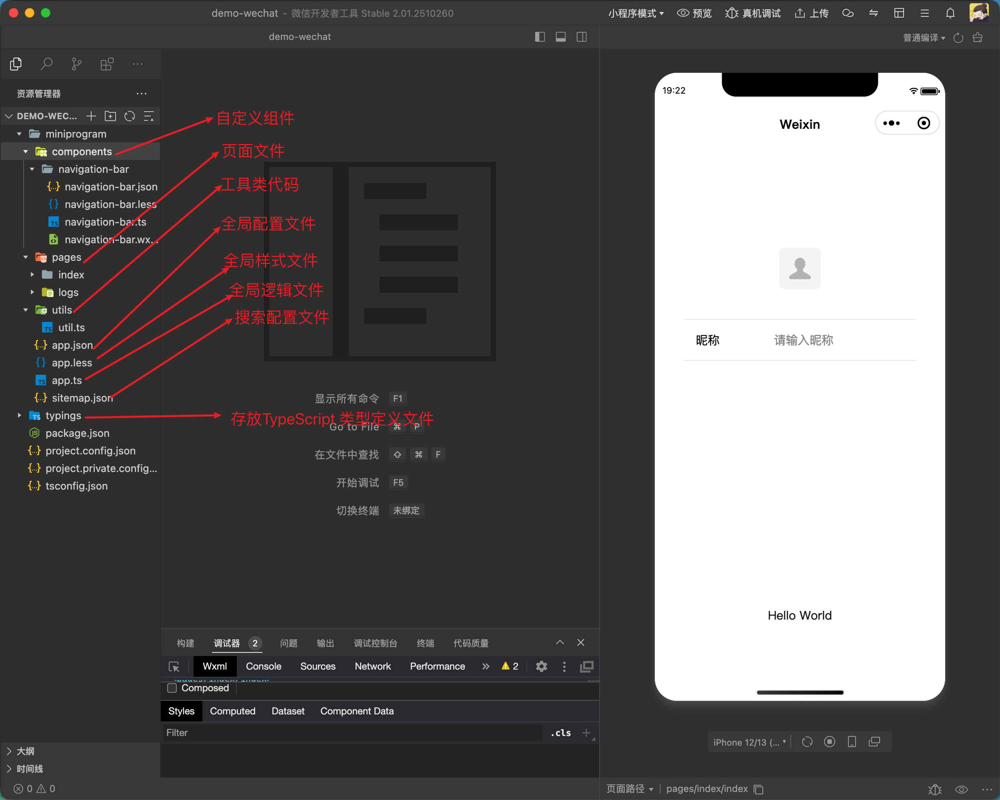
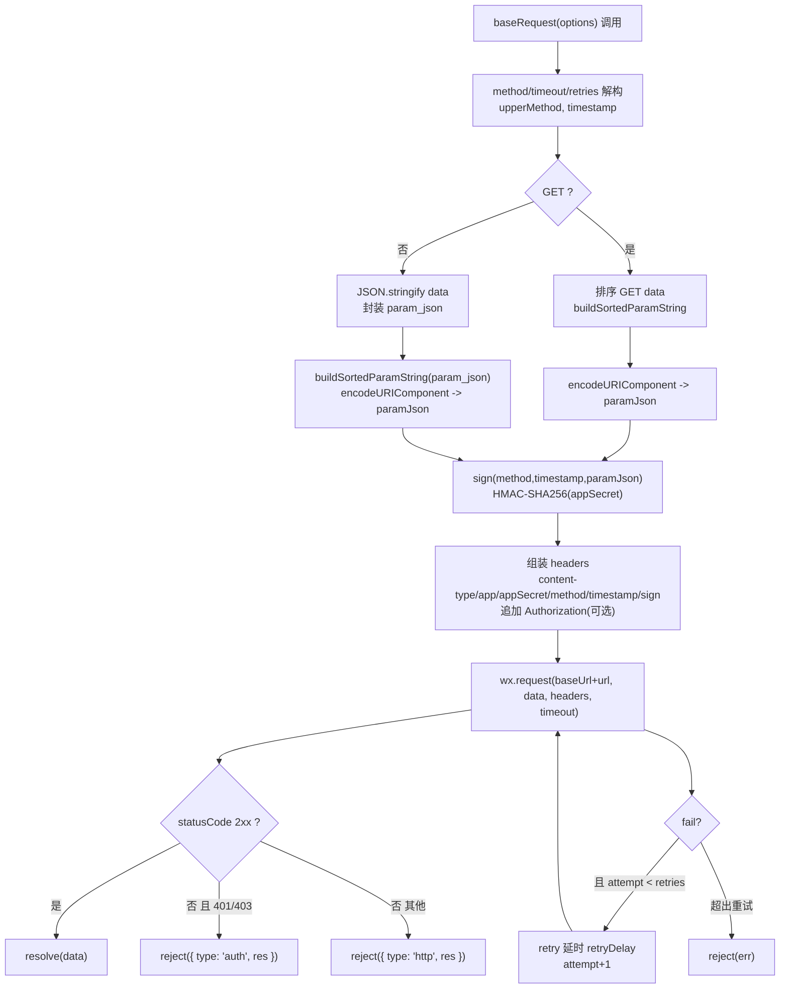
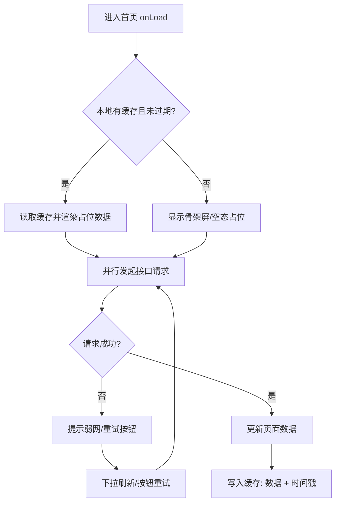

# 前端项目搭建 - 微信小程序

面向从 0 到上线的微信小程序搭建说明，覆盖目录规范、网络与安全、性能与动效、调试测试、发布验收等关键环节，满足无网络缓存、弱网兜底、网络字体/图片限制等需求。

## 1. 项目初始化

- 使用微信开发者工具创建项目，启用 `npm` 构建（设置中开启）

- 目录建议：



## 2. 基础配置

- `app.json`: 声明 `pages`、`window`（导航栏样式）、`tabBar`  
- `sitemap.json`: 配置收录规则
- 环境变量：构建时按环境生成 `configs/env.js`，运行态用 `import env from '../../configs/env'`。敏感信息只保留非密钥的公开配置

## 3. 资源限制与规范

- 背景图必须使用网络图片，不能使用本地图片；确保 CDN 域名在下载白名单内
- 字体必须使用网络字体，不能打包本地字体；用 `@font-face` 引入 CDN，需保证跨域与证书合规
- 图片体积与加载：首屏用压缩 WebP/PNG，大图懒加载（`image` 组件 `lazy-load`），必要时用占位或骨架屏
- 静态资源缓存：CDN 设置合理缓存，版本更新带上 hash/query，防止旧缓存

## 4. 样式与组件规范

- 使用 `rpx` 适配，约束最大宽度/高度，避免超长文案溢出（`word-break: break-all`）。  
- 组件化常用模块：导航栏、列表空态、加载骨架、错误提示/重试。  
- 避免滥用全局样式，页面内样式作用域化，减少选择器层级；图标优先 iconfont/svg sprite。

## 5. 网络与缓存策略

- 无网络缓存：关键接口不依赖本地缓存，必要时请求带时间戳；后端返回 `Cache-Control: no-cache`。
- 域名与 HTTPS：在微信后台配置 request/upload/download 域名，全部使用 HTTPS，证书有效且无混合内容。
- 网络差兜底：合理超时与重试（指数退避）；弱网降级动效/图片质量，提供「重试」按钮；用 `wx.getNetworkType` + `onNetworkStatusChange` 提示用户。
- 离线占位：允许可选的本地占位数据/空态，但上线数据必须来自实时接口。

## 6. 请求封装与状态管理

### 6.1 封装 `request`



```ts
import crypto from "crypto-js";

// 更健壮的请求封装：签名、超时、重试、鉴权错误分类
export const baseRequest = ({
  url = "",
  method = "GET",
  data = {},
  header = {},
  timeout = 15000,
  retries = 0,
  retryDelay = 500,
  baseUrl = "",
  appKey = "",
  appSecret = "",
  
} = {}) => {
  const upperMethod = method.toUpperCase();
  const timestamp = Math.floor(Date.now() / 1000);

  const buildSortedParamString = (params) => {
    if (!params || typeof params !== "object") return "";
    return Object.keys(params)
      .sort()
      .map((k) => `${k}=${params[k]}`)
      .join("&")
      .replace(/\s+/g, "");
  };

  const hmac = (input, secret) =>
    crypto.HmacSHA256(input, secret).toString(crypto.enc.Hex);

  const sign = (m, ts, paramJson) => {
    const paramPattern = `app_key${appKey}method${m}params${paramJson}timestamp${ts}`;
    const signPattern = appSecret + paramPattern + appSecret;
    return hmac(signPattern, appSecret);
  };

  const paramJson =
    upperMethod === "GET"
      ? encodeURIComponent(buildSortedParamString(data))
      : encodeURIComponent(
          buildSortedParamString({ param_json: JSON.stringify(data || {}) })
        );

  const signature = sign(upperMethod, timestamp, paramJson);

  const headers = {
    "content-type": "application/json",
    ...header,
    app: appKey,
    appSecret,
    method: upperMethod,
    timestamp: timestamp.toString(),
    sign: signature,
  };
  if (header?.Authorization) headers.Authorization = header.Authorization;

  const doRequest = (attempt = 0) =>
    new Promise((resolve, reject) => {
      wx.request({
        url: `${baseUrl}${url}`,
        method: upperMethod,
        data,
        header: headers,
        timeout,
        success: (res) => {
          const { statusCode } = res;
          if (statusCode >= 200 && statusCode < 300) {
            return resolve(res.data ?? res);
          }
          if (statusCode === 401 || statusCode === 403) {
            return reject({ type: "auth", res });
          }
          return reject({ type: "http", res });
        },
        fail: (err) => {
          if (attempt < retries) {
            return setTimeout(
              () => doRequest(attempt + 1).then(resolve).catch(reject),
              retryDelay
            );
          }
          reject(err);
        },
      });
    });

  return doRequest();
};
```

### 6.2 节流与并发：列表分页/搜索接口加防抖；长时间任务使用轮询或 `backgroundFetch`

### 6.3 页面数据流缓存：`onLoad` 拉首屏，`onPullDownRefresh` 触发刷新，分页处理 `no more` 状态；下拉/上拉结束后记得 `stopPullDownRefresh`

**首页请求缓存的作用**

- 首页请求缓存是为了提高首页的加载速度，避免用户在首页等待过长时间，从而提高用户体验。
- 首页请求缓存，防止断网及弱网情况下，用户无法看到内容。

**首页请求缓存的实现**



示例：基于前面 `request` 封装的轻量缓存方法，支持 TTL、强制刷新、断网回退：

```js
// utils/baseRequest.js
import { baseRequest } from "./baseRequest";

/**
 * 拉取并缓存接口数据
 * @param {Object} opts
 * @param {string} opts.key 缓存键（建议包含接口路径与查询参数）
 * @param {string} opts.url 接口路径
 * @param {Object} [opts.data] 请求参数
 * @param {number} [opts.ttl=5 * 60 * 1000] 缓存有效期（毫秒）
 * @param {boolean} [opts.force=false] 是否跳过缓存直接请求
 */
export async function requestWithCache({
  key,
  url,
  data,
  ttl = 5 * 60 * 1000,
  force = false,
}) {
  const now = Date.now();
  const cached = wx.getStorageSync(key);

  const isValid =
    cached &&
    cached.data !== undefined &&
    typeof cached.ts === "number" &&
    now - cached.ts < ttl;

  // 命中缓存且非强制刷新
  if (!force && isValid) {
    // 立即返回缓存，并在后台静默刷新（减少首屏等待）
    refreshInBackground();
    return { data: cached.data, from: "cache" };
  }

  // 直接请求
  return fetchAndStore();

  async function fetchAndStore() {
    try {
      const res = await baseRequest({ url, data });
      wx.setStorageSync(key, { data: res, ts: now });
      return { data: res, from: "network" };
    } catch (err) {
      // 断网或失败时尝试回退缓存
      if (cached) {
        return { data: cached.data, from: "stale-cache", error: err };
      }
      throw err;
    }
  }

  function refreshInBackground() {
    baseRequest({ url, data })
      .then((res) => wx.setStorageSync(key, { data: res, ts: Date.now() }))
      .catch(() => {});
  }
}
```

## 7. 安全策略

- 全程 HTTPS，上传/下载同域；接口签名/时间戳在后端完成。  
- token 仅短期存储（带过期时间），避免写死密钥；敏感操作二次确认。  
- 关闭调试开关与多余 `console`，在小程序后台开启安全与合规检查，审查第三方 SDK 仅保留必要权限。

## 8. 性能与动效

- 性能：首屏接口合并/并行，减少 setData 频次与对象深度，列表使用分批渲染；必要时分包与独立分包。  
- 动效：优先 CSS 过渡/动画或 `wx.createAnimation`，避免高频 JS 驱动；低端机降级（缩短时长、减少阴影/模糊）。  
- 图片与视频：开启 `lazy-load`，视频封面使用压缩图；避免在弱网自动播放视频。

## 9. 日志、监控与埋点

- 接口日志：统一封装上报错误码、耗时、重试次数；区分网络错误与业务错误。  
- 性能监控：记录首屏耗时、列表渲染耗时、资源大小；弱网/无网时的失败率。  
- 埋点：页面曝光、关键按钮、错误重试等打点；注意合规，避免采集个人敏感信息。

## 10. 调试与测试

- 本地：微信开发者工具 + 真机调试，弱网模式（如 2G/3G）下验证首屏和重试
- 人测清单：弱网/断网重试、登录态过期、分页边界、权限弹窗、图片字体加载失败、上拉/下拉交互

## 11. 构建与发布流程

- 构建脚本：根据环境写入 `configs/env.js`，可选注入版本号、构建时间，执行 lint/格式化。  
- 上传：使用微信 CLI 或开发者工具上传指定版本号与备注；分包体积检测。  
- 预发布验证：灰度或体验版验证域名配置、HTTPS、弱网兜底、埋点/日志上报。  
- 正式发布：确认白名单与证书开启，关闭「不校验域名」调试选项，完成真机冒烟（4G/地铁/WiFi）。

## 12. 常见问题与排查

- 图片/字体不加载：检查 CDN 域名是否在下载白名单、HTTPS 证书是否有效、资源是否带缓存穿透参数。  
- setData 过大导致卡顿：拆分数据、分批更新，避免深层大对象。  
- 分包体积超限：拆分业务分包，公共组件放主包或独立分包；清理无用资源。  
- 登录态失效：封装 token 刷新与重试队列，避免重复弹登录。
