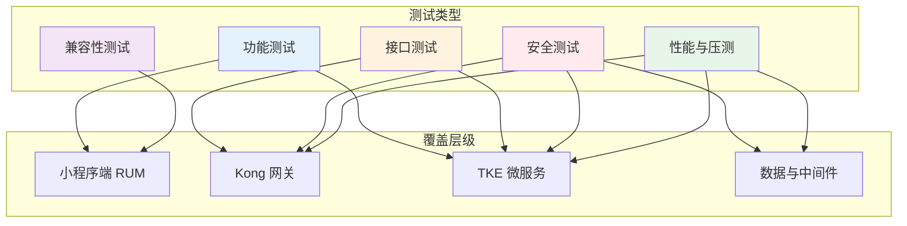
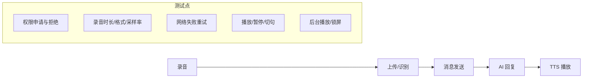
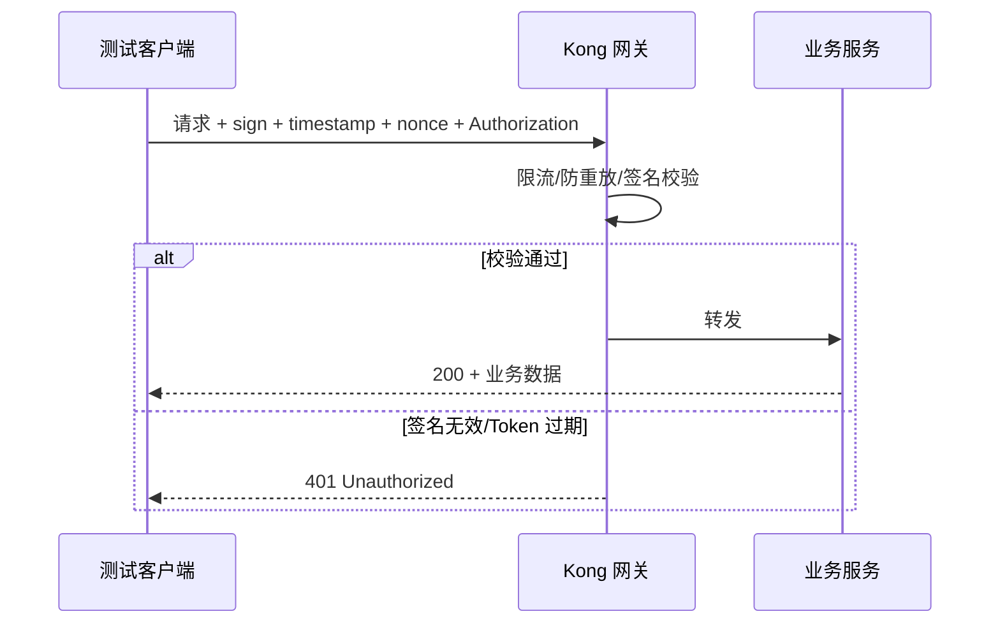
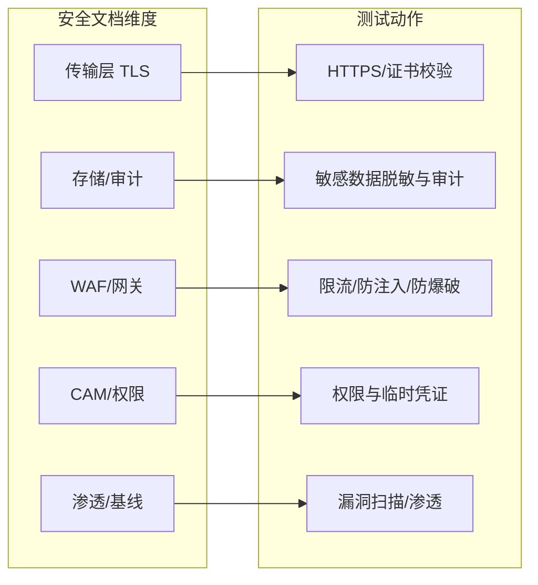
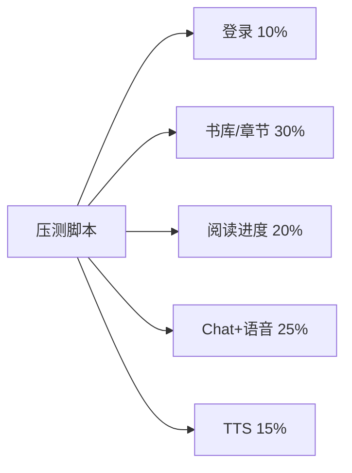

# 企鹅伴读 - 测试技术文档

> 📋 基于前端技术方案、网络安全架构与网络拓扑的完整测试规范，包含功能测试、接口测试、安全测试与压测方案

## 📊 1. 文档依据与测试范围

### 1.1 文档依据

| 依据文档 | 关联内容 |
| --- | --- |
| **docs-前端项目搭建 - 微信小程序-企鹅伴读.md** | 技术栈、核心模块（语音/阅读/AI Chat）、网络请求、安全方案、性能优化 |
| **docs-网络安全.md** | 传输/存储/审计安全、WAF/Kong 防护、CAM 权限、安全响应 SLA |
| **docs-网络拓扑图.md** | 用户→CDN→WAF→Kong→TKE 微服务→Redis/MySQL/Ckafka/COS、RUM/CLS/APM 可观测 |

### 1.2 测试范围总览



---

## 🧪 2. 功能测试

### 2.1 核心业务模块与用例映射

依据前端技术方案中的**展示层 + 业务层**划分，功能测试覆盖以下模块：

| 模块 | 核心能力 | 测试重点 |
| --- | --- | --- |
| **Chat 聊天页** | 长按录音、语音识别、发送消息、AI 回复、TTS 播放 | 录音起停、识别准确率、消息收发、播放与中断 |
| **Reading 阅读页** | 文本同步、TTS 朗读、进度管理、后台播放 | 分句高亮、预加载、进度保存、锁屏/通知栏控制 |
| **Library 书库页** | 书单、章节、内容拉取 | 列表加载、分页、搜索、缓存 |
| **Profile 我的** | 用户信息、设置、权限 | 登录态、设置持久化、权限引导 |

### 2.2 语音相关功能测试



| 用例编号 | 场景 | 前置条件 | 操作步骤 | 预期结果 |
| --- | --- | --- | --- | --- |
| F-Voice-01 | 首次录音权限拒绝 | 未授权录音 | 进入 Chat，长按录音 | 弹出授权弹窗；拒绝后提示需权限，可引导至设置 |
| F-Voice-02 | 正常录音并识别 | 已授权、网络正常 | 长按录音 3–10 秒，松开 | 上传成功，返回识别文本并展示 |
| F-Voice-03 | 录音超时 | 已授权 | 长按超过 60 秒 | 按前端设计：自动停止或提示超时 |
| F-Voice-04 | TTS 播放与切句 | 已有 AI 回复文本 | 点击播放、切换句子 | 当前句高亮，播放对应音频，切句无卡顿 |
| F-Voice-05 | 后台播放 | 正在朗读 | 切到后台/锁屏 | 使用 BackgroundAudioManager，锁屏/通知栏可控制 |

### 2.3 阅读与进度测试

| 用例编号 | 场景 | 预期结果 |
| --- | --- | --- |
| F-Read-01 | 打开章节 | 章节内容加载，前几句预加载 TTS |
| F-Read-02 | 播放中翻页/滚动 | 高亮与播放句同步，自动滚动到当前句 |
| F-Read-03 | 退出再进同一本书 | 进度恢复至上次位置（与后端/本地存储一致） |
| F-Read-04 | 预加载失败 | 有重试或降级，不阻塞当前句播放 |

### 2.4 网络与缓存测试

- **请求去重**：同一接口短时间重复触发，仅发一次请求（按前端“请求去重”设计）。
- **缓存策略**：音频/资源命中缓存时不再请求；过期后重新拉取并更新缓存。
- **Token 失效**：401 时跳转登录或刷新 Token，不出现无限重试。

---

## 🔌 3. 接口测试

### 3.1 接口与拓扑对应关系

接口请求路径：**用户 → (CDN) → WAF → Kong API 网关 → VPC → TKE 微服务**。接口测试需覆盖 Kong 路由与下游服务契约。

| 业务 | 建议网关路径示例 | 后端服务（参考拓扑） | 说明 |
| --- | --- | --- | --- |
| 用户登录/鉴权 | `/api/user/login`、`/api/user/refresh` | 用户服务 UserSvc | Token、刷新 |
| 语音识别 | `/api/voice/recognize` 或 `/api/voice/upload` | 用户服务或独立语音服务 | 上传音频，返回文本 |
| AI 对话 | `/api/chat/send`、`/api/chat/history` | AIGC 创作中心 AIGCSvc | 发送消息、历史记录 |
| TTS | `/api/tts/synthesize` | TTS 音色 TTSSvc | 文本→音频 URL 或流 |
| 书库/章节 | `/api/knowledge/books`、`/api/knowledge/chapter` | 知识库管理 KnowledgeSvc | 列表、章节内容 |
| 阅读进度 | `/api/reading/progress` | 用户服务或知识库 | 上报/拉取进度 |

（实际路径以项目为准，此处为示例。）

### 3.2 请求签名与鉴权（对齐安全方案）

前端技术方案与网络安全文档中均要求：**请求签名（如 SHA256 + timestamp + nonce）、Token 鉴权**。接口测试必须覆盖：



| 用例编号 | 场景 | 预期 |
| --- | --- | --- |
| I-Auth-01 | 无 Token | 401，且不暴露内部错误信息 |
| I-Auth-02 | 过期 Token | 401 或 403，可带明确错误码 |
| I-Auth-03 | 错误签名 | 401 |
| I-Auth-04 | 时间戳超出窗口（如 5 分钟） | 401 防重放 |
| I-Auth-05 | 合法 Token + 正确签名 | 200，返回业务数据 |

### 3.3 关键接口用例示例

| 接口 | 方法 | 关键参数 | 校验点 |
| --- | --- | --- | --- |
| 语音识别 | POST | 音频文件/URL、格式、采样率 | 状态码、返回文本不为空、耗时在 SLA 内 |
| TTS 合成 | POST | 文本、音色、语速等 | 返回音频 URL 或二进制，可播放 |
| 发送消息 | POST | 会话 ID、消息内容 | 返回 AI 回复或任务 ID，与前端约定一致 |
| 书单/章节 | GET | 分页、筛选 | 结构符合前端解析，分页正确 |

### 3.4 异常与边界

- **4xx/5xx**：接口测试脚本断言状态码与错误体结构，便于前端统一处理。
- **超时**：设置合理超时（如 10s/30s），验证网关与下游超时行为一致。
- **大文本/大文件**：TTS 长文本、语音上传大文件，验证大小限制与错误提示。

---

## 🛡️ 4. 安全测试

### 4.1 与网络安全架构的对应

安全测试项与 **docs-网络安全.md** 中的“安全开发与编码、数据全生命周期、云环境安全、权限管理、安全响应”一一对应：



### 4.2 安全测试清单

| 类别 | 测试项 | 说明 |
| --- | --- | --- |
| **传输安全** | 全站 HTTPS、TLS 1.3、证书有效 | 与“传输层 TLS 1.3 + SSL 证书”一致 |
| **请求安全** | 签名伪造、重放（重放 timestamp/nonce）、参数篡改 | 与前端“请求签名 + 时间戳 + nonce”一致 |
| **输入安全** | SQL 注入、XSS、命令注入 | 与“输入校验/防注入/防爆破”一致 |
| **鉴权与权限** | 越权（改 userId/资源 ID）、Token 泄露场景 | 与 CAM RBAC、最小权限一致 |
| **防刷与限流** | 同一接口高频调用、同一 IP 多账号 | 与 Kong/API 网关限流、WAF 一致 |
| **敏感数据** | 日志/错误信息中无密码、Token、完整手机号 | 与 CLS 日志脱敏、审计一致 |
| **依赖与镜像** | 开源组件漏洞、镜像安全扫描 | 与“开源组件管理 + TKE 镜像扫描”一致 |

### 4.3 渗透与基线

- **渗透测试**：按网络安全文档“渗透测试：自动化扫描 + 容器安全检测”执行，覆盖 Web 与 API，并记录修复与复测。
- **基线**：对齐“自测机制：基线 + 扫描 + 复检”，在发布前执行并留存结果。

---

## 📈 5. 性能与压测（压测方案）

### 5.1 压测在拓扑中的位置

压测流量路径与 **docs-网络拓扑图.md** 一致：

```text
压测端 → (可选 CDN) → WAF → Kong 网关 → VPC → TKE（UserSvc / KnowledgeSvc / TTSSvc / AIGCSvc / WebSvc）
                                                         ↓
                                              Redis / MySQL / Ckafka / COS
```

压测需验证：**网关限流与熔断、各微服务 QPS/延迟、数据库与缓存、消息队列** 在预期负载下的表现。

### 5.2 压测目标与指标

| 指标 | 说明 | 建议目标（示例） |
| --- | --- | --- |
| **QPS/TPS** | 单接口或混合场景下每秒请求数 | 按业务预期设定（见下） |
| **响应时间** | P50 / P95 / P99 延迟 | 例如：P99 &lt; 2s（普通 API），TTS 可单独放宽 |
| **错误率** | 5xx + 业务失败占比 | &lt; 0.1% |
| **可用性** | 成功请求占比 | ≥ 99.9% |
| **资源** | CPU/内存/连接数 | 不持续打满，留余量 |

### 5.3 场景设计

#### 5.3.1 单接口压测

对核心接口单独压测，便于定位瓶颈：

| 场景 | 接口类型 | 压测要点 |
| --- | --- | --- |
| 登录/鉴权 | POST `/api/user/login` | 高并发登录、Token 生成与校验、数据库连接池 |
| 语音识别 | POST 上传音频 | 大并发上传、下游识别服务容量、超时 |
| TTS 合成 | POST `/api/tts/synthesize` | 文本长度分布、下游 TTS 服务与 Ckafka 异步（若有） |
| 书单/章节 | GET 列表与详情 | 读多写少，关注 MySQL/从库、Redis 缓存命中 |
| AI 对话 | POST 发送消息 | 与 AIGC 服务、模型响应时间强相关，可单独设 P99 目标 |

#### 5.3.2 混合场景压测

模拟真实用户行为比例（比例需按产品数据调整）：



- **阶梯加压**：从 10% 目标 QPS 起，每 5–10 分钟增加 20%–30%，直到 100% 或出现拐点。
- **持续压测**：在目标 QPS 下持续 30–60 分钟，观察错误率、延迟、资源是否稳定。

### 5.4 压测工具与执行

| 工具 | 适用场景 |
| --- | --- |
| **JMeter** | 接口级压测、混合场景、CSV 参数化（多用户/多书籍） |
| **Locust** | 脚本化场景、Python 编写逻辑（如先登录再发消息） |
| **K6** | 脚本化、云压测集成、阈值断言 |
| **腾讯云 PTS / 压测大师** | 云上压测、与 CLB/Kong 同网或近源 |

执行要点：

1. **签名与鉴权**：压测脚本中实现与前端一致的签名算法（SHA256 + timestamp + nonce）及 Token 获取，保证请求能通过 Kong。
2. **环境隔离**：在测试 VPC/测试环境执行，避免影响生产；必要时使用测试账号与测试数据。
3. **监控联动**：压测期间观察 CLS 日志、APM 链路与 TraceID、RUM（若有压测端为真实前端），便于定位慢请求与错误。

### 5.5 网关与限流验证

- **Kong 限流**：在压测中逐步提高 QPS，确认达到限流阈值时返回 429 或约定错误码，且不影响其他路由。
- **熔断**：若下游 TTS/AIGC 超时或错误率升高，验证 Kong 或服务端熔断策略是否生效（如快速失败、降级）。

### 5.6 性能基线（与 RUM/APM 对齐）

网络拓扑中已包含 **RUM（前端性能）+ APM（后端链路）**，压测结果可与日常基线对比：

- **前端**：FCP、LCP、API 请求耗时、JS 错误率（RUM）。
- **后端**：接口 P95/P99、错误率、依赖调用（MySQL/Redis/Ckafka）耗时（APM）。

压测报告应记录：场景、QPS、P50/P95/P99、错误率、限流/熔断触发点、主要瓶颈（如某服务或 DB）。

---

## 📱 6. 兼容性与专项测试

### 6.1 兼容性

- **微信基础库版本**：覆盖项目支持的最低版本与当前主流版本（如 2.19.x、3.x）。
- **机型**：iOS / Android 各选低端、中端、高端机型若干，重点验证录音、后台播放、存储与网络。
- **系统版本**：iOS 与 Android 各 2–3 个主要版本。

### 6.2 专项

- **弱网**：2G/3G、高延迟、丢包，验证请求超时、重试、提示与不崩溃。
- **存储**：本地缓存满（如音频 100MB 上限）、清理策略是否按设计执行。
- **长时间**：长时间阅读/播放，观察内存与电量是否异常升高。

---

## 📋 7. 测试通过标准与交付物

### 7.1 通过标准

- **功能**：核心用例 100% 通过，无 P0/P1 未修复缺陷。
- **接口**：关键接口 100% 通过，签名/鉴权/异常场景覆盖。
- **安全**：无高危/中危未修复漏洞；安全清单项已执行并记录。
- **性能/压测**：达到 5.2 节目标（QPS、P99、错误率、可用性）；限流/熔断行为符合设计。
- **兼容性**：在约定机型与基础库版本上无阻塞性问题。

### 7.2 交付物

| 交付物 | 说明 |
| --- | --- |
| 功能测试用例与结果 | 用例表 + 执行记录（通过/失败/阻塞） |
| 接口测试脚本与报告 | 脚本（如 JMeter/Locust）+ 环境、数据、结果摘要 |
| 安全测试报告 | 清单执行情况、渗透/基线结果、修复与复测记录 |
| 压测报告 | 场景、QPS、延迟分布、错误率、瓶颈分析、与 RUM/APM 的对照 |
| 兼容性矩阵 | 机型 × 系统 × 基础库，通过/不通过说明 |

---

## 📎 8. 附录：与参考文档的对应关系

| 参考文档 | 本测试文档中的体现 |
| --- | --- |
| **前端项目搭建 - 微信小程序-企鹅伴读** | 功能测试按 Chat/Reading/Library/Profile 与语音/阅读/TTS 模块设计；接口与请求签名、Token、缓存策略一致；性能基线可与前端性能优化章节对照 |
| **网络安全** | 安全测试清单对应传输/存储/审计、WAF/Kong、CAM、渗透与基线；安全响应 SLA 用于漏洞优先级与复测节奏 |
| **网络拓扑图** | 接口测试路径与 Kong、TKE 微服务对应；压测路径与 CDN→WAF→Kong→TKE→Redis/MySQL/Ckafka 一致；监控使用 CLS/APM/RUM 与 TraceID 串联 |

---

*文档版本：1.0 | 依据：docs-前端项目搭建 - 微信小程序-企鹅伴读.md、docs-网络安全.md、docs-网络拓扑图.md*
