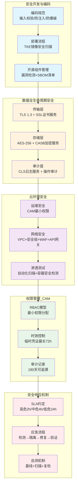
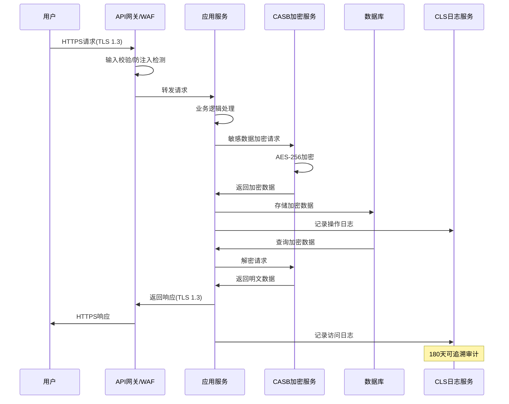
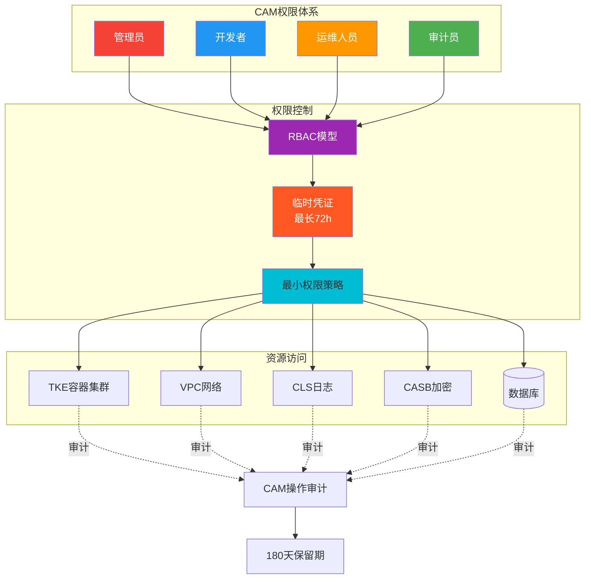
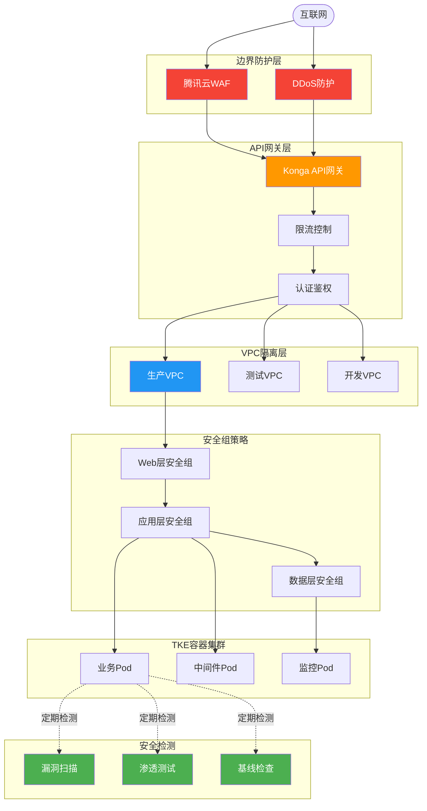
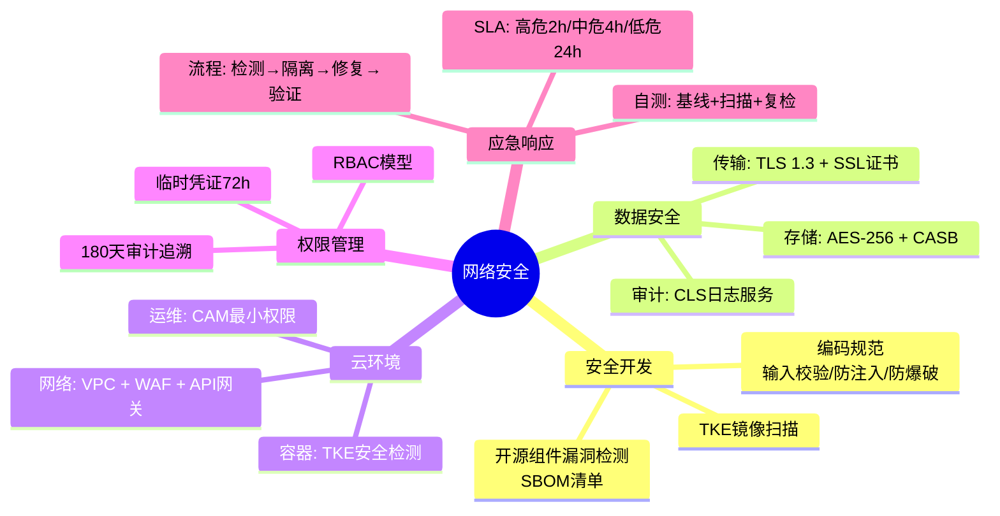

# 网络安全架构

## 整体架构图

## 安全防护流程图

```mermaid
flowchart LR
    Start([开发启动]) --> Code[安全编码]
    Code --> Scan[代码扫描]
    Scan --> Component[组件检测]
    Component --> Build[镜像构建]
    Build --> ImageScan[镜像扫描]
    ImageScan --> Deploy{安全检查通过?}
    Deploy -->|是| TKE[部署到TKE]
    Deploy -->|否| Fix[安全修复]
    Fix --> Scan
    
    TKE --> Runtime[运行时监控]
    Runtime --> WAF[WAF防护]
    WAF --> APIGateway[API网关]
    APIGateway --> App[应用服务]
    
    App --> Log[CLS日志审计]
    Log --> Alert{安全告警?}
    Alert -->|高危| Emergency2h[2h应急响应]
    Alert -->|中危| Emergency4h[4h应急响应]
    Alert -->|低危| Emergency24h[24h应急响应]
    
    Emergency2h --> Isolate[隔离处理]
    Emergency4h --> Isolate
    Emergency24h --> Isolate
    
    Isolate --> Recovery[修复验证]
    Recovery --> Complete([响应完成])

    style Start fill:#4caf50
    style Code fill:#2196f3
    style Scan fill:#2196f3
    style Component fill:#2196f3
    style ImageScan fill:#2196f3
    style Deploy fill:#ff9800
    style Fix fill:#f44336
    style TKE fill:#9c27b0
    style WAF fill:#9c27b0
    style Alert fill:#ff9800
    style Emergency2h fill:#f44336
    style Emergency4h fill:#ff9800
    style Emergency24h fill:#ffeb3b
    style Complete fill:#4caf50
```

## 数据安全流程

## 权限管理架构

## 网络安全架构

## 安全响应时间线

```mermaid
gantt
    title 安全响应SLA时间线
    dateFormat X
    axisFormat %H:%M

    section 高危漏洞
    检测告警 :milestone, 0, 0m
    应急响应 :active, 0, 120m
    隔离处理 :120, 150m
    修复验证 :150, 180m

    section 中危漏洞
    检测告警 :milestone, 0, 0m
    应急响应 :0, 240m
    隔离处理 :240, 280m
    修复验证 :280, 320m

    section 低危漏洞
    检测告警 :milestone, 0, 0m
    应急响应 :0, 1440m
    修复验证 :1440, 1500m
```

## 安全检查清单

## 详细说明

### 1. 安全开发与编码

- **编码规范**：强制安全编码标准（输入校验、防注入、防爆破）
- **部署流程**：启用 TKE（腾讯云容器服务）镜像安全扫描
- **开源组件**：引入前通过腾讯云开源组件漏洞检测，生成 SBOM 清单，同步 TKE 镜像仓库做准入控制

### 2. 数据全生命周期安全

- **传输**：TLS 1.3 加密（搭配腾讯云 SSL 证书服务）
- **存储**：敏感数据 AES-256 加密（对接腾讯云 CASB 加密服务）
- **审计**：全链路操作日志同步腾讯云 CLS 日志服务，敏感操作增加相应审计日志

### 3. 云环境安全

- **运维安全**：CAM（腾讯云访问管理）最小权限操作授权
- **网络安全**：VPC 隔离 + 安全组策略 + 腾讯云 WAF + Konga API 网关接口防护
- **渗透测试**：定期自动化扫描（结合腾讯云渗透测试服务）+ TKE 容器安全检测

### 4. 权限管理（CAM）

- **权限分配**：CAM RBAC 模型，按角色分配最小权限，适配 TKE、VPC 等资源访问控制
- **时效控制**：CAM 临时访问凭证自动过期（最长 72h），杜绝长期权限泄露
- **审计记录**：所有权限操作同步 CLS 日志，结合 CAM 操作审计，可追溯 180 天

### 5. 安全响应机制

- **SLA 约定**：高危漏洞 2h 响应、中危 4h、低危 24h（对接腾讯云安全中心告警）
- **应急流程**：检测（安全中心告警）→ 隔离（VPC 子网隔离 / TKE 容器隔离）→ 修复 → 验证
- **自测机制**：腾讯云安全中心基线自测 + TKE 全量安全扫描 + 组件漏洞复检
