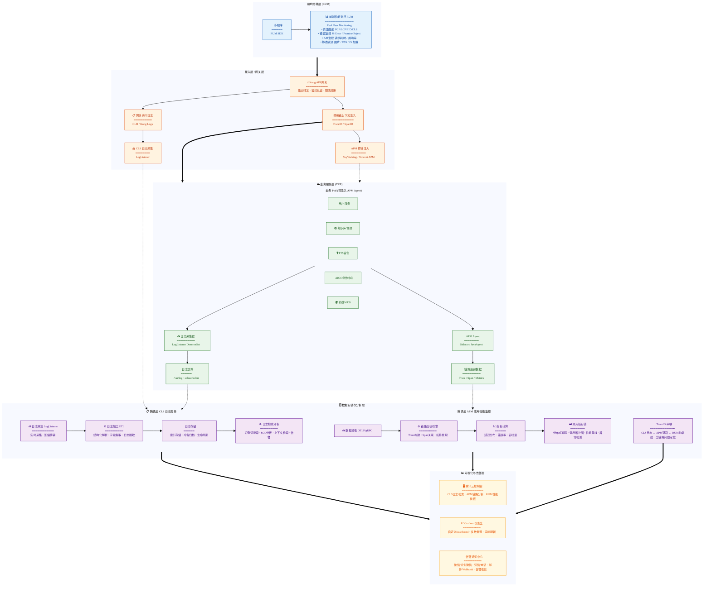

# 网络拓扑图

## 可观测性架构图（RUM + 网关 + APM + CLS）



### 架构说明

- **用户终端层 (RUM)**：小程序通过 RUM SDK 采集前端性能、JS 错误、API 请求与静态资源加载等数据，上报至前端性能监控 RUM（Real User Monitoring），用于衡量真实用户体验（FCP/LCP/FID/CLS 等核心指标）。
- **接入层 / 网关层**：Kong API 网关负责路由转发、鉴权认证与限流熔断；同时产生网关访问日志（经 LogListener 上报 CLS），并在请求中注入 TraceID/SpanID，便于下游 APM 串联调用链。
- **业务服务层 (TKE)**：用户服务、知识库管理、TTS 音色、AIGC 创作中心、前端 WEB 等业务 Pod 运行于 TKE，已注入 APM Agent；业务日志由 LogListener DaemonSet 采集落盘，链路与指标数据由 APM 侧采集，共同支撑全链路可观测。
- **数据存储与分析层**：腾讯云 CLS 负责日志采集、ETL 加工、存储与检索告警；腾讯云 APM 负责接收链路数据、构建 Trace、计算延迟/错误率/吞吐量等指标并存储调用链。通过 **TraceID 串联** CLS 日志、APM 链路与 RUM 前端数据，实现从用户端到后端的全链路问题定位。
- **可视化与告警层**：腾讯云控制台提供 CLS/APM/RUM 检索与看板，Grafana 可做多数据源自定义 Dashboard，告警通知中心将异常通过微信、短信、邮件、Webhook 等渠道推送，并支持告警收敛。

## 系统架构图

```mermaid
graph LR
    %% 用户层
    subgraph users["👥 用户访问层"]
        U1((👤<br/>用户1))
        U2((👤<br/>用户2))
        U3((👤<br/>用户3))
    end

    %% CDN加速层
    subgraph cdn["🚀 CDN加速层"]
        CDN["⚡ CDN<br/>━━━━━━━━<br/>内容分发网络"]
    end

    %% 安全网关层
    subgraph security["🛡️ 安全防护层"]
        WAF["🚪 门卫WAF<br/>━━━━━━━━<br/>Web应用防火墙"]
    end

    %% Kong网关层
    subgraph kong["🌐 API网关集群层"]
        direction LR
        KG1["⚡ Kong-1<br/>云网关"]
        KG2["⚡ Kong-2<br/>云网关"]
        KG3["⚡ Kong-3<br/>云网关"]
    end

    %% Kong统一认证
    subgraph kongAuth["🔒 网络隔离层"]
        direction TB
        VPC1["🌉 VPC-1<br/>专用网络"]
        VPC2["🌉 VPC-2<br/>专用网络"]
    end

    %% TKE部署集群
    subgraph tke["☁️ 容器编排层 - TKE"]
        direction TB
        TKE_Platform["🎯 TKE管理平台<br/>━━━━━━━━━━━━━━<br/>Kubernetes编排引擎"]
        
        subgraph services["🔷 微服务集群"]
            direction LR
            Web["🌍 前端WEB<br/>━━━━━━━━<br/>前端应用"]
            User["👥 用户服务<br/>━━━━━━━━<br/>用户管理"]
            Knowledge["📚 知识库管理<br/>━━━━━━━━<br/>知识管理"]
            TTS["🎙️ TTS音色<br/>━━━━━━━━<br/>语音合成"]
            AIGC["🤖 AIGC创作中心<br/>━━━━━━━━<br/>AI创作"]
        end
    end

    %% 基础设施层
    subgraph infra["🗄️ 基础设施层"]
        direction TB
        
        subgraph cache["💾 缓存集群 Redis"]
            Redis1["🔴 Redis-Master<br/>━━━━━━━━<br/>主节点"]
            Redis2["⚪ Redis-Slave-1<br/>━━━━━━━━<br/>从节点"]
            Redis3["⚪ Redis-Slave-2<br/>━━━━━━━━<br/>从节点"]
        end
        
        subgraph database["🗃️ 数据库集群 MySQL"]
            MySQL1["🟢 MySQL-Master<br/>━━━━━━━━<br/>主库"]
            MySQL2["⚪ MySQL-Slave-1<br/>━━━━━━━━<br/>从库"]
            MySQL3["⚪ MySQL-Slave-2<br/>━━━━━━━━<br/>从库"]
        end
        
        subgraph middleware["⚙️ 中间件服务"]
            Ckafka["📨 Ckafka<br/>━━━━━━━━<br/>消息队列"]
            CloudDev["☁️ CloudDev<br/>━━━━━━━━<br/>云函数"]
            ES["🔍 ElasticSearch<br/>━━━━━━━━<br/>搜索引擎"]
        end
        
        subgraph storage["💿 存储与配置"]
            NACOs["🎛️ NACOs<br/>━━━━━━━━<br/>配置中心"]
            COS["📦 COS<br/>━━━━━━━━<br/>对象存储"]
        end
    end

    %% 连接关系 - 简化版
    users ==> CDN
    
    CDN ==> WAF
    
    WAF ==> kong
    
    kong ==> kongAuth
    
    kongAuth ==> TKE_Platform
    
    TKE_Platform ==> services
    
    services -.-> cache
    services --> database
    services -.-> middleware
    services --> storage

    %% 样式定义 - 更现代的配色方案
    classDef userStyle fill:#4FC3F7,stroke:#01579B,stroke-width:3px,color:#fff,rx:50,ry:50
    classDef cdnStyle fill:#FF6B6B,stroke:#C92A2A,stroke-width:3px,color:#fff
    classDef securityStyle fill:#FFB74D,stroke:#E65100,stroke-width:3px,color:#000
    classDef kongStyle fill:#BA68C8,stroke:#4A148C,stroke-width:3px,color:#fff
    classDef apiStyle fill:#9575CD,stroke:#311B92,stroke-width:2px,color:#fff
    classDef vpcStyle fill:#7986CB,stroke:#1A237E,stroke-width:3px,color:#fff
    classDef tkeStyle fill:#81C784,stroke:#1B5E20,stroke-width:3px,color:#000
    classDef serviceStyle fill:#AED581,stroke:#33691E,stroke-width:2px,color:#000
    classDef redisStyle fill:#EF5350,stroke:#B71C1C,stroke-width:3px,color:#fff
    classDef mysqlStyle fill:#42A5F5,stroke:#0D47A1,stroke-width:3px,color:#fff
    classDef middlewareStyle fill:#FF7043,stroke:#BF360C,stroke-width:2px,color:#fff
    classDef storageStyle fill:#26A69A,stroke:#004D40,stroke-width:2px,color:#fff
    
    class U1,U2,U3 userStyle
    class CDN cdnStyle
    class WAF securityStyle
    class KG1,KG2,KG3 kongStyle
    class VPC1,VPC2 vpcStyle
    class TKE_Platform tkeStyle
    class Web,User,Knowledge,TTS,AIGC serviceStyle
    class Redis1,Redis2,Redis3 redisStyle
    class MySQL1,MySQL2,MySQL3 mysqlStyle
    class Ckafka,CloudDev,ES middlewareStyle
    class NACOs,COS storageStyle
```



## 架构说明

### 1. 用户层（User Layer）

- **功能**：终端用户访问入口
- **组件**：多个用户客户端

### 2. CDN加速层（CDN Acceleration）

- **CDN内容分发网络**：提供静态资源加速、就近访问、降低源站压力

### 3. 安全网关层（Security Gateway）

- **门卫WAF**：Web应用防火墙，防御网络攻击

### 4. Kong网关集群（Kong Gateway Cluster）

- **云原生Kong服务网关**：API网关集群，提供负载均衡、限流、熔断等功能

### 5. 网络隔离层（Network Isolation）

- **VPC专用网络**：虚拟私有云网络隔离
- **功能**：统一的身份认证和权限管理

### 6. TKE部署集群（Tencent Kubernetes Engine）

- **TKE主前端管理平台**：容器编排管理平台
- **微服务层**：
  + **前端WEB**：前端Web应用服务，提供用户界面
  + **用户服务**：用户管理服务，负责用户认证、权限管理
  + **知识库管理**：知识内容管理服务，管理知识库资源
  + **TTS音色**：文本转语音服务，提供语音合成功能
  + **AIGC创作中心**：AI生成内容服务，智能创作辅助

### 7. 基础设施层（Infrastructure Layer）

#### 7.1 缓存集群

- **Redis主从架构**：
  + 1个主节点（Master）
  + 2个从节点（Slave）
  + 提供高可用的缓存服务

#### 7.2 数据库集群

- **MySQL主从架构**：
  + 1个主库（Master）
  + 2个从库（Slave）
  + 支持读写分离和高可用

#### 7.3 中间件服务

- **Ckafka**：消息队列服务，处理TTS音色转换、AIGC内容生成等异步任务
- **云开发云托管**：Serverless云函数服务，支持轻量级业务逻辑
- **ElasticSearch**：全文搜索引擎，提供知识库快速检索功能

#### 7.4 存储服务

- **NACOs**：服务注册与配置中心，管理微服务配置
- **COS对象存储**：云端对象存储服务，存储知识库文件、音频文件、AIGC生成的内容等

## 数据流向

1. **用户请求流程**：

   ```
   用户 → CDN加速 → WAF防护 → Kong网关 → VPC网络 → TKE集群 → 微服务
   ```

2. **服务间通信**：
   + 微服务通过Kong网关进行服务间调用
   + 使用VPC专用网络保证网络隔离和安全

3. **数据存储**：
   + 热数据存储在Redis缓存
   + 持久化数据存储在MySQL数据库
   + 文件资源存储在COS对象存储

4. **异步处理**：
   + TTS音色和AIGC创作中心通过Ckafka消息队列处理异步任务

## 技术特点

- ✅ **高可用**：数据库和缓存采用主从架构，保证服务稳定性
- ✅ **可扩展**：基于Kubernetes的容器化部署，弹性伸缩
- ✅ **安全性**：多层安全防护（WAF + 身份认证 + VPC隔离）
- ✅ **微服务**：服务解耦，独立部署和扩展
- ✅ **负载均衡**：Kong网关提供智能路由和负载均衡
- ✅ **监控运维**：NACOs提供配置管理和服务发现
- ✅ **AI能力**：集成TTS语音合成和AIGC内容创作，赋能智能化应用
- ✅ **知识管理**：完善的知识库管理系统，支持全文检索
