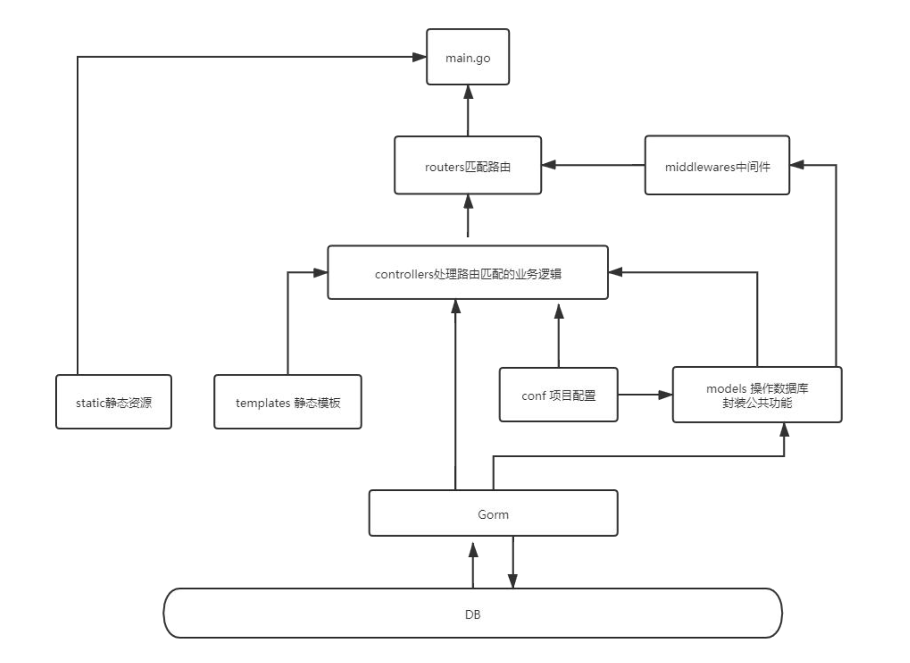

# Golang

## 一、环境搭建

### 1、下载SDK

官网：http://golang.org/

中文社区：https://studygolang.com/dl

Mac：https://go.dev/dl/

### 2、开发工具

vsc：下载以下的插件


注：vsc 下载因网络问题，所以 需要更改下载镜像

```bash
go env -w GOPROXY=https://goproxy.cn,https://goproxy.io,direct
```

### 3、初始化项目

```bash 
go mod init 项目名称
```

## 4、安装

```bash
# 创建文件
mkdir your-project
# 进入项目目录
cd your-project

# 初始化 Go 模块（如果还没有 go.mod 文件）
go mod init your-project-name

# 下载并整理依赖
go mod tidy

# 构建并安装可执行文件（如果有）
go install
```

## 二、插件的使用

### 1、fresh

[docs](https://gin-gonic.com/zh-cn/)

运行

```bash
# 检查是否安装
ls $(go env GOPATH)/bin | grep fresh

# 不加入环境变量
$(go env GOPATH)/bin/fresh
```

### 2、gin

[docs](https://gin-gonic.com/zh-cn/)

### 3、gorm

[docs](https://gorm.io/zh_CN/)

注：Mac 数据库启动方式：`sudo /usr/local/mysql/support-files/mysql.server start`。


### 4、go-ini

[github](https://github.com/go-ini/ini)

[docs](https://ini.unknwon.io/)

```bash
go get gopkg.in/ini.v1

go get gorm.io/driver/mysql
```

1）新建 conf/app.ini

```ini
app_name = demo-goem

[mysql]
ip = 127.0.0.1
port = 3306
user = user
password = admin
```

2）读取

models/core.go

```go
package models

import (
	"fmt"
	"os"

	"gopkg.in/ini.v1"
	"gorm.io/driver/mysql"
	"gorm.io/gorm"
)

var DB *gorm.DB
var err error

func init() {

	cfg, iniErr := ini.Load("./conf/app.ini")

	if iniErr != nil {
		fmt.Println("配置文件读取错误，请检查文件路径")
		os.Exit(1)
	}

	password := cfg.Section("mysql").Key("password").String()
	ip := cfg.Section("mysql").Key("ip").String()
	port := cfg.Section("mysql").Key("port").String()
	user := cfg.Section("mysql").Key("user").String()

	dsn := user + ":" + password + "@tcp(" + ip + ":" + port + ")/test01?charset=utf8mb4&parseTime=True&loc=Local"
	DB, err = gorm.Open(mysql.Open(dsn), &gorm.Config{})

	if err != nil {
		fmt.Println("failed to connect database")
	}
}

```

3）外部使用

```go
package main

import (
	"demo-gin/models"

	"github.com/gin-gonic/gin"
)

type User struct {
	Id       int    `gorm:"column:id" json:"id"` // 数据库列名 + JSON 字段名
	Username string `gorm:"column:username" json:"username"`
	Age      int    `gorm:"column:age" json:"age"`
}

func (User) TableName() string {
	return "t_user"
}


func main() {
	r := gin.Default()

	r.GET("/list", func(c *gin.Context) {
		users := []User{} // 使用复数命名更清晰
		// users := models.User{} // 使用复数命名更清晰

		// result := models.DB.Where("id>1 AND id<4").Find(&users) // 条件

		result := models.DB.Where("age LIKE?", "%22%").Find(&users) // 条件

		// 传入指针，并处理错误
		// result := models.DB.Find(&users)
		if result.Error != nil {
			c.JSON(500, gin.H{"error": result.Error.Error()})
			return
		}

		// 返回查询结果
		c.JSON(200, gin.H{
			"data": users,
		})
	})
	r.Run()
}
```

### 5、cookie

[docs](https://github.com/gin-contrib/sessions)

## 三、gin mvc 搭建

### 1、什么是 mvc

MVC 模式代表 Model-View-Controller（模型-视图-控制器） 模式。这种模式用于应用程序的分层开发。

Model（模型）- 模型代表一个存取数据的对象 或 JAVA POJO。它也可以带有逻辑，在数据变化时更新控制器。

View（视图）- 视图代表模型包含的数据的可视化。

Controller（控制器）- 控制器作用于模型和视图上。它控制数据流向模型对象，并在数据变化时更新视图。它使视图与模型分离开。

```xml-dtd
demo-gin-mvc        
├─ conf             存放配置文件
│  └─ app.ini       存储本地数据库信息
├─ controllers      控制器，可以在这个里面进行一些简单的数据操作
│  └─ admin         
│  │  └─ login.go   
│  │  └─ user.go    获取数据库中的所有 user 信息
├─ middlewares      中间键，用于判断用户权限（用于匹配路由，及匹配完成后的一系列操作）
│  └─ init.go       数据处理的某个模块
├─ models           连接数据库 和 映射数据库字段（也就是从数据库拿出来后给换一个名字等）、公共模块及方法
│  ├─ core.go       连接数据库的所有配置信息
│  └─ user.go       修改数据库返回的映射信息，并重新起名字，使用在 controllers 层下
├─ routers          路由文件（也就是接口地址）
│  └─ admin.go      接口的某一个模块，推荐一个模块一个文件，然后去走控制器，也可加入 中间键
├─ static           存放静态资源，例如：upload（上传的文件）、css、js、对象存储
├─ templates        存在 html 模版，也就是前端代码，但是一般情况不用，因为现在是前后端分离
├─ tmp              编译后的文件，不用在意
├─ README.md        描述
├─ go.mod           是 Go 模块的核心文件，用于定义模块的元信息和依赖关系
├─ go.sum           Go 模块的校验和文件，用于确保依赖的完整性和安全性（推荐上传 git）
└─ main.go          入口文件，首先走的这里
```

### 2、搭建的框架

[docs](https://github.com/Not-have/demo-go/tree/main/demo-gin-mvc)

### 3、项目流程图

 

## 四、

