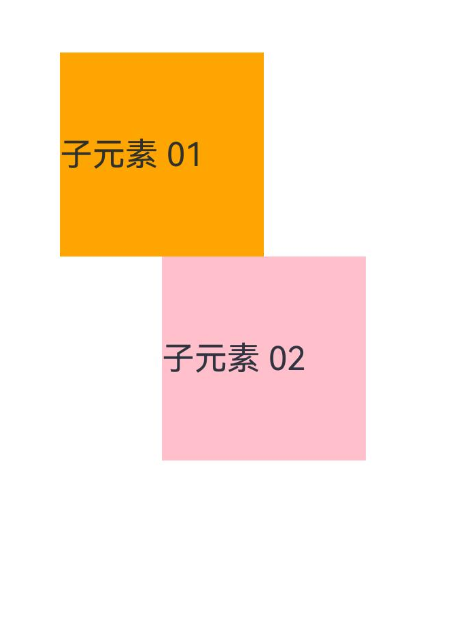
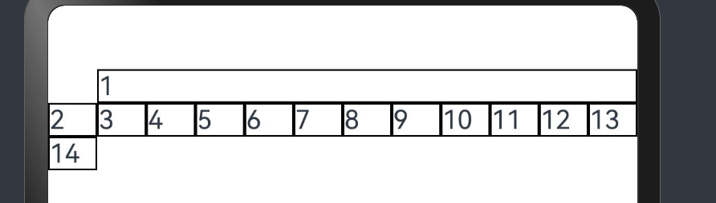
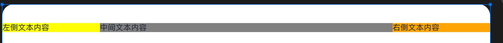
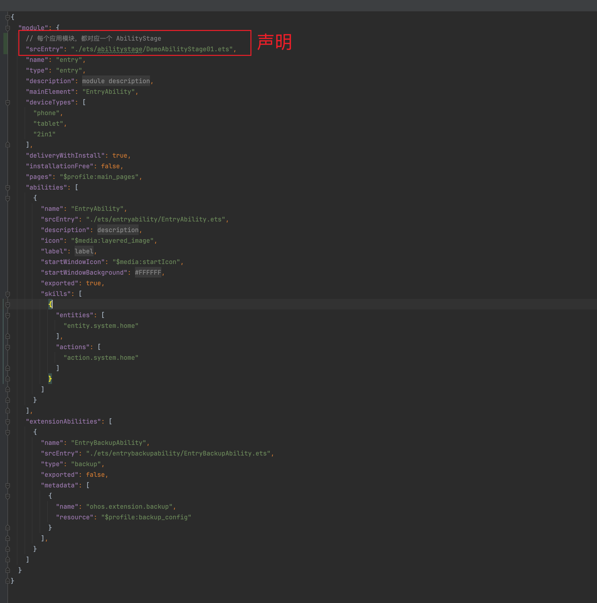
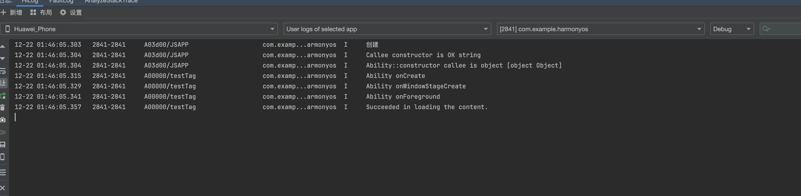
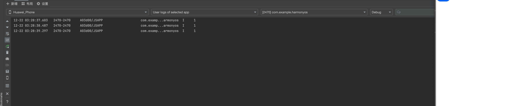

[doc](https://developer.huawei.com/consumer/cn/doc/harmonyos-guides-V5/application-dev-guide-V5)

创建一个项目


注：

① ArkTS 采用声明式开发规范。

# 一、基础结构认识

注：每一个页面，也就是一个组件。

```ets
@Entry // 标注当前模块入口
@Component // 组件，可以省略，但是组件的时候，可以写着
struct Style { // struct 默认是组件，所以 @Component 可以省略
  build() { // 必须有这个，因为他是用来构建组件的
    Text('测试文本').fontSize(20).fontColor('red').width('100%')
  }
}
```

# 二、UI

## 1、进度条

```ets
@Entry
@Component
struct Style {
  build() {
    Column() {
      // 进度条
      Progress({ value: 60 }).margin(20)
      Progress({ value: 50 }).margin(20)
      Progress({ value: 60, total: 300 }).margin(20).width(10).height(60)

      Progress({value: 30, type: ProgressType.ScaleRing})

      Progress({value: 30, type: ProgressType.Eclipse})

      Progress({value: 20, type: ProgressType.Capsule})
    }
  }
}
```

 

## 2、Button

```ets
@Entry
@Component
struct Index {
  @State message: string = 'Hello !';

  build() {
    Column() {
      Row() {
        Button(this.message,  { type: ButtonType.Normal, stateEffect: true }).borderRadius({topLeft: 10, bottomRight: 10})
        Button(this.message,  { type: ButtonType.Normal, stateEffect: false }).borderRadius(4)
        Button(this.message,  { type: ButtonType.Circle, stateEffect: true })
        Button(this.message,  { type: ButtonType.Capsule, stateEffect: true }).onClick(() => {
          console.log("点击")
        })
      }
    }
  }
}
```


## 3、Image 的使用

```eetc
@Entry
@Component
struct Index {
  @State message: string = 'Hello !';

  build() {
      Button(){
        Row() {
          Text(this.message)
          Image($rawfile('API.svg')).height(100).width(100)
        }
      }.width(150).height(150)
  }
}
```


## 4、相对布局

```etc
@Entry
@Component
struct Index {
  build() {
    RelativeContainer() {
      Text('子元素 01')
        .id('box-01')
        .backgroundColor(Color.Orange)
        .width(100)
        .height(100)
        .margin({ left: 50, top: 100 })
      Text('子元素 02')
        .backgroundColor(Color.Pink)
        .width(100)
        .height(100)
        .alignRules({
          left: { anchor: 'box-01', align: HorizontalAlign.Center },
          top: { anchor: 'box-01', align: VerticalAlign.Bottom }
        })
    }
  }
}
```



## 5、栅格布局

[docs](https://developer.huawei.com/consumer/cn/doc/harmonyos-guides-V5/arkts-layout-development-grid-layout-V5)

```etc
@Entry
@Component
struct Index {
  build() {
    GridRow() {
      GridCol({span: 11, offset: 1}) {
        Text('1').borderWidth(1).width('100%')
      }
      GridCol() {
        Text('2').borderWidth(1).width('100%')
      }
      GridCol() {
        Text('3').borderWidth(1).width('100%')
      }
      GridCol() {
        Text('4').borderWidth(1).width('100%')
      }
      GridCol() {
        Text('5').borderWidth(1).width('100%')
      }
      GridCol() {
        Text('6').borderWidth(1).width('100%')
      }
      GridCol() {
        Text('7').borderWidth(1).width('100%')
      }
      GridCol() {
        Text('8').borderWidth(1).width('100%')
      }
      GridCol() {
        Text('9').borderWidth(1).width('100%')
      }
      GridCol() {
        Text('10').borderWidth(1).width('100%')
      }
      GridCol() {
        Text('11').borderWidth(1).width('100%')
      }
      GridCol() {
        Text('12').borderWidth(1).width('100%')
      }
      GridCol() {
        Text('13').borderWidth(1).width('100%')
      }
      // 超出了，就会另起一个十二行
      GridCol() {
        Text('14').borderWidth(1).width('100%')
      }
    }
  }
}
```



## 6、媒体查询

```ets
import { mediaquery } from '@kit.ArkUI';

@Entry
@Component
struct Index {
  @State col01Width: string = '20%';
  @State col02Width: string = '60%';
  @State col03Width: string = '20%';
  // 帮我们去监听屏幕
  smListener = mediaquery.matchMediaSync('screen and (width>=320vp) and (width<=600vp)')
  mdListener = mediaquery.matchMediaSync('screen and (width>=600vp) and (width<=840vp)')
  lgListener = mediaquery.matchMediaSync('screen and (width>=840vp)')

  // 组件的生命周期方法：组件即将显示 aboutToAppear
  aboutToAppear(): void {
    console.log("组件即将显示")
    this.smListener.on('change', (result) => {
      if (result.matches) {
        console.log('当匹配到 sm 屏')
      }
      this.col01Width = '100%';
      this.col02Width = '100%';
      this.col03Width = '100%';
    })

    this.mdListener.on('change', (result) => {
      if (result.matches) {
        console.log('当匹配到 md 屏')
        this.col01Width = '10%';
        this.col02Width = '80%';
        this.col03Width = '10%';
      }
    })

    this.lgListener.on('change', (result) => {
      if (result.matches) {
        console.log('当匹配到 lg 屏')
        this.col01Width = '20%';
        this.col02Width = '60%';
        this.col03Width = '20%';
      }
    })
  }

  build() {
    Flex({wrap: FlexWrap.Wrap}) {
      Column() {
        Text('左侧文本内容').backgroundColor(Color.Yellow).width(this.col01Width)
      }

      Column() {
        Text('中间文本内容').backgroundColor(Color.Gray).width(this.col02Width)
      }

      Column() {
        Text('右侧文本内容').backgroundColor(Color.Orange).width(this.col03Width)
      }
    }.width('100%')
  }
}
```



# 三、API

## 1、Ability Kit（程序框架服务）

[docs](https://developer.huawei.com/consumer/cn/doc/harmonyos-guides-V5/ability-kit-V5)

entry/src/main/ets/abilitystage/DemoAbilityStage01.ets

```ets
import { AbilityStage } from "@kit.AbilityKit";

export class DemoAbilityStage01 extends AbilityStage {
  onCreate(): void {
    console.log('创建')
  }
  onDestroy(): void {
    console.log('销毁')
  }
}
```

配置



注：在真机模拟器中查看。



## 2、自定义启动页

entry/src/main/ets/entryability/EntryAbility.ets

```ts
import { AbilityConstant, ConfigurationConstant, UIAbility, Want } from '@kit.AbilityKit';
import { hilog } from '@kit.PerformanceAnalysisKit';
import { window } from '@kit.ArkUI';

export default class EntryAbility extends UIAbility {

  onWindowStageCreate(windowStage: window.WindowStage): void {
    // Main window is created, set main page for this ability
    hilog.info(0x0000, 'testTag', '%{public}s', 'Ability onWindowStageCreate');

		// 设置启动页
    windowStage.loadContent('pages/Router', (err) => {
      if (err.code) {
        hilog.error(0x0000, 'testTag', 'Failed to load the content. Cause: %{public}s', JSON.stringify(err) ?? '');
        return;
      }
      hilog.info(0x0000, 'testTag', 'Succeeded in loading the content.');
    });
  }
}
```

## 3、数据同步

[docs](https://developer.huawei.com/consumer/cn/doc/harmonyos-guides-V5/uiability-data-sync-with-ui-V5)

### 1）使用EventHub进行数据通信

[使用EventHub进行数据通信](https://developer.huawei.com/consumer/cn/doc/harmonyos-guides-V5/uiability-data-sync-with-ui-V5#使用eventhub进行数据通信)：在[基类Context](https://developer.huawei.com/consumer/cn/doc/harmonyos-guides-V5/application-context-stage-V5)中提供了[EventHub](https://developer.huawei.com/consumer/cn/doc/harmonyos-references-V5/js-apis-inner-application-eventhub-V5)对象，可以通过发布订阅方式来实现事件的传递。在事件传递前，订阅者需要先进行订阅，当发布者发布事件时，订阅者将接收到事件并进行相应处理。

注册一个自定义事件

src/main/ets/entryability/EntryAbility.ets

```ts
import { hilog } from '@kit.PerformanceAnalysisKit';
import { UIAbility, Context, Want, AbilityConstant } from '@kit.AbilityKit';

const DOMAIN_NUMBER: number = 0xFF00;
const TAG: string = '[EventAbility]';

export default class EntryAbility extends UIAbility {
  onCreate(want: Want, launchParam: AbilityConstant.LaunchParam): void {
    // 获取eventHub
    let eventhub = this.context.eventHub;
    // 执行订阅操作
    eventhub.on('event1', this.eventFunc);
    eventhub.on('event1', (data: string) => {
      // 触发事件，完成相应的业务操作
    });
    hilog.info(DOMAIN_NUMBER, TAG, '%{public}s', 'Ability onCreate');
  }

  // ...
  eventFunc(argOne: Context, argTwo: Context): void {
    hilog.info(DOMAIN_NUMBER, TAG, '1. ' + `${argOne}, ${argTwo}`);
    return;
  }
}
```

在UI中通过[eventHub.emit()](https://developer.huawei.com/consumer/cn/doc/harmonyos-references-V5/js-apis-inner-application-eventhub-V5#eventhubemit)方法触发该事件，在触发事件的同时，根据需要传入参数信息

```ts
import { common } from '@kit.AbilityKit';
import { promptAction } from '@kit.ArkUI';

@Entry
@Component
struct UiAbility {

  aboutToAppear(): void {
    console.log("aboutToAppear")

  }
  onPageShow(): void {
    console.log("onPageShow")
  }

  private context = getContext(this) as common.UIAbilityContext;
  //
  eventHubFunc(): void {
    // 带1个参数触发自定义“event1”事件
    this.context.eventHub.emit('event1', "1");
  }


  build() {
    Column() {
      Text("list").onClick(() => {
        promptAction.showToast({
          message: 'EventHubFuncA'
        });
      })
      Button("按钮").onClick(() => this.eventHubFunc())
    }
  }
}
```




### 2）使用AppStorage/LocalStorage进行数据同步

[使用AppStorage/LocalStorage进行数据同步](https://developer.huawei.com/consumer/cn/doc/harmonyos-guides-V5/uiability-data-sync-with-ui-V5#使用appstoragelocalstorage进行数据同步)：ArkUI提供了[AppStorage](https://developer.huawei.com/consumer/cn/doc/harmonyos-guides-V5/arkts-appstorage-V5)和[LocalStorage](https://developer.huawei.com/consumer/cn/doc/harmonyos-guides-V5/arkts-localstorage-V5)两种应用级别的状态管理方案，可用于实现应用级别和UIAbility级别的数据同步。
