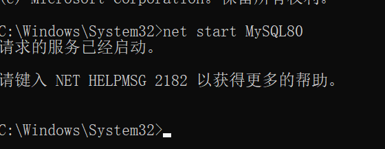
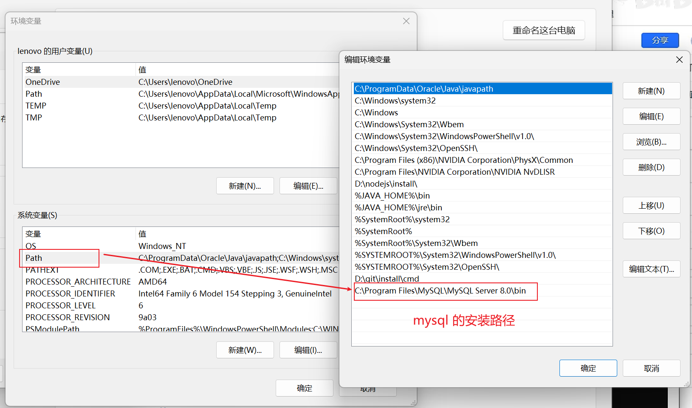
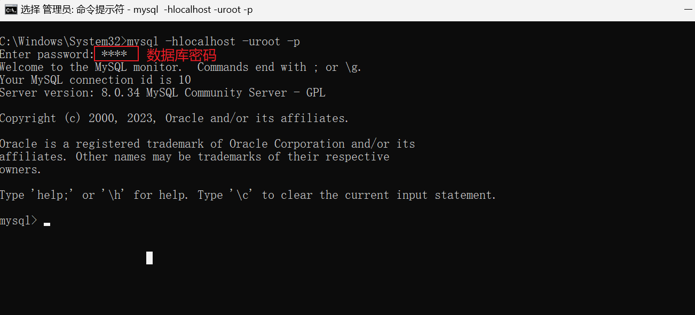
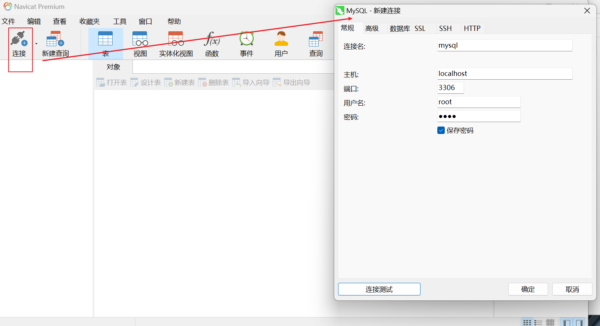
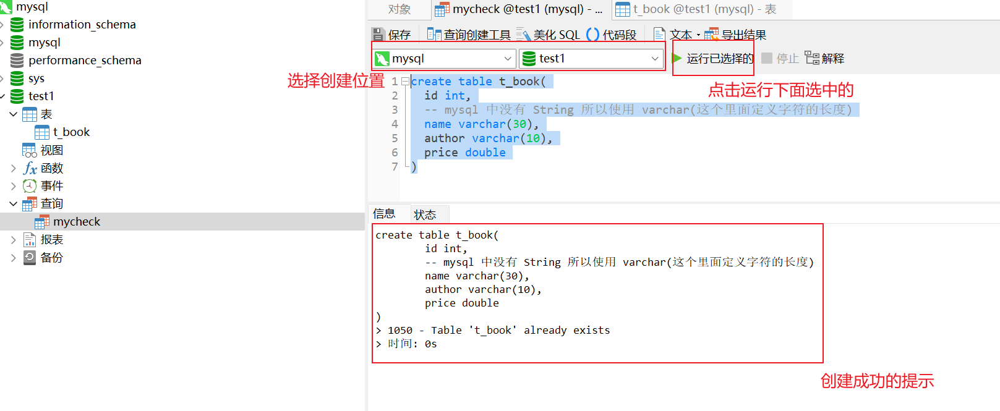

# 一、下载

[mysql](https://downloads.mysql.com/archives/installer/)

[navicat](https://drive.google.com/file/d/1n1q_CI_vQ0aLJCQs3sDWh3TXgz5pAfXi/view?usp=drive_link)

# 二、navicat 链接 mysql

## 1、navicat 报 2059的解决


### 1）启动 mysql 

```bash
# net start 查看所有正在运行的服务
# net start MySQL80 中 MySQL80 为 mysql 在我电脑中的名称
net start MySQL80
```

启动成功：

 

### 2）将 mysql 加入 path 环境变量

mysql -hlocalhost -uroot -p 报 'mysql' 不是内部或外部命令，也不是可运行的程序 或批处理文件



注：默认安装地址

```
C:\Program Files\MySQL\MySQL Server 8.0\bin
```

### 3）执行指令

```bash
mysql -hlocalhost -uroot -p
```



```bash
alter user 'root'@'localhost' identified by 'root' password expire never;
```


```bash
alter user 'root'@'localhost' identified with mysql_native_password by 'root';
```




进行以上的操作，你就链接成功了。


# 三、mysql

## 1、创建表

```mysql
create table t_book(
	id int,
	-- mysql 中没有 String 所以使用 varchar(这个里面定义字符的长度)
	name varchar(30),
	author varchar(10),
	price double
);
```



## 2、增删改查


