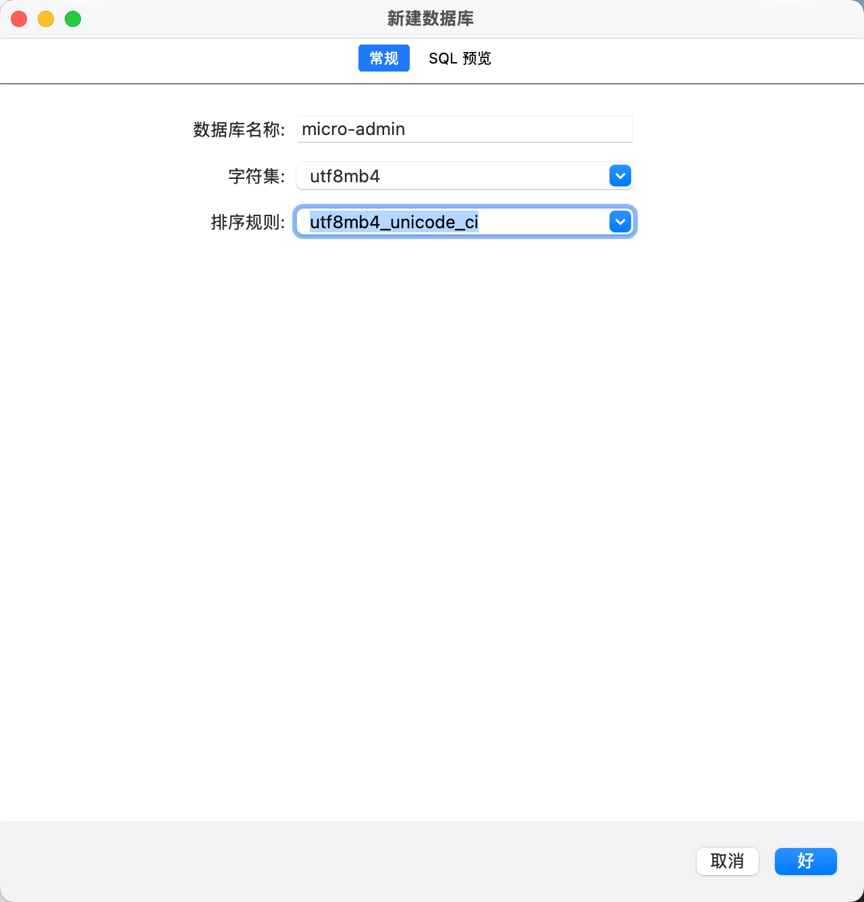
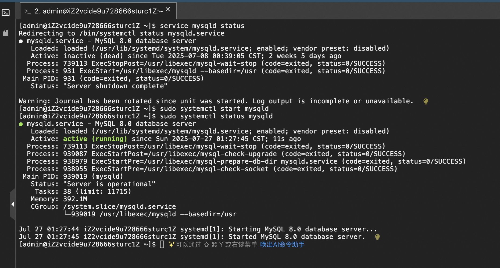

# 一、下载

[mysql](https://downloads.mysql.com/archives/installer/)

[navicat](https://drive.google.com/file/d/1n1q_CI_vQ0aLJCQs3sDWh3TXgz5pAfXi/view?usp=drive_link)

# 二、navicat 链接 mysql

## 1、navicat 报 2059的解决


### 1）启动 mysql 

```bash
# net start 查看所有正在运行的服务
# net start MySQL80 中 MySQL80 为 mysql 在我电脑中的名称
net start MySQL80
```

启动成功：

 

### 2）执行指令

```bash
mysql -hlocalhost -uroot -p
```


```bash
alter user 'root'@'localhost' identified by 'root' password expire never;
```


```bash
alter user 'root'@'localhost' identified with mysql_native_password by 'root';
```


进行以上的操作，你就链接成功了。

## 2、mysql 不是内部或外部命令

mysql -hlocalhost -uroot -p 报 'mysql' 不是内部或外部命令，也不是可运行的程序 或批处理文件


```
C:\Program Files\MySQL\MySQL Server 8.0\bin
```

注：默认安装地址

# 三、mysql

新建数据库



## 1、创建表

```mysql
create table t_book(
	id int,
	-- mysql 中没有 String 所以使用 varchar(这个里面定义字符的长度)
	name varchar(30),
	author varchar(10),
	price double
);
```


## 2、增删改查


# 四、部分指令（DDL）

注：登录当前数据库之后，才可以运行 mysql 指令

```bash
# 登录
mysql -uroot -proot
# mysql -u用户名 -p密码
```

## 1、查看当前数据库

``` mysql
show databases;
-- SQL 语句以 ; 结尾
-- 默认安装号是有四个库，这四个不要动
-- information_schema
-- mysql              
-- performance_schema 
-- sys
```

## 2、创建数据库

```mysql
create database test01;

-- Query OK, 1 row affected (0.01 sec)
-- 数据库名称一版不要修改
```

## 3、删除数据库

```mysql
drop database test01;

-- Query OK, 0 rows affected (0.01 sec)
```

## 4、使用数据库

```mysql
use 库名;
```

## 5、查询当前使用的数据库

```mysql
select database();
```

## 6、约束

可以限制表的插入、更新和删除等，例如：id、日期等；

主键不能重复。

### 1）设置主键 `primary key`

① 初始时设置主键

```mysql
create table test01(
	id int(11) primary key,
	-- mysql 中没有 String 所以使用 varchar(这个里面定义字符的长度)
	name varchar(30)
);

insert into test01 (id, name) values(2, "哈哈哈");
```

② 后面指定主键

```mysql
create table test02(
	id int(11),
	-- mysql 中没有 String 所以使用 varchar(这个里面定义字符的长度)
	name varchar(30),
	age int,
	primary key(id)  -- 指定主键
)

INSERT INTO test02(id, name, age) VALUES(2, '呵呵呵', 1);
```

③ 对已建成的表设置主键

```mysql
create table test03(
	id int(11),
	-- mysql 中没有 String 所以使用 varchar(这个里面定义字符的长度)
	name varchar(30),
	age int
)

INSERT INTO test03(id, name, age) VALUES(2, '呵呵呵', 1);

-- 修改表，设置主键,设置主键时，上面创建的一定要存在 id
alter table test03 add primary key (id);
```

④ 直接在 navicat  中设置


### 2）自增约束 `primary key auto_increment`

注：自增约束，主要是配合主键使用，防止主键为空、重复。

```mysql
create table test04(
	id int(11) primary key auto_increment,
	-- mysql 中没有 String 所以使用 varchar(这个里面定义字符的长度)
	name varchar(30)
)

insert into test04(name) values("哈哈哈");
-- 每次自增都是给 id + 1
insert into test04(name) values("啊啊啊");
insert into test04(name) values("呵呵呵");

-- 删除 不影响自增顺序
delete from test04 where id = 3;
insert into test04(name) values("啦啦啦啦");
```

### 3）唯一约束 `unique`

```mysql
create table test05(
	id int(11),
	-- mysql 中没有 String 所以使用 varchar(这个里面定义字符的长度)
	name varchar(30) unique
)

insert into test05(id, name) values(1, "哈哈哈");
-- 报错：1062 - Duplicate entry '哈哈哈' for key 'test05.name'
insert into test05(id, name) values(2, "哈哈哈");
```

### 4）非空约束 `not null`

```mysql
create table test06(
	id int(11),
	-- mysql 中没有 String 所以使用 varchar(这个里面定义字符的长度)
	name varchar(30) not null
)

-- 报错：1364 - Field 'name' doesn't have a default value
insert into test06(id) values(1);

-- 正确
insert into test06(id, name) values(1, "呵呵呵");
-- 只指定了 name 不为空，但是可以重复
insert into test06(id, name) values(1, "呵呵呵");
```

### 5）默认值 

```mysql
create table test07(
	id int(11),
	-- mysql 中没有 String 所以使用 varchar(这个里面定义字符的长度)
	sex char(1) default "女"
)

insert into test06(id) values(1);

insert into test06(id, sex) values(1, "男");
```

### 6）外键约束

注：多表之间的一种关联关系的一种限制。

```mysql
-- 商品
create table tb_goods(
	id int primary key,
	name varchar(20),
	description varchar(100)
)

-- 订单（订单表关联了商品）
create table tb_order(
	id int primary key,
	time datetime,
  goodId int,
	-- 设置外键：constraint 外键名 foreign key (当前表中的列名) references 表(主键) 
	constraint relation_order_goods foreign key (goodId) references tb_goods(id)
)


/*
被引用的表被成为父表 tb_goods
引用别人的表称为子表 tb_order

*/

insert into tb_goods(id, name, description) values(1, "小米", "手机");
insert into tb_goods(id, name, description) values(2, "锤子", "手机");
insert into tb_goods(id, name, description) values(3, "魅族", "手机");

-- 1452 - Cannot add or update a child row: a foreign key constraint fails (`test1`.`tb_order`, CONSTRAINT `relation_order_goods` FOREIGN KEY (`goodId`) REFERENCES `tb_goods` (`id`)) 给子表添加一个父没有的
insert into tb_order values(1, "2024-05-27", 3);
insert into tb_order values(2, "2024-05-27", 3);

-- 子表可以随意删
delete from tb_order where id = 2;

-- 父表被引用的数据不能删
delete from tb_goods where id = 1;
-- 1451 - Cannot delete or update a parent row: a foreign key constraint fails (`test1`.`tb_order`, CONSTRAINT `relation_order_goods` FOREIGN KEY (`goodId`) REFERENCES `tb_goods` (`id`))
delete from tb_goods where id = 3; -- 有引用
```


# 五、查询

基础数据创建：

```mysql
-- 基础查询条件
DROP TABLE IF EXISTS tb_search;

CREATE TABLE tb_search (
	id INT(11) DEFAULT NULL,
	name VARCHAR(99) DEFAULT NULL,
	age INT(11) DEFAULT NULL,
	sex CHAR(6) DEFAULT NULL,
	score CHAR(11) DEFAULT NULL,
	cid INT(11) DEFAULT NULL,
	groupLeaderId INT(11) DEFAULT NULL
);


INSERT INTO tb_search VALUES (1, "张三", 22, "男", 44, 1, 22);
INSERT INTO tb_search VALUES (2, "张二", 23, "男", 55, 1, 23);
INSERT INTO tb_search VALUES (3, "张四", 24, "男", 66, 2, 24);
INSERT INTO tb_search VALUES (4, "张五", 26, "女", 86, 2, 25);
INSERT INTO tb_search VALUES (5, "张六", 27, "男", 24, 1, 26);
INSERT INTO tb_search VALUES (6, "张七", 29, "女", 85, 1, 27);
INSERT INTO tb_search VALUES (7, "张八", 18, "女", 12, 4, 28);
INSERT INTO tb_search VALUES (8, "张九", 16, "女", 32, 4, 29);
INSERT INTO tb_search VALUES (9, "张十", 17, "女", 7, 1, 21);
INSERT INTO tb_search VALUES (10, "张十一", 15, "男", 75, 1, 20);
INSERT INTO tb_search VALUES (11, "张十二", 19, "女", 23, 1, 19);
```

## 1、基本查询

```mysql
-- 基础查询
-- SELECT 字段名1,字段名2,... FROM 表名;
SELECT id,name,age,sex,score,cid,groupLeaderId FROM tb_search;

-- 查询练习时，使用 * ，但是线上不可以，因为 * 的效率低下
SELECT * FROM tb_search;

-- 查询指定列，看什么查什么
SELECT id,name FROM tb_search;
```

## 2、条件查询

```mysql
SELECT 字段名1,字段名2,... FROM 表名 WHERE 字段 条件 值;
```

条件运算符：`=`、`>`、`<`、`>=`、`<=`、`!=`、`and`、`or`、`in`、`not in`、`between...and...`

```mysql
-- 查询 id 为 1 的信息
SELECT * FROM tb_search WHERE id = 1;

-- 查询 score 大于 60
SELECT * FROM tb_search WHERE score > 60;

-- 查询女，年龄小于 20， and 两边条件必须同时成立
SELECT * FROM tb_search WHERE sex = "女" AND age < 20;

-- 查询 id 为 2，年龄为 26，没有的就是 空，查不到
SELECT * FROM tb_search WHERE id = 2 OR age = 26;

-- 查询 id 为 1，2，3,也可使用 or 链接
SELECT * FROM tb_search WHERE id IN (1,2,3);

-- 查询 id 不是 1 的数据
SELECT * FROM tb_search WHERE id NOT IN (1,2,3);
SELECT * FROM tb_search WHERE id != 1 AND id != 2 AND id != 3;

-- 查询年龄 20 到 30
SELECT * FROM tb_search WHERE age >= 20 and age <= 30;
SELECT * FROM tb_search WHERE age BETWEEN 20 and 30;
```

## 3、模糊查询

```mysql
SELECT 字段名1,字段名2,... FROM 表名 WHERE 字段 like "_值%";

-- 十 前面匹配任意一个字符，十 后面匹配任何字符
SELECT * FROM tb_search WHERE name like "_十%";

-- _ 匹配任意一个字符
-- % 匹配任意字符（没有个数限制）
```

## 4、排序查询

```mysql
SELECT 字段名1,字段名2,... FROM 表名 ORDER BY 字段 [desc|asc];

-- desc 降序
-- asc 升序，默认就是升序

-- 年龄从小到大
SELECT * FROM tb_search ORDER BY age;
-- 年龄从大到小
SELECT * FROM tb_search ORDER BY age DESC;

-- 年龄相同的，按成绩排序
SELECT * FROM tb_search ORDER BY age, score DESC;

-- 成绩大于 60.并根据成绩进行降序
SELECT * FROM tb_search WHERE score > 60 ORDER BY score DESC;
```

## 5、聚合函数

注：将查询结果，聚合运算的到一个结果值。

> 聚合运算完，结果只有一行数据
>
> count(expr) 计算指定列不为 null 的行数
>
> max(expr) 计算指定列最大值
>
> min(expr) 计算指定列最小值
>
> avg(expr) 计算指定列平均值
>
> sum(expr) 计算指定列和
>
> 函数中的 expr，可以写列名（还可以写一些函数表达式）
>
> 注：大部分情况下操作的都是数字。

```mysql
SELECT COUNT(id) FROM tb_search; -- 当前行数
```

## 6、分组查询

注：只要有分组，查询结果就有几行

```mysql
select 字段1,字段2,... from 表名 group by 字段 having 字段 条件值;
-- select 字段1,字段2,... from 表名 [where 字段 条件 值] group by 字段 having 字段 条件值;

-- group by 字段,根据指定字段分组
-- having 字段 值, 分组后再过滤

-- having 和 where 都是过滤
-- where 是分组前过滤,having 是分组后过滤
-- where 后不能使用聚合函数,having 可以聚合函数

-- SQL 只要有分组，分成几组，就有几行数据，一般配合 聚合函数 使用
```

```mysql
SELECT sex FROM tb_search GROUP BY sex;
SELECT sex,COUNT(id) FROM tb_search GROUP BY sex;

-- 查询班级号
SELECT cid FROM tb_search GROUP BY cid;

-- 查询班内成绩和
SELECT cid,SUM(score) FROM tb_search GROUP BY cid;

-- 查询班内成绩和大于 200 的班级
SELECT cid,SUM(score) FROM tb_search GROUP BY cid HAVING SUM(score) > 200;

-- 查询班内成绩和大于 200 的班级，并进行降序
SELECT cid,SUM(score) FROM tb_search GROUP BY cid HAVING SUM(score) > 200 ORDER BY SUM(score) DESC;
```

## 7、分页查询

注：查询完的，限制查询条数。

```mysql
SELECT * FROM tb_search LIMIT 2;

-- 从下标二开始，查询两条数据
SELECT * FROM tb_search LIMIT 2, 2;
```

# 六、多表联查

## 1、合并结果集

### 纵向拼接

注：

`UNION` 联合数据，重复数据会去重；

`UNION ALL ` 联合数据，重复数据不会去重，保留所有的数据；

```mysql
create table tb_test01(
	id int,
	name varchar(20),
	age INT,
	description varchar(100)
)
insert into tb_test01(id, name, age,description) values(1, "哈哈哈", 16,"手机");
insert into tb_test01(id, name, age, description) values(2, "啊啊", 18, "手机");

create table tb_test02(
	id int primary key,
	name varchar(20),
	description varchar(100)
)

INSERT INTO tb_test02(id, name, description) VALUES(2, '测试1', "test");
INSERT INTO tb_test02(id, name, description) VALUES(3, '测试2', "test");

/*
合并结果集的两个表的字段数量要一致

SELECT * FROM tb_test01
UNION
SELECT * FROM tb_test02

这样就会报错

最好数据类型、数量要一致

UNION 数据重复，会进行去重

UNION ALL 数据重复了，也会保留，不会进行去重操作
*/
SELECT id, name FROM tb_test01
UNION
SELECT id, name FROM tb_test02
```

## 2、链接查询

注：连接查询是将多张表数据链接在一起（横向）查询返回。


这就是不正确的，`链接查询最重要的就是过滤条件`。

链接查询分为以下几种：

* 内链接
* 外连接
* 子查询

### 1）内链接

```mysql
-- 一个班级中存在多个学生，这个就是一对多

-- 创建学生表 

DROP TABLE IF EXISTS tb_student;

CREATE TABLE tb_student (
	id INT(11) DEFAULT NULL,
	name VARCHAR(99) DEFAULT NULL,
	age INT(11) DEFAULT NULL,
	sex CHAR(6) DEFAULT NULL,
	score CHAR(11) DEFAULT NULL,
	cid INT(11) DEFAULT NULL,
	groupLeaderId INT(11) DEFAULT NULL
);


INSERT INTO tb_student VALUES (1, "张三", 22, "男", 44, 1, 22);
INSERT INTO tb_student VALUES (2, "张二", 23, "男", 55, 1, 23);
INSERT INTO tb_student VALUES (3, "张四", 24, "男", 66, 2, 24);
INSERT INTO tb_student VALUES (4, "张五", 26, "女", 86, 2, 25);
INSERT INTO tb_student VALUES (5, "张六", 27, "男", 24, 1, 26);
INSERT INTO tb_student VALUES (6, "张七", 29, "女", 85, 3, 27);
INSERT INTO tb_student VALUES (7, "张八", 18, "女", 12, 3, 28);
INSERT INTO tb_student VALUES (8, "张九", 16, "女", 32, 3, 29);
INSERT INTO tb_student VALUES (9, "张十", 17, "女", 7, 1, 21);
INSERT INTO tb_student VALUES (10, "张十一", 15, "男", 75, 2, 20);
INSERT INTO tb_student VALUES (11, "张十二", 19, "女", 23, 1, 19);

-- 创建班级表

DROP TABLE IF EXISTS tb_class;

CREATE TABLE tb_class (
	cid INT(11) DEFAULT NULL,
	cname VARCHAR(99) DEFAULT NULL,
	caddress VARCHAR(11) DEFAULT NULL
);


INSERT INTO tb_class VALUES (1, "一班", "1 楼");
INSERT INTO tb_class VALUES (2, "二班", "2 楼");
INSERT INTO tb_class VALUES (4, "三班", "3 楼");

-- 语法(查询学生信息以及学生关联的班级信息)
SELECT * FROM 表名一 INNER JOIN 表名二 on 表名一.字段名 = 表名二.字段名;

SELECT * FROM tb_student INNER JOIN tb_class on tb_student.cid = tb_class.cid;
```


```mysql
-- 指定学生 学号 姓名 班号 班名
SELECT tb_student.id, tb_student.name, tb_class.cname FROM tb_student INNER JOIN tb_class on tb_student.cid = tb_class.cid;

-- 也可以给表设置别名
-- as 可以省略
SELECT s.id, s.name, c.cname 
FROM tb_student as s 
INNER JOIN tb_class as c
on s.cid = c.cid;

-- 简写 别名和上面的写法一样
SELECT tb_student.id, tb_student.name, tb_class.cname FROM tb_student, tb_class WHERE tb_student.cid = tb_class.cid;
```

 

特点：

`只会查询符合关联条件的数据。`

### 2）外连接

```mysql
-- 语法(查询学生信息以及学生关联的班级信息)
SELECT * FROM 表名一 LEFT|RIGHT OUTER JOIN 表名二 on 表名一.字段名 = 表名二.字段名;
```

外链接会保留不符合条件的信息。

左 以左表为主

右 以右表为主

```mysql
DROP TABLE IF EXISTS tb_student;

CREATE TABLE tb_student (
	id INT(11) DEFAULT NULL,
	name VARCHAR(99) DEFAULT NULL,
	age INT(11) DEFAULT NULL,
	sex CHAR(6) DEFAULT NULL,
	score CHAR(11) DEFAULT NULL,
	cid INT(11) DEFAULT NULL,
	groupLeaderId INT(11) DEFAULT NULL
);


INSERT INTO tb_student VALUES (1, "张三", 22, "男", 44, 1, 22);
INSERT INTO tb_student VALUES (2, "张二", 23, "男", 55, 1, 23);
INSERT INTO tb_student VALUES (3, "张四", 24, "男", 66, 2, 24);
INSERT INTO tb_student VALUES (4, "张五", 26, "女", 86, 2, 25);
INSERT INTO tb_student VALUES (5, "张六", 27, "男", 24, 1, 26);
INSERT INTO tb_student VALUES (6, "张七", 29, "女", 85, 3, 27);
INSERT INTO tb_student VALUES (7, "张八", 18, "女", 12, 3, 28);
INSERT INTO tb_student VALUES (8, "张九", 16, "女", 32, 3, 29);
INSERT INTO tb_student VALUES (9, "张十", 17, "女", 7, 1, 21);
INSERT INTO tb_student VALUES (10, "张十一", 15, "男", 75, 2, 20);
INSERT INTO tb_student VALUES (11, "张十二", 19, "女", 23, 1, 19);


DROP TABLE IF EXISTS tb_class;

CREATE TABLE tb_class (
	cid INT(11) DEFAULT NULL,
	cname VARCHAR(99) DEFAULT NULL,
	caddress VARCHAR(11) DEFAULT NULL
);


INSERT INTO tb_class VALUES (1, "一班", "1 楼");
INSERT INTO tb_class VALUES (2, "二班", "2 楼");
INSERT INTO tb_class VALUES (4, "三班", "3 楼");

SELECT * FROM tb_student s LEFT OUTER JOIN tb_class c on s.cid = c.cid;

SELECT * FROM tb_student s RIGHT OUTER JOIN tb_class c on s.cid = c.cid;
```

### 3）子查询（subquery）

注：也叫嵌套查询。

将 sql 语句当表，写在 from 后

将 sql 语句当条件，写在 where 后

```mysql
-- 子查询就是嵌套查询
-- 查询的结果就是一张虚拟表

SELECT * FROM tb_student WHERE sex = "男";
SELECT id, name, sex, age FROM tb_student WHERE sex = "男";


-- 子查询当表
SELECT * FROM (SELECT id, name, sex, age FROM tb_student WHERE sex = "男") t WHERE t.age < 20;

-- 子查询当作条件（但是注意条件值的个数，也就是列数和行数）
SELECT age FROM tb_student WHERE id = 3;

-- 年龄大于 id 为 3的这个的年龄
SELECT * FROM tb_student WHERE age < (SELECT age FROM tb_student WHERE id = 3);

-- 查询与 id 为 1 同一个班级的
SELECT * FROM tb_student WHERE cid = (SELECT cid FROM tb_student WHERE id = 1);
```

# 八、[MySQL](https://www.mysqlzh.com/) 函数

[docs](https://www.mysqlzh.com/doc/113.html)

[docs](https://www.mysql.net.cn/doc/refman/8.0/en/functions.html)

 ## 1、字符串函数

| 名字                         | 描述                                                         | 示例                                                         |
| :--------------------------- | ------------------------------------------------------------ | ------------------------------------------------------------ |
| CHARSET(str)                 | 返回字符串的集                                               | SELECT CHARSET("李勇"); -- 返回字符集<br/>SELECT CHARSET("李勇") FROM DUAL; |
| CONCAT(str1, str2, str3)     | 合并字符串                                                   | SELECT CONCAT("hello", "word", "!");<br/><br/>SELECT CONCAT(cid, name) FROM tb_student; |
| INSTR(str, substr)           | 返回第一次出现的子字符串的索引<br/>返回 0 时表示不存在       | SELECT INSTR("hello", "o");                                  |
| UCASE(str)                   | 转换成大写                                                   | SELECT UCASE("hello");                                       |
| LCASE(str)                   | 转换成小写                                                   | SELECT LCASE("HELLO");                                       |
| LEFT(str, len)               | 返回字符串最左边 len 的字符 str ，或者  NULL 如果任何参数是 NULL | SELECT LEFT("HELLO", 2);                                     |
| RIGHT(str, len)              | 返回字符串最右边 len 的字符 str ，或者  NULL 如果任何参数是 NULL | SELECT RIGHT("HELLO", 2);                                    |
| LENGTH(str)                  | str 的长度                                                   | SELECT LENGTH("hello");                                      |
| REPLACE(str,from_str,to_str) | 在 str 中用 to_str 替换 from_str                             | SELECT REPLACE("hello.", ".", "!");                          |
| LTRIM(str) <br />RTRIM(str)  | 去除前后空格                                                 | SELECT LTRIM(" hello");<br/>SELECT RTRIM("hello ");          |

## 2、数学函数

[docs](https://www.mysql.net.cn/doc/refman/8.0/en/numeric-functions.html)

| 名字          | 描述                                       | 示例                           |
| ------------- | ------------------------------------------ | ------------------------------ |
| ABS(X)        | 绝对值                                     | SELECT ABS(-1);                |
| BIN(N)        | 十进制转二进制                             |                                |
| CEILING(X)    | 向上取整                                   | SELECT CEILING(10.2);          |
| FLOOR(X)      | 向下取整                                   | SELECT FLOOR(10.2);            |
| FORMAT(X,D)   | 保留小数位数，x 真实的数字，d 保留几位小数 | SELECT FORMAT(10.333333,2);    |
| TRUNCATE(X,D) | 截取                                       | SELECT TRUNCATE(10.633333, 2); |
| ROUND(X, D)   | 四舍五入, D保留小数点后几位，可以不传      | SELECT ROUND(10.633333);       |
| RAND()        | 随机数，0 ~ 1 之间                         | SELECT RAND                    |

## 3、日期函数

[docs](https://www.mysql.net.cn/doc/refman/8.0/en/date-and-time-functions.html)

| 名字                              | 描述         | 示例                                                         |
| --------------------------------- | ------------ | ------------------------------------------------------------ |
| SYSDATE()                         | 获取当前时间 | SELECT SYSDATE();                                            |
| NOW()                             | 获取当前时间 | SELECT NOW();                                                |
| ADDTIME(expr1,expr2)              | 添加时间     | SELECT ADDTIME("00:01:00", "00:00:50")                       |
| ADDDATE(date,INTERVAL expr unit)  | 添加日期     | SELECT ADDDATE('2024-06-19',INTERVAL 2 YEAR);<br/>SELECT ADDDATE('2024-06-19',INTERVAL 2 MONTH);<br/>SELECT ADDDATE('2024-06-19',INTERVAL 2 DAY); |
| DATE_ADD(date,INTERVAL expr unit) | 添加日期     |                                                              |
| CURRENT_TIMESTAMP()               | 当前时间戳   | SELECT CURRENT_TIMESTAMP();                                  |

## 4、日期字符串转换函数

### 1）日期 转 字符串

```mysql
-- date_format(data, '%Y-%m-%d');

SELECT DATE_FORMAT(NOW(), '%Y-%m-%d');
SELECT DATE_FORMAT(NOW(), '%Y年%m月%d日');
```

### 2）字符串 转 日期

```mysql
-- str_to_date('2024年06月19日');

SELECT STR_TO_DATE('2024年06月19日','%Y年%m月%d日');
```

## 5、流程函数

[docs](https://www.mysqlzh.com/doc/115.html)

```mysql
-- =============== 流程函数 ================
-- IF(expr1,expr2,expr3)	如果expr1为真，则返回expr2，否则返回expr3
-- isnull()函数,判断是否为空
-- isnull(字段) 如果是null,返回1 不是null返回0

-- 查询学生id,姓名,成绩,以及是否及格(60及以上及格)
select sid,sname,score,if(score >= 60,'及格','不及格') 等级 from tb_student;

-- 成年人,未成年
select sid,sname,if(age >= 18,'成年','未成年') from tb_student;

-- 查询学生id,姓名,成绩,如果成绩为null,显示缺考
select sid,sname,if(isnull(score) = 1,'缺考',score) from tb_student;

-- IFNULL(expr1,expr2)	如果 expr1不是NULL,则返回expr1，否则返回expr2；
-- 查询学生id,姓名,成绩,如果成绩为null,显示缺考
select sid,sname,ifnull(score,'缺考') 成绩 from stu;

-- CASE [value] WHEN [value1] THEN[result1]… ELSE[default] END	如果value等于value1, 返回result1,否则返回default
select case 4 
when 1 then '一'
when 2 then '二'
when 3 then '三'
else '其他'
end as 结果
-- 等值判断
select case age 
when 20 then '弱冠'
when 15 then '豆蔻'
when 95 then '耄耋'
else '其他'
end as 结果
from tb_student;

-- 范围判断
-- CASE WHEN [expr1] THEN [result1]… ELSE [default] END	如果expr是真, 返回result1,否则返回default
-- 查询学生id,姓名,成绩,及等级(60以下不及格,60-70,及格,71-80,中等,81-90良好,91-100优秀)
select sid,sname,score,case
when score < 60 then '不及格'
when score <= 70 then '及格'
when score <= 80 then '中等'
when score <= 90 then '良好'
else '优秀'
end as 等级

from tb_student;
```

# ~~java 链接数据库~~

## 1、下载 JBDC 驱动

地址：https://dev.mysql.com/downloads/connector/j/?os=26


## 2、插入数据

```java
package com.mysql.test01;

import java.sql.Connection;
import java.sql.DriverManager;
import java.sql.SQLException;
import java.sql.Statement;

public class Test01 {
    public static void main(String[] args) throws ClassNotFoundException, SQLException {
        // 1、加载驱动
        Class.forName("com.mysql.cj.jdbc.Driver");
        /**
         * 2、获取链接
         * riverManager.getConnection 要三个参数
         */
        Connection conn = DriverManager.getConnection("jdbc:mysql://本机IP（127.0.0.1）:端口号（3306）/数据库名称?useSSL=false&useUnicode=true&characterEncoding=UTF-8&serverTimezone=Asia/Shanghai&allowPublicKeyRetrieval=true", "root", "root");
        // 3、创建会话
        Statement sta = conn.createStatement();
        // 4、发送 sql （也就是这里写 sql 语句）
        long i = sta.executeLargeUpdate("insert into t_book(id, name, author, price) values (1, '测试一', 'test', 22)");
        // 5、处理结果

        if (i > 0) {
            System.out.println("插入成gong");
        } else {
            System.out.println("插入 error");
        }
        // 6、关闭资源
        sta.close();
        conn.close();
    }
}
```

## 3、查询

```java
package com.mysql.test01;

import java.sql.*;

public class Test02 {
    public static void main(String[] args) throws ClassNotFoundException, SQLException {
        // 1、加载驱动
        Class.forName("com.mysql.cj.jdbc.Driver");
        /**
         * 2、获取链接
         * riverManager.getConnection 要三个参数
         */
        Connection conn = DriverManager.getConnection("jdbc:mysql://127.0.0.1:3306/test1?useSSL=false&useUnicode=true&characterEncoding=UTF-8&serverTimezone=Asia/Shanghai&allowPublicKeyRetrieval=true", "root", "root");
        // 3、创建会话
        Statement sta = conn.createStatement();
        // 4、发送 sql （也就是这里写 sql 语句）
        // ResultSet 理解为结果集合
        ResultSet resultSet = sta.executeQuery("select * from t_book");
        // 5、判断是否有记录
        while (resultSet.next()) {
            System.out.println(resultSet.getString("name"));
        }
        // 6、关闭资源
        sta.close();
        conn.close();
    }
}
```

# 九、在线服务器使用

## 1、阿里云


找到自己购买的在线服务器，然后点击 `远程链接`

打开之后的样子


## 2、查看数据库状态

```bash
# 查看当前状态
service mysqld status

# 重新启动
sudo systemctl start mysqld

# 再次查看
sudo systemctl status mysqld
```


